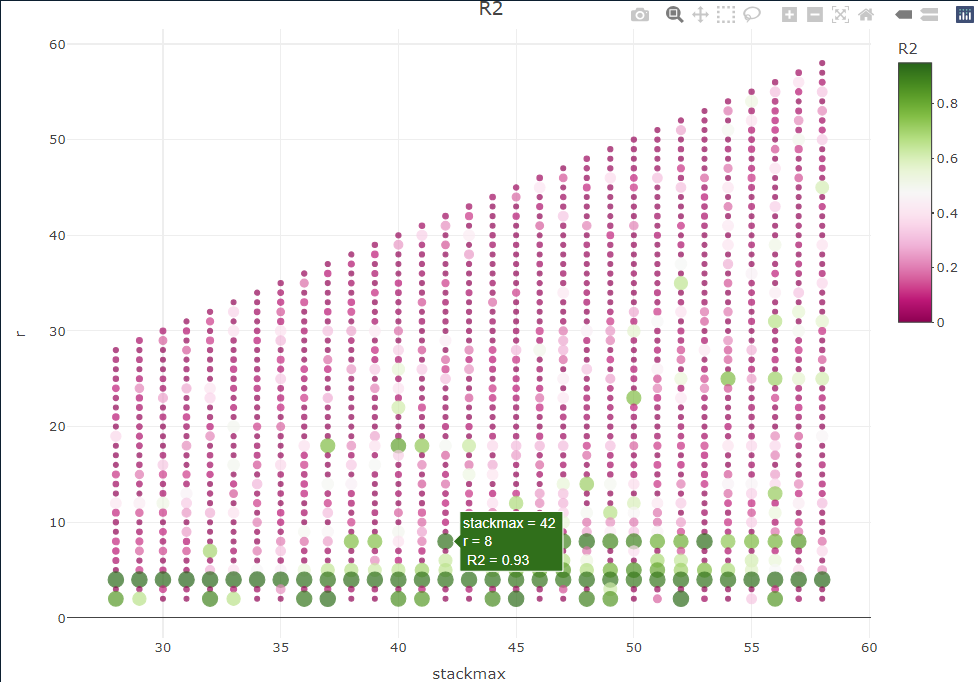
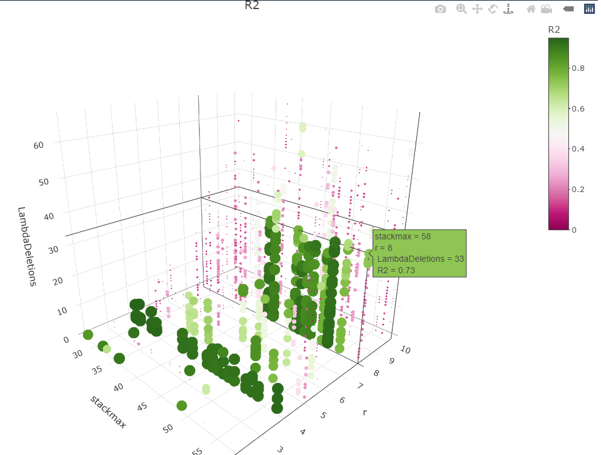

<!-- README.md is generated from README.Rmd. Please edit that file -->

```{r, include = FALSE}
knitr::opts_chunk$set(
  collapse = TRUE,
  comment = "#>",
  fig.path = "man/figures/README-",
  out.width = "100%"
)
```

# havok

**NOTE: This package is in active development (beta), updates regularly, and may have bugs. Please report any bugs to the package maintainer.**

This package allows for modeling of chaotic systems as intermittently forced linear systems through the use of Hankel Alternative View of Koopman (HAVOK) analysis (Brunton, Brunton, Proctor, Kaiser, & Kutz, 2017). This package has additional functionality for the SINDy algorithm (Brunton, Proctor, & Kutz, 2016), as well as other nonlinear analysis methods. This package also contains functionality for model optimization through parallel processing via the `phavok()` function.


## Installation

You can install the development version from [GitHub](https://github.com/) with:

``` r
# install.packages("devtools")
devtools::install_github("RobertGM111/havok")
```
<!--
``` r
install.packages("havok")
```
-->

## Examples

### Lorenz attractor - Basic `havok()` Function Usage

Simulate data from a Lorenz attractor.

```{r example, eval=TRUE}
library(havok)
library(deSolve)


#Generate Data
##Set Lorenz Parameters
parameters <- c(s = 10, r = 28, b = 8/3)
n <- 3
state <- c(X=-8, Y=8, Z=27) ##Inital Values

dt<-0.001
tspan<-seq(dt,200,dt)
N<-length(tspan)

Lorenz <- function(t, state, parameters) {
  with(as.list(c(state, parameters)), {
    dX <- s * (Y - X)
    dY <- X * (r - Z) - Y
    dZ <- X * Y - b * Z
    list(c(dX, dY, dZ))
  })
}

out <- ode(y = state, times = tspan, func = Lorenz, parms = parameters, rtol = 1e-12, atol = 1e-12)
xdat <- out[,"X"]
t <- out[,"time"]

# Run HAVOK Analysis
hav <- havok(xdat = xdat, dt = dt)
```

To plot the resulting time series and forcing term use `plot(hav)`

```{r plotting, eval=TRUE, echo = TRUE}
plot(hav, what = "both")
```


### Internet Trolls - Parameter Optimization via Parallel Processing

Load internet trolls data (Full data available at [www.fivethirtyeight.com](https://fivethirtyeight.com/features/why-were-sharing-3-million-russian-troll-tweets/?fbclid=IwAR0PEu76Gtl_jHaXvghjmdQOAio_qgqe-bJp6ZQRbh5mt94EPQ884IA0XCA). The original data file for this example contains data from June 19, 2015, to Dec. 31, 2017.

```{r}
data("Internet_Trolls")
```

Conduct parameter optimization via `phavok()`

```{r}

# troll activity extracted 4 times per day during the US presidential  election year 2016 on 11 different topics 
right <- results.all.truncated[results.all.truncated$Type=="Right",] # only right-wing trolls
xdat <- right$Topic3  # Russian Twitter troll posting activity on the topic of Racial Justice/Black Lives Matter
dt <- 0.25   # 4 measurements per day

# All possible rs within specified stackmax range, no sparsification dimension

results <- phavok(xdat = xdat, dt = dt, stackmaxes = 28:58)
```


```{r}
phav <- phavok(xdat = xdat, dt = dt, stackmaxes = 28:58, rs = 2:10, random = 0.5, sparsify = T, sparserandom = 0.4)
```


## References

* Brunton, S. L., Brunton, B. W., Proctor, J. L., Kaiser, E., & Kutz, J. N. (2017). Chaos as an intermittently forced linear system. Nature communications, 8(1), 19.

* Brunton, S. L., Proctor, J. L., & Kutz, J. N. (2016). Discovering governing equations from data by sparse identification of nonlinear dynamical systems. Proceedings of the National Academy of Sciences, 113(15), 3932-3937.

* Moulder, R. G., Martynova, E., & Boker, S. M. (2021). Extracting nonlinear dynamics from psychological and behavioral time series through HAVOK analysis. Multivariate Behavioral Research, 1-25.
