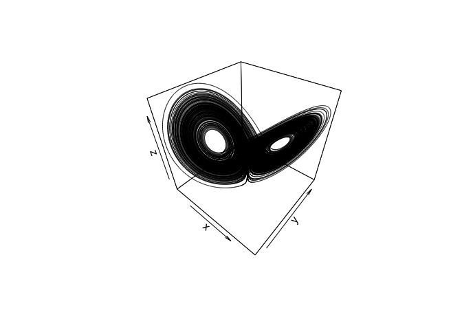

<!-- README.md is generated from README.Rmd. Please edit that file -->
havok
=====

<!-- badges: start -->
<!-- badges: end -->
This package allows for modeling of chaotic systems as intermittently forced linear systems through the use of Hankel Alternative View of Koopman (HAVOK) analysis (Brunton, Brunton, Proctor, Kaiser, & Kutz, 2017). This package has additional functionality for the SINDy algoirthm (Brunton, Proctor, & Kutz, 2016).

Installation
------------

You can install the development version from [GitHub](https://github.com/) with:

``` r
# install.packages("devtools")
devtools::install_github("RobertGM111/havok")
```

<!--
``` r
install.packages("havok")
```
-->
Example
-------

This is a basic example which shows you how to solve a common problem:

``` r
library(havok)
library(deSolve)
library(plot3D)


#Generate Data
##Set Lorenz Parameters
parameters <- c(s = 10, r = 28, b = 8/3)
n <- 3
state <- c(X=-8, Y=8, Z=27) ##Inital Values

#Intergrate
dt<-0.001
tspan<-seq(dt,200,dt)
N<-length(tspan)

Lorenz <- function(t, state, parameters) {
  with(as.list(c(state, parameters)), {
    dX <- s * (Y - X)
    dY <- X * (r - Z) - Y
    dZ <- X * Y - b * Z
    list(c(dX, dY, dZ))
  })
}

out <- ode(y = state, times = tspan, func = Lorenz, parms = parameters, rtol = 1e-12, atol = 1e-12)
xdat <- out[,"X"]
t <- out[,"time"]

L <- 1:200000

scatter3D(x = out[L,"X"], y = out[L,"Y"], z = out[L,"Z"], col = rgb(0,0,0,.1), type = "l")
```



What is special about using `README.Rmd` instead of just `README.md`? You can include R chunks like so:

``` r
summary(cars)
#>      speed           dist       
#>  Min.   : 4.0   Min.   :  2.00  
#>  1st Qu.:12.0   1st Qu.: 26.00  
#>  Median :15.0   Median : 36.00  
#>  Mean   :15.4   Mean   : 42.98  
#>  3rd Qu.:19.0   3rd Qu.: 56.00  
#>  Max.   :25.0   Max.   :120.00
```

You'll still need to render `README.Rmd` regularly, to keep `README.md` up-to-date.

You can also embed plots, for example:


In that case, don't forget to commit and push the resulting figure files, so they display on GitHub!

References
----------

-   Brunton, S. L., Brunton, B. W., Proctor, J. L., Kaiser, E., & Kutz, J. N. (2017). Chaos as an intermittently forced linear system. Nature communications, 8(1), 19.

-   Brunton, S. L., Proctor, J. L., & Kutz, J. N. (2016). Discovering governing equations from data by sparse identification of nonlinear dynamical systems. Proceedings of the National Academy of Sciences, 113(15), 3932-3937.
