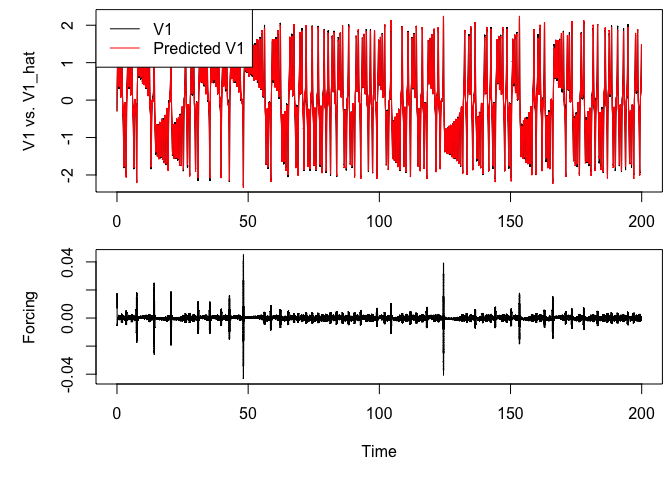

<!-- README.md is generated from README.Rmd. Please edit that file -->

# havok

**NOTE: This package is in active development (beta), updates regularly,
and may have bugs. Please report any bugs to the package maintainer.**

This package allows for modeling of chaotic systems as intermittently
forced linear systems through the use of Hankel Alternative View of
Koopman (HAVOK) analysis (Brunton, Brunton, Proctor, Kaiser, & Kutz,
2017). This package has additional functionality for the SINDy algorithm
(Brunton, Proctor, & Kutz, 2016), as well as other nonlinear analysis
methods. This package also contains functionality for model optimization
through parallel processing via the `phavok()` function.

## Installation

You can install the development version from
[GitHub](https://github.com/) with:

``` r
# install.packages("devtools")
devtools::install_github("RobertGM111/havok")
```

<!--
``` r
install.packages("havok")
```
-->

## Examples

### Lorenz attractor - Basic `havok()` Function Usage

Simulate data from a Lorenz attractor.

``` r
library(havok)
library(deSolve)


#Generate Data
##Set Lorenz Parameters
parameters <- c(s = 10, r = 28, b = 8/3)
n <- 3
state <- c(X=-8, Y=8, Z=27) ##Inital Values

dt<-0.001
tspan<-seq(dt,200,dt)
N<-length(tspan)

Lorenz <- function(t, state, parameters) {
  with(as.list(c(state, parameters)), {
    dX <- s * (Y - X)
    dY <- X * (r - Z) - Y
    dZ <- X * Y - b * Z
    list(c(dX, dY, dZ))
  })
}

out <- ode(y = state, times = tspan, func = Lorenz, parms = parameters, rtol = 1e-12, atol = 1e-12)
xdat <- out[,"X"]
t <- out[,"time"]

# Run HAVOK Analysis
hav <- havok(xdat = xdat, dt = dt)
#> Warning in havok(xdat = xdat, dt = dt): Agument "devMethod" not selected.
#> Defaulting to devMethod = "FOCD"
```

To plot the resulting time series and forcing term use `plot(hav)`

``` r
plot(hav, what = "both")
```



### Internet Trolls - Parameter Optimization via Parallel Processing

Load internet trolls data (Full data available at
[www.fivethirtyeight.com](https://fivethirtyeight.com/features/why-were-sharing-3-million-russian-troll-tweets/?fbclid=IwAR0PEu76Gtl_jHaXvghjmdQOAio_qgqe-bJp6ZQRbh5mt94EPQ884IA0XCA).
The original data file for this example contains data from June 19,
2015, to Dec. 31, 2017.

``` r
data("Internet_Trolls")
```

Conduct parameter optimization via `phavok()`

``` r
#'# Russian Twitter Troll Activity Example

library(plotly)
#> Loading required package: ggplot2
#> 
#> Attaching package: 'plotly'
#> The following object is masked from 'package:ggplot2':
#> 
#>     last_plot
#> The following object is masked from 'package:stats':
#> 
#>     filter
#> The following object is masked from 'package:graphics':
#> 
#>     layout

# troll activity extracted 4 times per day during the US presidential  election year 2016 on 11 different topics 
right <- results.all$avg.all.date[results.all$avg.all.date$Type=="Right",] # only right-wing trolls
xdat <- right$Topic3  # Russian Twitter troll posting activity on the topic of Racial Justice/Black Lives Matter
dt <- 0.25   # 4 measurements per day

# All possible rs within specified stackmax range, no sparsification dimension

results <- phavok(xdat = xdat, dt = dt, stackmaxes = 28:58)
```

    #> Warning: `line.width` does not currently support multiple values.

<div class="plotly html-widget html-fill-item-overflow-hidden html-fill-item" id="htmlwidget-22f1521e4ee659bbf231" style="width:100%;height:480px;"></div>
<script type="application/json" data-for="htmlwidget-22f1521e4ee659bbf231">{"x":{"visdat":{"104a75c03041c":["function () ","plotlyVisDat"]},"cur_data":"104a75c03041c","attrs":{"104a75c03041c":{"x":{},"y":{},"mode":"markers","text":{},"hovertemplate":"stackmax = %{x} <br>r = %{y}<br> R2 = %{text:.2f} <extra><\/extra>","color":{},"size":{},"colors":"PiYG","alpha_stroke":1,"sizes":[10,100],"spans":[1,20],"type":"scatter"}},"layout":{"margin":{"b":40,"l":60,"t":25,"r":10},"title":"R2","xaxis":{"domain":[0,1],"automargin":true,"title":"stackmax"},"yaxis":{"domain":[0,1],"automargin":true,"title":"r"},"hovermode":"closest","showlegend":false,"legend":{"yanchor":"top","y":0.5}},"source":"A","config":{"modeBarButtonsToAdd":["hoverclosest","hovercompare"],"showSendToCloud":false},"data":[{"x":[28,28,28,28,28,28,28,28,28,28,28,28,28,28,28,28,28,28,28,28,28,28,28,28,28,28,28,55,55,55,55,55,55,55,55,55,55,55,55,55,55,55,55,55,55,55,55,55,55,55,55,55,55,55,55,55,55,55,55,55,55,55,55,55,55,55,55,55,55,55,55,55,55,55,55,55,55,55,55,55,55,56,56,56,56,56,56,56,56,56,56,56,56,56,56,56,56,56,56,56,56,56,56,56,56,56,56,56,56,56,56,56,56,56,56,56,56,56,56,56,56,56,56,56,56,56,56,56,56,56,56,56,56,56,56,56,29,29,29,29,29,29,29,29,29,29,29,29,29,29,29,29,29,29,29,29,29,29,29,29,29,29,29,29,54,54,54,54,54,54,54,54,54,54,54,54,54,54,54,54,54,54,54,54,54,54,54,54,54,54,54,54,54,54,54,54,54,54,54,54,54,54,54,54,54,54,54,54,54,54,54,54,54,54,54,54,54,57,57,57,57,57,57,57,57,57,57,57,57,57,57,57,57,57,57,57,57,57,57,57,57,57,57,57,57,57,57,57,57,57,57,57,57,57,57,57,57,57,57,57,57,57,57,57,57,57,57,57,57,57,57,57,57,30,30,30,30,30,30,30,30,30,30,30,30,30,30,30,30,30,30,30,30,30,30,30,30,30,30,30,30,30,53,53,53,53,53,53,53,53,53,53,53,53,53,53,53,53,53,53,53,53,53,53,53,53,53,53,53,53,53,53,53,53,53,53,53,53,53,53,53,53,53,53,53,53,53,53,53,53,53,53,53,53,58,58,58,58,58,58,58,58,58,58,58,58,58,58,58,58,58,58,58,58,58,58,58,58,58,58,58,58,58,58,58,58,58,58,58,58,58,58,58,58,58,58,58,58,58,58,58,58,58,58,58,58,58,58,58,58,58,31,31,31,31,31,31,31,31,31,31,31,31,31,31,31,31,31,31,31,31,31,31,31,31,31,31,31,31,31,31,52,52,52,52,52,52,52,52,52,52,52,52,52,52,52,52,52,52,52,52,52,52,52,52,52,52,52,52,52,52,52,52,52,52,52,52,52,52,52,52,52,52,52,52,52,52,52,52,52,52,52,32,32,32,32,32,32,32,32,32,32,32,32,32,32,32,32,32,32,32,32,32,32,32,32,32,32,32,32,32,32,32,51,51,51,51,51,51,51,51,51,51,51,51,51,51,51,51,51,51,51,51,51,51,51,51,51,51,51,51,51,51,51,51,51,51,51,51,51,51,51,51,51,51,51,51,51,51,51,51,51,51,33,33,33,33,33,33,33,33,33,33,33,33,33,33,33,33,33,33,33,33,33,33,33,33,33,33,33,33,33,33,33,33,50,50,50,50,50,50,50,50,50,50,50,50,50,50,50,50,50,50,50,50,50,50,50,50,50,50,50,50,50,50,50,50,50,50,50,50,50,50,50,50,50,50,50,50,50,50,50,50,50,34,34,34,34,34,34,34,34,34,34,34,34,34,34,34,34,34,34,34,34,34,34,34,34,34,34,34,34,34,34,34,34,34,49,49,49,49,49,49,49,49,49,49,49,49,49,49,49,49,49,49,49,49,49,49,49,49,49,49,49,49,49,49,49,49,49,49,49,49,49,49,49,49,49,49,49,49,49,49,49,49,35,35,35,35,35,35,35,35,35,35,35,35,35,35,35,35,35,35,35,35,35,35,35,35,35,35,35,35,35,35,35,35,35,35,48,48,48,48,48,48,48,48,48,48,48,48,48,48,48,48,48,48,48,48,48,48,48,48,48,48,48,48,48,48,48,48,48,48,48,48,48,48,48,48,48,48,48,48,48,48,48,36,36,36,36,36,36,36,36,36,36,36,36,36,36,36,36,36,36,36,36,36,36,36,36,36,36,36,36,36,36,36,36,36,36,36,47,47,47,47,47,47,47,47,47,47,47,47,47,47,47,47,47,47,47,47,47,47,47,47,47,47,47,47,47,47,47,47,47,47,47,47,47,47,47,47,47,47,47,47,47,47,37,37,37,37,37,37,37,37,37,37,37,37,37,37,37,37,37,37,37,37,37,37,37,37,37,37,37,37,37,37,37,37,37,37,37,37,46,46,46,46,46,46,46,46,46,46,46,46,46,46,46,46,46,46,46,46,46,46,46,46,46,46,46,46,46,46,46,46,46,46,46,46,46,46,46,46,46,46,46,46,46,38,38,38,38,38,38,38,38,38,38,38,38,38,38,38,38,38,38,38,38,38,38,38,38,38,38,38,38,38,38,38,38,38,38,38,38,38,45,45,45,45,45,45,45,45,45,45,45,45,45,45,45,45,45,45,45,45,45,45,45,45,45,45,45,45,45,45,45,45,45,45,45,45,45,45,45,45,45,45,45,45,39,39,39,39,39,39,39,39,39,39,39,39,39,39,39,39,39,39,39,39,39,39,39,39,39,39,39,39,39,39,39,39,39,39,39,39,39,39,44,44,44,44,44,44,44,44,44,44,44,44,44,44,44,44,44,44,44,44,44,44,44,44,44,44,44,44,44,44,44,44,44,44,44,44,44,44,44,44,44,44,44,40,40,40,40,40,40,40,40,40,40,40,40,40,40,40,40,40,40,40,40,40,40,40,40,40,40,40,40,40,40,40,40,40,40,40,40,40,40,40,43,43,43,43,43,43,43,43,43,43,43,43,43,43,43,43,43,43,43,43,43,43,43,43,43,43,43,43,43,43,43,43,43,43,43,43,43,43,43,43,43,43,41,41,41,41,41,41,41,41,41,41,41,41,41,41,41,41,41,41,41,41,41,41,41,41,41,41,41,41,41,41,41,41,41,41,41,41,41,41,41,41,42,42,42,42,42,42,42,42,42,42,42,42,42,42,42,42,42,42,42,42,42,42,42,42,42,42,42,42,42,42,42,42,42,42,42,42,42,42,42,42,42],"y":[28,27,26,25,24,23,22,21,20,19,18,17,16,15,14,13,12,11,10,9,8,7,6,5,4,3,2,55,54,53,52,51,50,49,48,47,46,45,44,43,42,41,40,39,38,37,36,35,34,33,32,31,30,29,28,27,26,25,24,23,22,21,20,19,18,17,16,15,14,13,12,11,10,9,8,7,6,5,4,3,2,56,55,54,53,52,51,50,49,48,47,46,45,44,43,42,41,40,39,38,37,36,35,34,33,32,31,30,29,28,27,26,25,24,23,22,21,20,19,18,17,16,15,14,13,12,11,10,9,8,7,6,5,4,3,2,29,28,27,26,25,24,23,22,21,20,19,18,17,16,15,14,13,12,11,10,9,8,7,6,5,4,3,2,54,53,52,51,50,49,48,47,46,45,44,43,42,41,40,39,38,37,36,35,34,33,32,31,30,29,28,27,26,25,24,23,22,21,20,19,18,17,16,15,14,13,12,11,10,9,8,7,6,5,4,3,2,57,56,55,54,53,52,51,50,49,48,47,46,45,44,43,42,41,40,39,38,37,36,35,34,33,32,31,30,29,28,27,26,25,24,23,22,21,20,19,18,17,16,15,14,13,12,11,10,9,8,7,6,5,4,3,2,30,29,28,27,26,25,24,23,22,21,20,19,18,17,16,15,14,13,12,11,10,9,8,7,6,5,4,3,2,53,52,51,50,49,48,47,46,45,44,43,42,41,40,39,38,37,36,35,34,33,32,31,30,29,28,27,26,25,24,23,22,21,20,19,18,17,16,15,14,13,12,11,10,9,8,7,6,5,4,3,2,58,57,56,55,54,53,52,51,50,49,48,47,46,45,44,43,42,41,40,39,38,37,36,35,34,33,32,31,30,29,28,27,26,25,24,23,22,21,20,19,18,17,16,15,14,13,12,11,10,9,8,7,6,5,4,3,2,31,30,29,28,27,26,25,24,23,22,21,20,19,18,17,16,15,14,13,12,11,10,9,8,7,6,5,4,3,2,52,51,50,49,48,47,46,45,44,43,42,41,40,39,38,37,36,35,34,33,32,31,30,29,28,27,26,25,24,23,22,21,20,19,18,17,16,15,14,13,12,11,10,9,8,7,6,5,4,3,2,32,31,30,29,28,27,26,25,24,23,22,21,20,19,18,17,16,15,14,13,12,11,10,9,8,7,6,5,4,3,2,51,50,49,48,47,46,45,44,43,42,41,40,39,38,37,36,35,34,33,32,31,30,29,28,27,26,25,24,23,22,21,20,19,18,17,16,15,14,13,12,11,10,9,8,7,6,5,4,3,2,33,32,31,30,29,28,27,26,25,24,23,22,21,20,19,18,17,16,15,14,13,12,11,10,9,8,7,6,5,4,3,2,50,49,48,47,46,45,44,43,42,41,40,39,38,37,36,35,34,33,32,31,30,29,28,27,26,25,24,23,22,21,20,19,18,17,16,15,14,13,12,11,10,9,8,7,6,5,4,3,2,34,33,32,31,30,29,28,27,26,25,24,23,22,21,20,19,18,17,16,15,14,13,12,11,10,9,8,7,6,5,4,3,2,49,48,47,46,45,44,43,42,41,40,39,38,37,36,35,34,33,32,31,30,29,28,27,26,25,24,23,22,21,20,19,18,17,16,15,14,13,12,11,10,9,8,7,6,5,4,3,2,35,34,33,32,31,30,29,28,27,26,25,24,23,22,21,20,19,18,17,16,15,14,13,12,11,10,9,8,7,6,5,4,3,2,48,47,46,45,44,43,42,41,40,39,38,37,36,35,34,33,32,31,30,29,28,27,26,25,24,23,22,21,20,19,18,17,16,15,14,13,12,11,10,9,8,7,6,5,4,3,2,36,35,34,33,32,31,30,29,28,27,26,25,24,23,22,21,20,19,18,17,16,15,14,13,12,11,10,9,8,7,6,5,4,3,2,47,46,45,44,43,42,41,40,39,38,37,36,35,34,33,32,31,30,29,28,27,26,25,24,23,22,21,20,19,18,17,16,15,14,13,12,11,10,9,8,7,6,5,4,3,2,37,36,35,34,33,32,31,30,29,28,27,26,25,24,23,22,21,20,19,18,17,16,15,14,13,12,11,10,9,8,7,6,5,4,3,2,46,45,44,43,42,41,40,39,38,37,36,35,34,33,32,31,30,29,28,27,26,25,24,23,22,21,20,19,18,17,16,15,14,13,12,11,10,9,8,7,6,5,4,3,2,38,37,36,35,34,33,32,31,30,29,28,27,26,25,24,23,22,21,20,19,18,17,16,15,14,13,12,11,10,9,8,7,6,5,4,3,2,45,44,43,42,41,40,39,38,37,36,35,34,33,32,31,30,29,28,27,26,25,24,23,22,21,20,19,18,17,16,15,14,13,12,11,10,9,8,7,6,5,4,3,2,39,38,37,36,35,34,33,32,31,30,29,28,27,26,25,24,23,22,21,20,19,18,17,16,15,14,13,12,11,10,9,8,7,6,5,4,3,2,44,43,42,41,40,39,38,37,36,35,34,33,32,31,30,29,28,27,26,25,24,23,22,21,20,19,18,17,16,15,14,13,12,11,10,9,8,7,6,5,4,3,2,40,39,38,37,36,35,34,33,32,31,30,29,28,27,26,25,24,23,22,21,20,19,18,17,16,15,14,13,12,11,10,9,8,7,6,5,4,3,2,43,42,41,40,39,38,37,36,35,34,33,32,31,30,29,28,27,26,25,24,23,22,21,20,19,18,17,16,15,14,13,12,11,10,9,8,7,6,5,4,3,2,41,40,39,38,37,36,35,34,33,32,31,30,29,28,27,26,25,24,23,22,21,20,19,18,17,16,15,14,13,12,11,10,9,8,7,6,5,4,3,2,42,41,40,39,38,37,36,35,34,33,32,31,30,29,28,27,26,25,24,23,22,21,20,19,18,17,16,15,14,13,12,11,10,9,8,7,6,5,4,3,2],"mode":"markers","text":[0.0107652209766538,0.0268462200391675,0.000695883595682238,0.0183622778614779,0.0865537598830868,0.0199734014604078,0.00106192539722836,0.0736903101283923,0.001136701293288,0.358953523529501,0.00115291494856702,0.00127768607610195,0.00191209908310355,0.107551941449364,0.0307188610858647,0.0039119739361585,0.40785743562751,0.0933897771375707,0.0135089874161486,0.00065627393805735,0.0950107275806448,0.0755784205544148,0.050314441315165,0.00172503900594121,0.938651796247606,2.78968856987373e-05,0.838298763625181,0.0170069362128105,0.527778628551474,0.0303120587313178,0.386240868618912,0.0598665550849056,0.0360446158493628,0.0596004028030135,0.00425443913287817,0.0571759544749511,0.10602987844957,0.0432699641713297,0.0031337171568172,0.0426918399143494,0.00046979948825733,0.0242414734025541,0.00237124231349666,0.0351488769371626,0.00232887396258586,0.00659116287639783,0.445631902458401,0.0256973327489875,0.0368736793741437,0.0524398634433311,0.000123255223849485,0.0477876305301201,0.00218721357890087,0.00246187846472465,0.281580449980139,0.0220029072118374,0.0492128507878411,0.244784851158321,0.00504185769328716,0.0157068555349407,0.0350987292424919,0.0176274494451526,0.00262526726573462,0.0302856850984422,0.356368466942379,0.00369233379500595,0.0310017334801541,0.0277112321321594,0.460810071081914,0.342410795674665,0.0932627337096262,0.139736221249443,0.339188561623594,0.00322803221559184,0.764206772005164,0.00723127733596679,0.608028107524452,0.581708362721871,0.932856223843726,0.00260149259168773,0.321785935574297,0.0173066741965976,0.307762453374357,0.0351066095046147,0.0629696748478647,0.0694206225863258,0.078177589057011,0.000731431351121489,0.143322673428519,0.000997374983900912,0.385469368606525,0.000609015462020604,0.00067852782304729,0.00120886814382937,0.341361760026959,4.87267830695274e-07,0.00364321948498216,0.00473698755471759,0.515416764333623,0.00066438500184226,0.0101386589733997,0.0850587790575762,0.00301291747122097,0.428644987783547,0.00718939999759306,0.00342350396563702,0.660436997043958,0.0193266138786485,0.0124959892464676,0.000146929858865242,0.0601837055414265,0.000279843854510684,0.707926491693658,0.020263395098222,0.124505859089188,0.0105152903568989,0.0107238926049069,2.53475573769696e-09,0.216296872006938,0.362498783104835,0.206108424237319,0.000136977060930559,0.246601079341276,0.356368178644942,0.720880460361578,0.071680663126225,0.536664562654875,0.0532432918203763,0.181771047621802,0.771835078455598,0.0670453108796135,0.546144148953568,0.474144504241485,0.930729194944884,0.0906615872651424,0.840278021852165,0.0441818701143,0.0076399777042503,0.0350894915104862,0.00393913172085537,0.0544732652861892,0.211656608440629,0.0661425691869489,0.0422891990871206,0.0128085886399608,0.0340255540905699,0.0551591548366693,0.0373790996448971,0.000364901755060859,0.0235835252968872,0.192730671353118,0.0372823438360179,0.0023277792707905,0.426508713317436,0.132910481008424,0.00159266424469342,0.0362082728214735,0.10813007622369,0.161261585645223,0.012314758624063,0.109710713789577,0.941068795810225,0.0203786600068356,0.658359555400536,0.0147202685579023,0.191574742618952,1.44172043784352e-05,0.490796303450626,3.48189199572655e-07,0.0298172122000106,0.000639330930210599,0.185624665170421,1.18959753811104e-05,0.394480730631216,0.000717974710382328,0.170779187130371,0.00179184949298557,0.415192576227769,0.00119539373744253,0.395204874483515,0.000528917075239886,0.273416969984011,0.000176099360596209,0.146975620316868,0.000125916874157541,3.63537096825466e-05,0.196190911013793,0.00152639439438047,0.00192622690427279,0.218407086440053,0.142900020063982,0.15657449910904,7.66224471758999e-05,0.761154465226787,0.144629900155469,0.00819138113321057,0.00623844510639982,0.00980491389633739,0.0637592082754521,0.0192028097113035,0.391605330231727,0.00838060807046461,0.000231086816477372,0.150496767825506,0.456049986775175,0.175841698696499,0.0896029561633738,0.0116024809602292,0.103685789395382,0.0384832478856428,0.731576443955909,0.0568625340315233,0.00012941259449397,0.682106036502284,0.921911083289663,0.0071515650621223,0.000445608563019208,0.0311416267728767,0.380510654237129,0.0667868337905999,0.00223222406414161,0.0439000950014898,0.217592583565074,0.0344658367601566,0.50307908378155,0.112979326049106,0.00336497262795309,0.0250905680907386,0.143278936473211,0.00851533132283738,0.00212392127909379,0.0015476410539646,0.00110669019630815,0.0159552459789239,0.0029729176920247,0.0426562220825612,3.71763528601638e-07,0.0468852127623687,0.0303584714059034,6.67397190744452e-06,0.315935040798631,0.000124953044110368,0.557428962992507,0.0010644419024908,0.491024092990942,0.0408344991339482,0.101073618214468,0.028519624534209,0.00984281736692133,0.566083045491836,0.0426761182320276,0.0337867478689998,0.0823815310181445,0.0231303435629352,0.000691694527976048,0.152522684082452,0.0310159701352647,0.00269657919288307,0.00265873260768067,0.0230536304015913,0.215807621176253,0.0899332434006059,0.426721838629776,0.00489818458829041,0.119175130164819,0.187813373044164,0.836828656504691,0.0433829446446855,0.00231484657806467,0.376719291900146,0.937796180473773,0.000433796810131343,0.0251032644574477,0.0436014328372263,0.159084051252718,0.00049729505156206,0.000138534983454287,0.000508161288463745,0.0308764470948961,0.0310509057910117,0.250494476929752,0.00524986094389841,0.0445709508318404,3.65047710934287e-06,0.0013424133422301,1.21344341337774e-05,0.0299471793677865,0.322875694996923,0.122340217249543,0.0186817603190113,0.0438248223631266,0.519664328937916,0.114068935349128,0.00158735725609737,0.0908565447668324,0.0338760918433532,0.131195393155967,0.00672262317182033,0.0617591783183191,0.943732926142969,0.095300583258365,3.87317555039296e-07,0.000341498349520964,0.0100601073455265,1.36679071078981e-06,0.00896406878978064,0.000565333345443133,0.00198484740895964,0.000270265243791743,0.161924217161243,0.02140525942762,0.0724444684632417,0.0279466523956608,0.050919277844254,0.0277042470222331,0.000201489281655358,0.00181161966145558,0.00140371323900236,0.00360898901896214,0.00319989242168189,4.05812710781335e-05,0.0011564758913673,0.0149880206564607,0.186555083510303,0.153316239414938,0.00105499945628213,0.0460216763015843,0.407876410369794,0.00264882100530037,0.0392560151489554,0.134740313929723,0.197184340340725,0.0326811870505139,0.0160113067928725,0.00485752507724497,0.00634242714976162,0.0372031190347549,0.118532363466626,0.0721288645060638,0.0187733630889557,0.0597762633131342,0.0973373785087733,0.00337772626343317,0.000267195299628769,0.0294817196019812,0.00873078250811201,0.0139952570314136,0.931826325660766,0.00510956874547829,0.000579061010807715,0.755231010384874,0.922047212740376,0.00170701975595518,0.0270219304732009,0.00413127042874056,2.91530591010262e-05,0.0469254711483874,0.31818573857437,0.00103660701063665,0.215215534511454,0.0326071495299031,0.0563027223498924,0.327851059412168,0.00366508710703071,0.0367133619067708,0.0429191650282476,0.0112909407396857,0.605718603274621,0.000157601042758908,0.0579448553153319,0.000159919422242932,0.00693447645965378,0.000635937892408549,0.387891133017684,0.000456252728644001,0.000416399754064022,0.0453955888127232,0.356313662150808,0.00612460877217528,0.0089636645646119,0.000112905380493706,0.566691574713274,0.0982958989599848,0.00373018521087712,0.0165560749547281,0.150003734161487,1.09882474948593e-05,0.61064164600378,0.00851286786592707,0.0576373475200716,0.0286036603801559,0.0164679925143918,0.00129248736968957,0.463094569431496,0.000875363784335226,0.000418179638255862,0.0488920837508616,9.31183419998903e-06,0.0537211135015323,0.0553115823022972,0.302114167518565,0.00737276978684025,0.0166302310093505,0.00441165528907872,0.172850387952123,0.357460424467996,2.42425791826606e-05,0.228535806039403,0.943896308017859,0.00244415324626292,0.000210248810517774,0.00572030802117514,0.0625939171032635,0.00832807609525523,0.155073927202409,0.00606964723822606,0.0123845254728706,0.000320674100525329,0.262271840134788,0.00148980126688747,0.0213194888894663,0.077484639394451,0.0296602727095054,0.00332329857485206,0.222214469316149,0.0088079881854402,0.00204761677676064,0.121132392755137,0.0339846402383875,0.456677939242374,0.334942858594237,0.240123258573216,0.00024783782902975,0.245800874373539,0.0646163894457421,0.137334502532647,0.00822170873140929,0.0224035735460784,0.949334382589584,0.0257930781619274,5.34259551110598e-05,0.00969839830265289,0.257986370024433,0.000137527034528633,0.0151476407555903,0.00101699348303759,0.108120181523793,0.0127244436861269,0.307235589141149,0.000563878738212816,5.85652542446953e-06,0.000334666897652834,0.0969220680767418,0.00262504900359118,0.0518986248869256,4.68900005664275e-08,0.479894588938552,1.62920456297125e-05,0.649364814373915,4.89816913415199e-05,0.0255665555798126,0.383544254654496,0.000136335620308568,0.0499330604437751,0.0286396167371959,0.133348182847259,0.160905504375481,2.67014203223219e-05,0.550429396721861,0.0455107112038298,0.405152846494211,0.010280525943163,0.00592722124659705,0.0258643060102684,0.0313811705129653,0.106349210634487,2.24159698223906e-06,0.0747938590318858,3.23466903704221e-05,0.198409403666677,0.0113945173847861,0.334744568134942,2.97465955249537e-05,0.250714064329709,0.12357932783874,0.79038153255591,0.140147025019919,0.637897994326729,0.703283616678062,0.923076744005064,0.0179405802044639,0.934128974608169,0.0163789220283622,0.118803678479437,0.00968991807015045,0.11218554628766,0.012923055465778,0.000870910061294363,0.0135116746111312,0.00237126015186633,0.395707298835115,0.353827405636088,3.55416895649886e-05,0.0127062003125399,0.0694907914393799,0.211151612432249,0.00222815057217532,0.0271136192910958,0.0343747737378757,0.0680085919046364,3.92090920141638e-05,0.0192347960235778,0.0014585140708966,0.274880700067711,0.00206290910936396,0.000120048839459437,0.000153033023100852,0.693609409117215,0.0206141532356476,0.276190066740312,0.945226140997147,0.000888811867599517,0.883218205636188,0.00503470655692794,0.0131922229989242,0.0115675208978734,0.00160894450449097,0.0131879755805801,0.305175573924522,0.00205251191710356,0.000552403465431619,0.00331384991661116,0.0261103852107627,0.00308147427156473,0.0542453242798259,0.000436945556621139,0.000454143412439529,0.00837871563803559,0.0117430103904411,0.0109337451829477,0.0444893696204662,0.0114238151610211,0.113256480187198,0.473715683687157,0.0216404128947078,0.00909855927972631,0.0570504161348201,0.0176223711399654,0.438411063333502,0.136516120917332,0.205982559460616,0.0813467189324549,0.0214049948703428,0.000181836078184764,0.00362229857991212,0.0282173707369401,0.117560397331683,0.000144327698343865,0.0936538387315922,0.0116217578609162,0.108783099018694,6.30361269519379e-06,0.409341930223427,0.190157631597915,0.179588644125405,0.454640261827486,0.789585643543685,0.0121096123115182,0.683719753796991,0.809577299567412,0.912228237063552,0.015487939187231,0.163945855406789,0.000104890736971903,0.351817556432443,0.00602127652570857,0.385311659511973,0.0185303969592922,0.0012461338384429,0.0279633634124571,0.0659193398471347,0.0152473394688632,0.0525638320029674,0.00991392374082974,0.055518525159959,0.00421048464359658,0.495538172860921,0.00990913131479708,0.000130217324500363,0.000731833056520739,0.496043501977951,0.00244165986714753,0.0669710091213826,0.151244042470124,5.49673591117851e-06,0.389112490566405,9.54233464495497e-05,0.00212194479426696,4.33980827476725e-06,0.0420573117769448,0.00023036923761193,0.380911202271379,0.940468965454315,0.0570297720124071,0.657966630119762,0.0128187191623508,0.00921862453341711,2.95046779980002e-06,0.0166706458689413,0.0897365770249044,0.110025207633013,0.000372406600332003,0.0111977373965075,0.00111101067924361,0.204800561849797,6.09840205760546e-05,0.00937449309707319,2.19623239730415e-05,0.00168945296382234,0.0203887357684643,0.00700253130027692,0.000108116311038136,0.000212851121106211,0.261624688101352,0.058153649127776,0.568493973246318,0.0269089676526523,0.00661372432508503,0.000224380673435178,0.0584394953489457,0.0437073280501317,7.0705722219841e-05,0.755091705072253,0.0864593514285063,0.0237121560868084,3.5336959563781e-05,0.0173509126556047,0.161598590892561,0.0100816372200517,0.047575228093917,0.0516355966012642,0.371666270886858,0.00327322825075218,0.597022351939929,0.466785027232095,0.195790775384319,0.315998874859339,0.887373319571468,0.379286083530236,2.68628074883962e-05,0.853463152555472,0.908812412898624,0.0122715534205798,0.000331284278037461,0.007085296471427,0.00443684673553766,0.0302519704857609,0.00187027925673307,0.0324669656810025,0.0714332229898925,0.00138988947844372,3.57449971154461e-05,0.0121356442817688,0.0468433603340738,0.0587021922480449,0.00812454525345965,0.00960618136715868,0.000720127000273992,0.124779595220002,0.00201932807609916,0.0227717512221104,0.0453497069969694,0.145476147861852,0.00705714713364565,0.290381333993744,0.0162456330639753,0.120855585179873,0.000131561399591973,0.201896283423496,0.0103310229905351,0.00827118862120574,0.193990567085491,7.97374708426939e-05,0.470904148553397,0.940670424058491,0.0288589836168499,3.66411059581896e-07,0.00909508137910433,0.00535450090615314,0.0131603818683067,0.368954229638278,0.00884711280804061,0.0029684877964293,0.000266533493416011,0.0020591207906633,0.0143070086665654,0.0915610180571457,0.0146906668631168,0.0209894578155462,0.000253410966803244,0.00886084071094938,0.00153736898965339,1.78743474656507e-05,0.000326586887941104,0.0340677138694039,0.110890744228147,0.239590471127661,0.200200314477686,0.000632775244185532,0.0850680785133995,5.75478017830649e-05,0.254511978229896,0.0415531057264158,0.0202721937403074,0.0322517787949493,0.0222893047992698,0.0142852572188033,0.0187275397681958,0.308051024010705,0.0345182280984599,0.0398373084880961,0.0228643538237702,0.49074333565369,0.00278570188236276,0.000432949524970908,0.662523217602101,0.228127750055893,0.430979122572212,0.877170623517365,0.000498545683525474,0.000181407527453361,0.782047150016557,0.913710461198888,0.621203027717284,0.839181862321286,0.0135897032062181,0.0383272807214438,0.0687897015412789,0.147509602377224,0.0618861788795099,0.38564930754836,0.292809121702704,1.20616351988384e-05,0.0993805992046403,0.0561194715501297,0.324216200979476,0.0355787886061462,0.0607022427673042,0.0909507178154161,0.00373580185577426,0.166530325007813,0.0082333107226703,0.000643884112837022,0.0101477361951593,0.358132967266976,0.0272852127078795,3.97600749919866e-05,0.0232273876296378,0.00215880308806758,0.0772645636096844,0.0678152433804356,0.0187173593134173,0.19698934456997,0.305554832864194,0.0235547137887958,0.441900931951497,0.933452693119459,0.225929449699209,0.000351318624521378,0.0232157200953456,0.0192609664065079,0.0088890948927245,0.0928035936721678,0.000268194055222661,0.00448745103810371,0.000202114200134617,0.207624699340344,0.000192082858508518,0.0276880215722466,0.0124797364213104,0.00345115519324622,0.00205323590594785,0.0111120834057369,0.0314175140992937,0.0431282539994,4.99035745284929e-05,0.00648263154833651,0.442824509895389,0.0529010047170604,0.00284233769024226,0.000667514788711615,0.311355972076858,0.00691650927576244,0.0221763467322172,0.0425527084466684,0.0238299054071543,0.0327953029144173,4.05923126304741e-05,0.0117329797229123,0.109804000357373,0.172771802094118,0.00629960293924612,0.0202941442264136,0.710777830486958,0.0052520744698361,0.000342814568335627,0.492894588782507,0.186830333696315,0.255710537887724,0.924830222164669,0.189817900409887,0.527625013233667,0.668029465207924,0.924222639388722,0.00253863271360194,0.888381245121349,0.0160005167615833,0.17742520229644,0.000324688607273533,0.103936674879579,6.33754088708305e-06,0.00774869552854331,0.0439545312667616,0.000771457412240322,0.000486865027773814,0.00183371035467271,0.087052653738739,0.040994632740275,0.0194858884599512,0.11779110862989,0.00140235305877859,0.0174914601881028,0.0122488862933054,0.000440851159269163,0.383843024938981,0.0670066580728186,0.115909339700862,0.0359738975898991,0.0765308412454996,0.0845727052963631,4.23153651246425e-06,0.0441148222982623,8.83959807853274e-06,0.488793050884388,0.181293637962995,0.0315761611840323,0.0137020182975567,0.547913877406064,0.928494286123911,0.0319481232932097,0.912389606802946,0.00145247286852757,0.145757870266571,0.00225172672765676,0.0255058292796425,0.0135799723618592,0.323399824539115,0.0141549696299186,0.00203431614215834,0.00695225554929091,0.000130146067856967,0.00611002637586409,0.0234521485397712,0.0119063733705098,0.414766015941905,0.00820738932669122,0.000764750146280333,0.0226969074285212,0.189303444037043,0.259511097561786,0.277506838850572,0.168949419920855,2.92554792543774e-05,0.427747818992601,0.000557329875162312,0.402768234138401,0.0213089119043763,0.039943595473642,0.000603144146217542,0.0255138924640699,0.30159891566669,0.00806744424711749,0.0376567134004706,0.0130282932449155,0.551578073685474,0.307131270587063,0.283449980831324,0.340589872968063,0.5467685896787,0.0546914446948618,0.879853752139183,0.00178071099303359,0.664059203305469,0.823704186106894,0.912521296334828,0.141029455185568,3.76309655727295e-05,0.00710203777100287,0.0698084241233906,0.00286853691616235,4.8115082599693e-07,0.00145951789773443,0.0730349139983453,0.00362911430934713,0.309309369122709,0.00611666690740677,5.03912371264837e-05,0.177631390851332,0.0864049157124079,0.00300315285464304,1.77570940800175e-05,0.270034861738757,0.00627253450638579,0.00522875415795713,0.0033772072742914,0.00328127646236435,0.758008453192167,0.00957235757196786,3.5343744349808e-05,0.000345303472809252,0.484830875409959,0.0322854289859043,0.110371789238416,0.30493307624258,2.40917620542214e-06,0.461871541242639,0.251412009216408,0.031650480436332,6.46110632310027e-05,0.644621000825227,0.919168008045813,0.058163339884843,0.928467248043217,0.026950730107111,0.40175613472236,0.0106957538178144,0.0539829891273663,1.93252983385947e-05,0.15808089586192,0.00267844321340558,0.020891399741164,0.000138112379000798,0.0304852588826655,0.000153418605035282,0.00995379532263302,0.0124429847344649,0.0200517360495564,5.26770228760889e-06,0.000491016138269353,0.104332530397022,0.0448349931716068,0.50590469332298,0.00648136347713638,0.0272568779334498,0.000745309025356505,0.0666240292796755,0.178383481066514,0.0939457521665133,0.00435938794365466,3.7603145177328e-05,0.0583079697093703,0.27802549439634,0.0191730900144045,0.168440808497541,0.0373395891131051,0.00588640819720579,0.241667832204898,0.213357297506466,0.00296707160779575,0.38844348781675,0.0203915538263784,0.895050429710893,0.146067681125718,0.000314590799694556,0.783306582758422,0.915050596788849,0.0179607303000655,0.000309785118187588,0.00757243776705949,0.0567848375522913,3.0323977755784e-07,0.0339083915477432,0.000146309749384311,0.0803333862694191,0.101688147439304,0.00197016893682017,0.2581031849948,0.0339395490297887,0.00113914179181338,0.00365197246584442,0.237302204906178,0.000576914484247477,7.13655267265096e-06,3.47651483499718e-05,0.00121840365932133,0.00088963978401605,0.00217340135503988,0.00027184901922578,0.221775847731547,0.0283887055293595,0.330381400282311,0.00184349739167583,0.444603112316718,0.053049901590049,0.0457108403549673,0.00641334914915619,0.120666685144442,0.00327277892289596,0.752868461630345,0.00451304691201885,3.29187534956175e-05,0.660234536337806,0.928257951362974,0.0326408823966404,3.63247618097522e-05,0.0223831318488521,0.167265519962151,0.000261567715720593,0.0639502803557894,0.000787108815502735,0.000271366576391634,0.0142248585163678,0.00113019173053498,0.00674814209071615,0.000112471795699229,0.000231842755984376,0.119454649036897,0.00459594961042048,0.000466711680374895,0.00109582940406385,0.0241375284421178,0.0161798806385785,0.292308503645403,0.10223074470042,1.3090482565294e-06,0.054298556674554,0.0791961662545157,0.0499356689965751,0.0154671124429334,0.0038127529197189,0.0100570302200429,0.0232018949796353,0.298429874812697,0.245649747036056,0.0188365272846501,0.00168679039959259,0.000246260628878377,0.0908289875335027,0.680973108687973,0.0555959764030477,0.0461775135815789,0.015398095729046,0.94668833781645,0.00451200601244033,0.000404393616230479,0.776209887368377,0.919662086601534,0.0353561020090871,0.93242027078526,0.0180188567302168,0.0812416570759929,0.00684141990676704,0.0489614689685294,0.000994955696809318,0.0961549918358456,0.000720730946374753,0.00695608493438469,0.0419656194579391,0.424020539495018,0.00108225695675975,0.0943543387300093,0.0552425498228133,0.326670161816156,0.0026549886442513,0.205369287263273,0.0135898936197958,0.00294220606427407,0.0091802752559057,5.27745668725147e-05,0.258124113950853,0.387001386209813,0.0220384918744529,0.482101174758956,0.0231545234150905,6.58124990284516e-05,0.000278747936063912,0.000155244782716382,0.0353340651176013,0.00161572387004093,0.000272433179832375,0.749960814153153,0.0250060564569327,0.217910126057927,0.622061530434751,0.928437078292543,0.0238318664037039,0.000206698347373253,0.03070555249951,0.0017647879953721,0.00103680873881189,0.000136845611330556,0.0135766411261545,0.027561670952646,0.00137352559167037,0.000312014365447236,0.000151730767114189,0.0220457328447616,0.010037191219259,0.173510340410822,1.15952931073948e-06,0.0215535860735484,0.00844527835803408,0.000767942667807574,0.0972830711458252,0.0760551853234667,0.0486218527189198,0.00558486898254485,0.110291787113764,0.0900689531734464,0.0174180234847733,0.00640416395868296,0.0113026711870658,0.0388079470798213,0.357624193910033,0.00543821006267694,0.268906873148557,0.399930367089543,0.00231846672834192,0.0683927097050173,0.380704663390797,0.18662728164408,0.0169280225077276,0.0269459785967704,0.744522188445478,0.00414023013594882,0.64724851593413,0.654425736021431,0.9235405853881,0.0453487937881034,0.867916217619424,0.0127028170380919,0.237531680745324,0.00400388262970459,0.0014179646509064,0.00256988709523086,0.0698083620394307,0.034552013199712,0.00991447854082484,0.0200392755303999,0.00288370687281237,0.178914786899069,0.000526397182684621,0.335946725514671,0.0528394717727465,0.555338470899801,0.0339146544642424,0.387152198241761,0.0528079202823297,0.616530689688937,0.000218938355136197,0.0028568116002344,0.026072789409134,0.816621050874696,0.336007290665471,0.00820469843732381,0.0505130797239852,0.000295625014327986,0.0329922166272167,6.49742509058612e-05,0.161394818875581,0.000123750641052204,0.495891869751567,0.388474246575141,0.0332835905663717,0.0698904528461625,0.645771407018136,0.924213460809112,0.0158644764329159,0.859807550868391,0.0269798597615035,0.113407790872986,0.0034646979891674,0.424698329974464,0.00218069976686567,0.241850598502096,0.01098348024564,0.000267450572170034,5.44351672180887e-05,0.0461045441425959,0.000467522343617556,0.0091154812536109,8.17508797621827e-06,0.00955897605284784,0.000120356536092895,0.1859572927489,0.0686658794247346,0.228423075120717,0.00753701075752209,8.77342616592129e-09,0.149481878386153,0.00134036928195054,0.000343134686915999,0.0611465233851859,0.002031982468014,0.6300664736268,0.0010676700479446,0.18322047813732,0.52426248846548,0.00843012819960203,0.108509551260369,0.0293195320563705,0.109833462947414,0.123325680473067,0.000795995813433082,0.8988847311246,1.21093810868014e-06,0.858495230664537,0.496662215535287,0.924646828539023,0.0566816499716147,0.000478902172275413,0.0296497894828292,0.342086224600708,0.025799635931849,0.00928712039486669,0.0104555648907475,0.0224279713875747,0.000746168407507593,0.00556154455441867,0.141463562832273,0.00259800589033784,0.0232711350084998,3.37247939631622e-05,0.000558892203535942,0.139288190024672,1.25758387202285e-06,0.329457102517275,3.26162942289887e-06,0.00238955155747764,0.00250215148905969,0.0998187372725811,0.00528726931277941,0.000360974472726422,0.0105741249982138,0.730460323302334,5.7369461176498e-07,0.204951738189358,0.00354128589831781,0.150044226162143,0.0111605415828972,0.00556731750508512,0.116518023618442,0.170566993480256,0.256065559011593,0.193156107588008,0.0629916825646562,0.000669056791527128,0.70290709372216,0.922485739071628,0.0799302921130894,0.835873498015337,0.0295057157647683,0.226182634889958,7.60464780504458e-05,0.149171606528907,0.00028361755095386,0.000431122315123678,0.000844111094660576,0.11855419514994,1.17901453915379e-06,0.0307218219364391,0.000498511938437494,0.0127347882817796,5.54276697072744e-08,0.430386868335138,2.48469905196897e-06,0.163465449395807,0.111367564585465,0.305236414981551,0.00227870365695635,0.000567663407472557,0.00862138734352012,0.00317968764478464,0.0515012437648276,0.00746945008040265,0.490542620645092,0.160334328235296,0.00191945668185215,0.0566742550682467,0.179741122238057,0.0339787716044216,0.0835264660397988,0.0276698032864876,0.0680612738415718,0.00273696414803315,0.926325795232718,0.000776992969228443,0.633137206092715,0.655192670451993,0.921016668739178,0.0187964988981886,0.000331879137891198],"hovertemplate":["stackmax = %{x} <br>r = %{y}<br> R2 = %{text:.2f} <extra><\/extra>","stackmax = %{x} <br>r = %{y}<br> R2 = %{text:.2f} <extra><\/extra>","stackmax = %{x} <br>r = %{y}<br> R2 = %{text:.2f} <extra><\/extra>","stackmax = %{x} <br>r = %{y}<br> R2 = %{text:.2f} <extra><\/extra>","stackmax = %{x} <br>r = %{y}<br> R2 = %{text:.2f} <extra><\/extra>","stackmax = %{x} <br>r = %{y}<br> R2 = %{text:.2f} <extra><\/extra>","stackmax = %{x} <br>r = %{y}<br> R2 = %{text:.2f} <extra><\/extra>","stackmax = %{x} <br>r = %{y}<br> R2 = %{text:.2f} <extra><\/extra>","stackmax = %{x} <br>r = %{y}<br> R2 = %{text:.2f} <extra><\/extra>","stackmax = %{x} <br>r = %{y}<br> R2 = %{text:.2f} <extra><\/extra>","stackmax = %{x} <br>r = %{y}<br> R2 = %{text:.2f} <extra><\/extra>","stackmax = %{x} <br>r = %{y}<br> R2 = %{text:.2f} <extra><\/extra>","stackmax = %{x} <br>r = %{y}<br> R2 = %{text:.2f} <extra><\/extra>","stackmax = %{x} <br>r = %{y}<br> R2 = %{text:.2f} <extra><\/extra>","stackmax = %{x} <br>r = %{y}<br> R2 = %{text:.2f} <extra><\/extra>","stackmax = %{x} <br>r = %{y}<br> R2 = %{text:.2f} <extra><\/extra>","stackmax = %{x} <br>r = %{y}<br> R2 = %{text:.2f} <extra><\/extra>","stackmax = %{x} <br>r = %{y}<br> R2 = %{text:.2f} <extra><\/extra>","stackmax = %{x} <br>r = %{y}<br> R2 = %{text:.2f} <extra><\/extra>","stackmax = %{x} <br>r = %{y}<br> R2 = %{text:.2f} <extra><\/extra>","stackmax = %{x} <br>r = %{y}<br> R2 = %{text:.2f} <extra><\/extra>","stackmax = %{x} <br>r = %{y}<br> R2 = %{text:.2f} <extra><\/extra>","stackmax = %{x} <br>r = %{y}<br> R2 = %{text:.2f} <extra><\/extra>","stackmax = %{x} <br>r = %{y}<br> R2 = %{text:.2f} <extra><\/extra>","stackmax = %{x} <br>r = %{y}<br> R2 = %{text:.2f} <extra><\/extra>","stackmax = %{x} <br>r = %{y}<br> R2 = %{text:.2f} <extra><\/extra>","stackmax = %{x} <br>r = %{y}<br> R2 = %{text:.2f} <extra><\/extra>","stackmax = %{x} <br>r = %{y}<br> R2 = %{text:.2f} <extra><\/extra>","stackmax = %{x} <br>r = %{y}<br> R2 = %{text:.2f} <extra><\/extra>","stackmax = %{x} <br>r = %{y}<br> R2 = %{text:.2f} <extra><\/extra>","stackmax = %{x} <br>r = %{y}<br> R2 = %{text:.2f} <extra><\/extra>","stackmax = %{x} <br>r = %{y}<br> R2 = %{text:.2f} <extra><\/extra>","stackmax = %{x} <br>r = %{y}<br> R2 = %{text:.2f} <extra><\/extra>","stackmax = %{x} <br>r = %{y}<br> R2 = %{text:.2f} <extra><\/extra>","stackmax = %{x} <br>r = %{y}<br> R2 = %{text:.2f} <extra><\/extra>","stackmax = %{x} <br>r = %{y}<br> R2 = %{text:.2f} <extra><\/extra>","stackmax = %{x} <br>r = %{y}<br> R2 = %{text:.2f} <extra><\/extra>","stackmax = %{x} <br>r = %{y}<br> R2 = %{text:.2f} <extra><\/extra>","stackmax = %{x} <br>r = %{y}<br> R2 = %{text:.2f} <extra><\/extra>","stackmax = %{x} <br>r = %{y}<br> R2 = %{text:.2f} <extra><\/extra>","stackmax = %{x} <br>r = %{y}<br> R2 = %{text:.2f} <extra><\/extra>","stackmax = %{x} <br>r = %{y}<br> R2 = %{text:.2f} <extra><\/extra>","stackmax = %{x} <br>r = %{y}<br> R2 = %{text:.2f} <extra><\/extra>","stackmax = %{x} <br>r = %{y}<br> R2 = %{text:.2f} <extra><\/extra>","stackmax = %{x} <br>r = %{y}<br> R2 = %{text:.2f} <extra><\/extra>","stackmax = %{x} <br>r = %{y}<br> R2 = %{text:.2f} <extra><\/extra>","stackmax = %{x} <br>r = %{y}<br> R2 = %{text:.2f} <extra><\/extra>","stackmax = %{x} <br>r = %{y}<br> R2 = %{text:.2f} <extra><\/extra>","stackmax = %{x} <br>r = %{y}<br> R2 = %{text:.2f} <extra><\/extra>","stackmax = %{x} <br>r = %{y}<br> R2 = %{text:.2f} <extra><\/extra>","stackmax = %{x} <br>r = %{y}<br> R2 = %{text:.2f} <extra><\/extra>","stackmax = %{x} <br>r = %{y}<br> R2 = %{text:.2f} <extra><\/extra>","stackmax = %{x} <br>r = %{y}<br> R2 = %{text:.2f} <extra><\/extra>","stackmax = %{x} <br>r = %{y}<br> R2 = %{text:.2f} <extra><\/extra>","stackmax = %{x} <br>r = %{y}<br> R2 = %{text:.2f} <extra><\/extra>","stackmax = %{x} <br>r = %{y}<br> R2 = %{text:.2f} <extra><\/extra>","stackmax = %{x} <br>r = %{y}<br> R2 = %{text:.2f} <extra><\/extra>","stackmax = %{x} <br>r = %{y}<br> R2 = %{text:.2f} <extra><\/extra>","stackmax = %{x} <br>r = %{y}<br> R2 = %{text:.2f} <extra><\/extra>","stackmax = %{x} <br>r = %{y}<br> R2 = %{text:.2f} <extra><\/extra>","stackmax = %{x} <br>r = %{y}<br> R2 = %{text:.2f} <extra><\/extra>","stackmax = %{x} <br>r = %{y}<br> R2 = %{text:.2f} <extra><\/extra>","stackmax = %{x} <br>r = %{y}<br> R2 = %{text:.2f} <extra><\/extra>","stackmax = %{x} <br>r = %{y}<br> R2 = %{text:.2f} <extra><\/extra>","stackmax = %{x} <br>r = %{y}<br> R2 = %{text:.2f} <extra><\/extra>","stackmax = %{x} <br>r = %{y}<br> R2 = %{text:.2f} <extra><\/extra>","stackmax = %{x} <br>r = %{y}<br> R2 = %{text:.2f} <extra><\/extra>","stackmax = %{x} <br>r = %{y}<br> R2 = %{text:.2f} <extra><\/extra>","stackmax = %{x} <br>r = %{y}<br> R2 = %{text:.2f} <extra><\/extra>","stackmax = %{x} <br>r = %{y}<br> R2 = %{text:.2f} <extra><\/extra>","stackmax = %{x} <br>r = %{y}<br> R2 = %{text:.2f} <extra><\/extra>","stackmax = %{x} <br>r = %{y}<br> R2 = %{text:.2f} <extra><\/extra>","stackmax = %{x} <br>r = %{y}<br> R2 = %{text:.2f} <extra><\/extra>","stackmax = %{x} <br>r = %{y}<br> R2 = %{text:.2f} <extra><\/extra>","stackmax = %{x} <br>r = %{y}<br> R2 = %{text:.2f} <extra><\/extra>","stackmax = %{x} <br>r = %{y}<br> R2 = %{text:.2f} <extra><\/extra>","stackmax = %{x} <br>r = %{y}<br> R2 = %{text:.2f} <extra><\/extra>","stackmax = %{x} <br>r = %{y}<br> R2 = %{text:.2f} <extra><\/extra>","stackmax = %{x} <br>r = %{y}<br> R2 = %{text:.2f} <extra><\/extra>","stackmax = %{x} <br>r = %{y}<br> R2 = %{text:.2f} <extra><\/extra>","stackmax = %{x} <br>r = %{y}<br> R2 = %{text:.2f} <extra><\/extra>","stackmax = %{x} <br>r = %{y}<br> R2 = %{text:.2f} <extra><\/extra>","stackmax = %{x} <br>r = %{y}<br> R2 = %{text:.2f} <extra><\/extra>","stackmax = %{x} <br>r = %{y}<br> R2 = %{text:.2f} <extra><\/extra>","stackmax = %{x} <br>r = %{y}<br> R2 = %{text:.2f} <extra><\/extra>","stackmax = %{x} <br>r = %{y}<br> R2 = %{text:.2f} <extra><\/extra>","stackmax = %{x} <br>r = %{y}<br> R2 = %{text:.2f} <extra><\/extra>","stackmax = %{x} <br>r = %{y}<br> R2 = %{text:.2f} <extra><\/extra>","stackmax = %{x} <br>r = %{y}<br> R2 = %{text:.2f} <extra><\/extra>","stackmax = %{x} <br>r = %{y}<br> R2 = %{text:.2f} <extra><\/extra>","stackmax = %{x} <br>r = %{y}<br> R2 = %{text:.2f} <extra><\/extra>","stackmax = %{x} <br>r = %{y}<br> R2 = %{text:.2f} <extra><\/extra>","stackmax = %{x} <br>r = %{y}<br> R2 = %{text:.2f} <extra><\/extra>","stackmax = %{x} <br>r = %{y}<br> R2 = %{text:.2f} <extra><\/extra>","stackmax = %{x} <br>r = %{y}<br> R2 = %{text:.2f} <extra><\/extra>","stackmax = %{x} <br>r = %{y}<br> R2 = %{text:.2f} <extra><\/extra>","stackmax = %{x} <br>r = %{y}<br> R2 = %{text:.2f} <extra><\/extra>","stackmax = %{x} <br>r = %{y}<br> R2 = %{text:.2f} <extra><\/extra>","stackmax = %{x} <br>r = %{y}<br> R2 = %{text:.2f} <extra><\/extra>","stackmax = %{x} <br>r = %{y}<br> R2 = %{text:.2f} <extra><\/extra>","stackmax = %{x} <br>r = %{y}<br> R2 = %{text:.2f} <extra><\/extra>","stackmax = %{x} <br>r = %{y}<br> R2 = %{text:.2f} <extra><\/extra>","stackmax = %{x} <br>r = %{y}<br> R2 = %{text:.2f} <extra><\/extra>","stackmax = %{x} <br>r = %{y}<br> R2 = %{text:.2f} <extra><\/extra>","stackmax = %{x} <br>r = %{y}<br> R2 = %{text:.2f} <extra><\/extra>","stackmax = %{x} <br>r = %{y}<br> R2 = %{text:.2f} <extra><\/extra>","stackmax = %{x} <br>r = %{y}<br> R2 = %{text:.2f} <extra><\/extra>","stackmax = %{x} <br>r = %{y}<br> R2 = %{text:.2f} <extra><\/extra>","stackmax = %{x} <br>r = %{y}<br> R2 = %{text:.2f} <extra><\/extra>","stackmax = %{x} <br>r = %{y}<br> R2 = %{text:.2f} <extra><\/extra>","stackmax = %{x} <br>r = %{y}<br> R2 = %{text:.2f} <extra><\/extra>","stackmax = %{x} <br>r = %{y}<br> R2 = %{text:.2f} <extra><\/extra>","stackmax = %{x} <br>r = %{y}<br> R2 = %{text:.2f} <extra><\/extra>","stackmax = %{x} <br>r = %{y}<br> R2 = %{text:.2f} <extra><\/extra>","stackmax = %{x} <br>r = %{y}<br> R2 = %{text:.2f} <extra><\/extra>","stackmax = %{x} <br>r = %{y}<br> R2 = %{text:.2f} <extra><\/extra>","stackmax = %{x} <br>r = %{y}<br> R2 = %{text:.2f} <extra><\/extra>","stackmax = %{x} <br>r = %{y}<br> R2 = %{text:.2f} <extra><\/extra>","stackmax = %{x} <br>r = %{y}<br> R2 = %{text:.2f} <extra><\/extra>","stackmax = %{x} <br>r = %{y}<br> R2 = %{text:.2f} <extra><\/extra>","stackmax = %{x} <br>r = %{y}<br> R2 = %{text:.2f} <extra><\/extra>","stackmax = %{x} <br>r = %{y}<br> R2 = %{text:.2f} <extra><\/extra>","stackmax = %{x} <br>r = %{y}<br> R2 = %{text:.2f} <extra><\/extra>","stackmax = %{x} <br>r = %{y}<br> R2 = %{text:.2f} <extra><\/extra>","stackmax = %{x} <br>r = %{y}<br> R2 = %{text:.2f} <extra><\/extra>","stackmax = %{x} <br>r = %{y}<br> R2 = %{text:.2f} <extra><\/extra>","stackmax = %{x} <br>r = %{y}<br> R2 = %{text:.2f} <extra><\/extra>","stackmax = %{x} <br>r = %{y}<br> R2 = %{text:.2f} <extra><\/extra>","stackmax = %{x} <br>r = %{y}<br> R2 = %{text:.2f} <extra><\/extra>","stackmax = %{x} <br>r = %{y}<br> R2 = %{text:.2f} <extra><\/extra>","stackmax = %{x} <br>r = %{y}<br> R2 = %{text:.2f} <extra><\/extra>","stackmax = %{x} <br>r = %{y}<br> R2 = %{text:.2f} <extra><\/extra>","stackmax = %{x} <br>r = %{y}<br> R2 = %{text:.2f} <extra><\/extra>","stackmax = %{x} <br>r = %{y}<br> R2 = %{text:.2f} <extra><\/extra>","stackmax = %{x} <br>r = %{y}<br> R2 = %{text:.2f} <extra><\/extra>","stackmax = %{x} <br>r = %{y}<br> R2 = %{text:.2f} <extra><\/extra>","stackmax = %{x} <br>r = %{y}<br> R2 = %{text:.2f} <extra><\/extra>","stackmax = %{x} <br>r = %{y}<br> R2 = %{text:.2f} <extra><\/extra>","stackmax = %{x} <br>r = %{y}<br> R2 = %{text:.2f} <extra><\/extra>","stackmax = %{x} <br>r = %{y}<br> R2 = %{text:.2f} <extra><\/extra>","stackmax = %{x} <br>r = %{y}<br> R2 = %{text:.2f} <extra><\/extra>","stackmax = %{x} <br>r = %{y}<br> R2 = %{text:.2f} <extra><\/extra>","stackmax = %{x} <br>r = %{y}<br> R2 = %{text:.2f} <extra><\/extra>","stackmax = %{x} <br>r = %{y}<br> R2 = %{text:.2f} <extra><\/extra>","stackmax = %{x} <br>r = %{y}<br> R2 = %{text:.2f} <extra><\/extra>","stackmax = %{x} <br>r = %{y}<br> R2 = %{text:.2f} <extra><\/extra>","stackmax = %{x} <br>r = %{y}<br> R2 = %{text:.2f} <extra><\/extra>","stackmax = %{x} <br>r = %{y}<br> R2 = %{text:.2f} <extra><\/extra>","stackmax = %{x} <br>r = %{y}<br> R2 = %{text:.2f} <extra><\/extra>","stackmax = %{x} <br>r = %{y}<br> R2 = %{text:.2f} <extra><\/extra>","stackmax = %{x} <br>r = %{y}<br> R2 = %{text:.2f} <extra><\/extra>","stackmax = %{x} <br>r = %{y}<br> R2 = %{text:.2f} <extra><\/extra>","stackmax = %{x} <br>r = %{y}<br> R2 = %{text:.2f} <extra><\/extra>","stackmax = %{x} <br>r = %{y}<br> R2 = %{text:.2f} <extra><\/extra>","stackmax = %{x} <br>r = %{y}<br> R2 = %{text:.2f} <extra><\/extra>","stackmax = %{x} <br>r = %{y}<br> R2 = %{text:.2f} <extra><\/extra>","stackmax = %{x} <br>r = %{y}<br> R2 = %{text:.2f} <extra><\/extra>","stackmax = %{x} <br>r = %{y}<br> R2 = %{text:.2f} <extra><\/extra>","stackmax = %{x} <br>r = %{y}<br> R2 = %{text:.2f} <extra><\/extra>","stackmax = %{x} <br>r = %{y}<br> R2 = %{text:.2f} <extra><\/extra>","stackmax = %{x} <br>r = %{y}<br> R2 = %{text:.2f} <extra><\/extra>","stackmax = %{x} <br>r = %{y}<br> R2 = %{text:.2f} <extra><\/extra>","stackmax = %{x} <br>r = %{y}<br> R2 = %{text:.2f} <extra><\/extra>","stackmax = %{x} <br>r = %{y}<br> R2 = %{text:.2f} <extra><\/extra>","stackmax = %{x} <br>r = %{y}<br> R2 = %{text:.2f} <extra><\/extra>","stackmax = %{x} <br>r = %{y}<br> R2 = %{text:.2f} <extra><\/extra>","stackmax = %{x} <br>r = %{y}<br> R2 = %{text:.2f} <extra><\/extra>","stackmax = %{x} <br>r = %{y}<br> R2 = %{text:.2f} <extra><\/extra>","stackmax = %{x} <br>r = %{y}<br> R2 = %{text:.2f} <extra><\/extra>","stackmax = %{x} <br>r = %{y}<br> R2 = %{text:.2f} <extra><\/extra>","stackmax = %{x} <br>r = %{y}<br> R2 = %{text:.2f} <extra><\/extra>","stackmax = %{x} <br>r = %{y}<br> R2 = %{text:.2f} <extra><\/extra>","stackmax = %{x} <br>r = %{y}<br> R2 = %{text:.2f} <extra><\/extra>","stackmax = %{x} <br>r = %{y}<br> R2 = %{text:.2f} <extra><\/extra>","stackmax = %{x} <br>r = %{y}<br> R2 = %{text:.2f} <extra><\/extra>","stackmax = %{x} <br>r = %{y}<br> R2 = %{text:.2f} <extra><\/extra>","stackmax = %{x} <br>r = %{y}<br> R2 = %{text:.2f} <extra><\/extra>","stackmax = %{x} <br>r = %{y}<br> R2 = %{text:.2f} <extra><\/extra>","stackmax = %{x} <br>r = %{y}<br> R2 = %{text:.2f} <extra><\/extra>","stackmax = %{x} <br>r = %{y}<br> R2 = %{text:.2f} <extra><\/extra>","stackmax = %{x} <br>r = %{y}<br> R2 = %{text:.2f} <extra><\/extra>","stackmax = %{x} <br>r = %{y}<br> R2 = %{text:.2f} <extra><\/extra>","stackmax = %{x} <br>r = %{y}<br> R2 = %{text:.2f} <extra><\/extra>","stackmax = %{x} <br>r = %{y}<br> R2 = %{text:.2f} <extra><\/extra>","stackmax = %{x} <br>r = %{y}<br> R2 = %{text:.2f} <extra><\/extra>","stackmax = %{x} <br>r = %{y}<br> R2 = %{text:.2f} <extra><\/extra>","stackmax = %{x} <br>r = %{y}<br> R2 = %{text:.2f} <extra><\/extra>","stackmax = %{x} <br>r = %{y}<br> R2 = %{text:.2f} <extra><\/extra>","stackmax = %{x} <br>r = %{y}<br> R2 = %{text:.2f} <extra><\/extra>","stackmax = %{x} <br>r = %{y}<br> R2 = %{text:.2f} <extra><\/extra>","stackmax = %{x} <br>r = %{y}<br> R2 = %{text:.2f} <extra><\/extra>","stackmax = %{x} <br>r = %{y}<br> R2 = %{text:.2f} <extra><\/extra>","stackmax = %{x} <br>r = %{y}<br> R2 = %{text:.2f} <extra><\/extra>","stackmax = %{x} <br>r = %{y}<br> R2 = %{text:.2f} <extra><\/extra>","stackmax = %{x} <br>r = %{y}<br> R2 = %{text:.2f} <extra><\/extra>","stackmax = %{x} <br>r = %{y}<br> R2 = %{text:.2f} <extra><\/extra>","stackmax = %{x} <br>r = %{y}<br> R2 = %{text:.2f} <extra><\/extra>","stackmax = %{x} <br>r = %{y}<br> R2 = %{text:.2f} <extra><\/extra>","stackmax = %{x} <br>r = %{y}<br> R2 = %{text:.2f} <extra><\/extra>","stackmax = %{x} <br>r = %{y}<br> R2 = %{text:.2f} <extra><\/extra>","stackmax = %{x} <br>r = %{y}<br> R2 = %{text:.2f} <extra><\/extra>","stackmax = %{x} <br>r = %{y}<br> R2 = %{text:.2f} <extra><\/extra>","stackmax = %{x} <br>r = %{y}<br> R2 = %{text:.2f} <extra><\/extra>","stackmax = %{x} <br>r = %{y}<br> R2 = %{text:.2f} <extra><\/extra>","stackmax = %{x} <br>r = %{y}<br> R2 = %{text:.2f} <extra><\/extra>","stackmax = %{x} <br>r = %{y}<br> R2 = %{text:.2f} <extra><\/extra>","stackmax = %{x} <br>r = %{y}<br> R2 = %{text:.2f} <extra><\/extra>","stackmax = %{x} <br>r = %{y}<br> R2 = %{text:.2f} <extra><\/extra>","stackmax = %{x} <br>r = %{y}<br> R2 = %{text:.2f} <extra><\/extra>","stackmax = %{x} <br>r = %{y}<br> R2 = %{text:.2f} <extra><\/extra>","stackmax = %{x} <br>r = %{y}<br> R2 = %{text:.2f} <extra><\/extra>","stackmax = %{x} <br>r = %{y}<br> R2 = %{text:.2f} <extra><\/extra>","stackmax = %{x} <br>r = %{y}<br> R2 = %{text:.2f} <extra><\/extra>","stackmax = %{x} <br>r = %{y}<br> R2 = %{text:.2f} <extra><\/extra>","stackmax = %{x} <br>r = %{y}<br> R2 = %{text:.2f} <extra><\/extra>","stackmax = %{x} <br>r = %{y}<br> R2 = %{text:.2f} <extra><\/extra>","stackmax = %{x} <br>r = %{y}<br> R2 = %{text:.2f} <extra><\/extra>","stackmax = %{x} <br>r = %{y}<br> R2 = %{text:.2f} <extra><\/extra>","stackmax = %{x} <br>r = %{y}<br> R2 = %{text:.2f} <extra><\/extra>","stackmax = %{x} <br>r = %{y}<br> R2 = %{text:.2f} <extra><\/extra>","stackmax = %{x} <br>r = %{y}<br> R2 = %{text:.2f} <extra><\/extra>","stackmax = %{x} <br>r = %{y}<br> R2 = %{text:.2f} <extra><\/extra>","stackmax = %{x} <br>r = %{y}<br> R2 = %{text:.2f} <extra><\/extra>","stackmax = %{x} <br>r = %{y}<br> R2 = %{text:.2f} <extra><\/extra>","stackmax = %{x} <br>r = %{y}<br> R2 = %{text:.2f} <extra><\/extra>","stackmax = %{x} <br>r = %{y}<br> R2 = %{text:.2f} <extra><\/extra>","stackmax = %{x} <br>r = %{y}<br> R2 = %{text:.2f} <extra><\/extra>","stackmax = %{x} <br>r = %{y}<br> R2 = %{text:.2f} <extra><\/extra>","stackmax = %{x} <br>r = %{y}<br> R2 = %{text:.2f} <extra><\/extra>","stackmax = %{x} <br>r = %{y}<br> R2 = %{text:.2f} <extra><\/extra>","stackmax = %{x} <br>r = %{y}<br> R2 = %{text:.2f} <extra><\/extra>","stackmax = %{x} <br>r = %{y}<br> R2 = %{text:.2f} <extra><\/extra>","stackmax = %{x} <br>r = %{y}<br> R2 = %{text:.2f} <extra><\/extra>","stackmax = %{x} <br>r = %{y}<br> R2 = %{text:.2f} <extra><\/extra>","stackmax = %{x} <br>r = %{y}<br> R2 = %{text:.2f} <extra><\/extra>","stackmax = %{x} <br>r = %{y}<br> R2 = %{text:.2f} <extra><\/extra>","stackmax = %{x} <br>r = %{y}<br> R2 = %{text:.2f} <extra><\/extra>","stackmax = %{x} <br>r = %{y}<br> R2 = %{text:.2f} <extra><\/extra>","stackmax = %{x} <br>r = %{y}<br> R2 = %{text:.2f} <extra><\/extra>","stackmax = %{x} <br>r = %{y}<br> R2 = %{text:.2f} <extra><\/extra>","stackmax = %{x} <br>r = %{y}<br> R2 = %{text:.2f} <extra><\/extra>","stackmax = %{x} <br>r = %{y}<br> R2 = %{text:.2f} <extra><\/extra>","stackmax = %{x} <br>r = %{y}<br> R2 = %{text:.2f} <extra><\/extra>","stackmax = %{x} <br>r = %{y}<br> R2 = %{text:.2f} <extra><\/extra>","stackmax = %{x} <br>r = %{y}<br> R2 = %{text:.2f} <extra><\/extra>","stackmax = %{x} <br>r = %{y}<br> R2 = %{text:.2f} <extra><\/extra>","stackmax = %{x} <br>r = %{y}<br> R2 = %{text:.2f} <extra><\/extra>","stackmax = %{x} <br>r = %{y}<br> R2 = %{text:.2f} <extra><\/extra>","stackmax = %{x} <br>r = %{y}<br> R2 = %{text:.2f} <extra><\/extra>","stackmax = %{x} <br>r = %{y}<br> R2 = %{text:.2f} <extra><\/extra>","stackmax = %{x} <br>r = %{y}<br> R2 = %{text:.2f} <extra><\/extra>","stackmax = %{x} <br>r = %{y}<br> R2 = %{text:.2f} <extra><\/extra>","stackmax = %{x} <br>r = %{y}<br> R2 = %{text:.2f} <extra><\/extra>","stackmax = %{x} <br>r = %{y}<br> R2 = %{text:.2f} <extra><\/extra>","stackmax = %{x} <br>r = %{y}<br> R2 = %{text:.2f} <extra><\/extra>","stackmax = %{x} <br>r = %{y}<br> R2 = %{text:.2f} <extra><\/extra>","stackmax = %{x} <br>r = %{y}<br> R2 = %{text:.2f} <extra><\/extra>","stackmax = %{x} <br>r = %{y}<br> R2 = %{text:.2f} <extra><\/extra>","stackmax = %{x} <br>r = %{y}<br> R2 = %{text:.2f} <extra><\/extra>","stackmax = %{x} <br>r = %{y}<br> R2 = %{text:.2f} <extra><\/extra>","stackmax = %{x} <br>r = %{y}<br> R2 = %{text:.2f} <extra><\/extra>","stackmax = %{x} <br>r = %{y}<br> R2 = %{text:.2f} <extra><\/extra>","stackmax = %{x} <br>r = %{y}<br> R2 = %{text:.2f} <extra><\/extra>","stackmax = %{x} <br>r = %{y}<br> R2 = %{text:.2f} <extra><\/extra>","stackmax = %{x} <br>r = %{y}<br> R2 = %{text:.2f} <extra><\/extra>","stackmax = %{x} <br>r = %{y}<br> R2 = %{text:.2f} <extra><\/extra>","stackmax = %{x} <br>r = %{y}<br> R2 = %{text:.2f} <extra><\/extra>","stackmax = %{x} <br>r = %{y}<br> R2 = %{text:.2f} <extra><\/extra>","stackmax = %{x} <br>r = %{y}<br> R2 = %{text:.2f} <extra><\/extra>","stackmax = %{x} <br>r = %{y}<br> R2 = %{text:.2f} <extra><\/extra>","stackmax = %{x} <br>r = %{y}<br> R2 = %{text:.2f} <extra><\/extra>","stackmax = %{x} <br>r = %{y}<br> R2 = %{text:.2f} <extra><\/extra>","stackmax = %{x} <br>r = %{y}<br> R2 = %{text:.2f} <extra><\/extra>","stackmax = %{x} <br>r = %{y}<br> R2 = %{text:.2f} <extra><\/extra>","stackmax = %{x} <br>r = %{y}<br> R2 = %{text:.2f} <extra><\/extra>","stackmax = %{x} <br>r = %{y}<br> R2 = %{text:.2f} <extra><\/extra>","stackmax = %{x} <br>r = %{y}<br> R2 = %{text:.2f} <extra><\/extra>","stackmax = %{x} <br>r = %{y}<br> R2 = %{text:.2f} <extra><\/extra>","stackmax = %{x} <br>r = %{y}<br> R2 = %{text:.2f} <extra><\/extra>","stackmax = %{x} <br>r = %{y}<br> R2 = %{text:.2f} <extra><\/extra>","stackmax = %{x} <br>r = %{y}<br> R2 = %{text:.2f} <extra><\/extra>","stackmax = %{x} <br>r = %{y}<br> R2 = %{text:.2f} <extra><\/extra>","stackmax = %{x} <br>r = %{y}<br> R2 = %{text:.2f} <extra><\/extra>","stackmax = %{x} <br>r = %{y}<br> R2 = %{text:.2f} <extra><\/extra>","stackmax = %{x} <br>r = %{y}<br> R2 = %{text:.2f} <extra><\/extra>","stackmax = %{x} <br>r = %{y}<br> R2 = %{text:.2f} <extra><\/extra>","stackmax = %{x} <br>r = %{y}<br> R2 = %{text:.2f} <extra><\/extra>","stackmax = %{x} <br>r = %{y}<br> R2 = %{text:.2f} <extra><\/extra>","stackmax = %{x} <br>r = %{y}<br> R2 = %{text:.2f} <extra><\/extra>","stackmax = %{x} <br>r = %{y}<br> R2 = %{text:.2f} <extra><\/extra>","stackmax = %{x} <br>r = %{y}<br> R2 = %{text:.2f} <extra><\/extra>","stackmax = %{x} <br>r = %{y}<br> R2 = %{text:.2f} <extra><\/extra>","stackmax = %{x} <br>r = %{y}<br> R2 = %{text:.2f} <extra><\/extra>","stackmax = %{x} <br>r = %{y}<br> R2 = %{text:.2f} <extra><\/extra>","stackmax = %{x} <br>r = %{y}<br> R2 = %{text:.2f} <extra><\/extra>","stackmax = %{x} <br>r = %{y}<br> R2 = %{text:.2f} <extra><\/extra>","stackmax = %{x} <br>r = %{y}<br> R2 = %{text:.2f} <extra><\/extra>","stackmax = %{x} <br>r = %{y}<br> R2 = %{text:.2f} <extra><\/extra>","stackmax = %{x} <br>r = %{y}<br> R2 = %{text:.2f} <extra><\/extra>","stackmax = %{x} <br>r = %{y}<br> R2 = %{text:.2f} <extra><\/extra>","stackmax = %{x} <br>r = %{y}<br> R2 = %{text:.2f} <extra><\/extra>","stackmax = %{x} <br>r = %{y}<br> R2 = %{text:.2f} <extra><\/extra>","stackmax = %{x} <br>r = %{y}<br> R2 = %{text:.2f} <extra><\/extra>","stackmax = %{x} <br>r = %{y}<br> R2 = %{text:.2f} <extra><\/extra>","stackmax = %{x} <br>r = %{y}<br> R2 = %{text:.2f} <extra><\/extra>","stackmax = %{x} <br>r = %{y}<br> R2 = %{text:.2f} <extra><\/extra>","stackmax = %{x} <br>r = %{y}<br> R2 = %{text:.2f} <extra><\/extra>","stackmax = %{x} <br>r = %{y}<br> R2 = %{text:.2f} <extra><\/extra>","stackmax = %{x} <br>r = %{y}<br> R2 = %{text:.2f} <extra><\/extra>","stackmax = %{x} <br>r = %{y}<br> R2 = %{text:.2f} <extra><\/extra>","stackmax = %{x} <br>r = %{y}<br> R2 = %{text:.2f} <extra><\/extra>","stackmax = %{x} <br>r = %{y}<br> R2 = %{text:.2f} <extra><\/extra>","stackmax = %{x} <br>r = %{y}<br> R2 = %{text:.2f} <extra><\/extra>","stackmax = %{x} <br>r = %{y}<br> R2 = %{text:.2f} <extra><\/extra>","stackmax = %{x} <br>r = %{y}<br> R2 = %{text:.2f} <extra><\/extra>","stackmax = %{x} <br>r = %{y}<br> R2 = %{text:.2f} <extra><\/extra>","stackmax = %{x} <br>r = %{y}<br> R2 = %{text:.2f} <extra><\/extra>","stackmax = %{x} <br>r = %{y}<br> R2 = %{text:.2f} <extra><\/extra>","stackmax = %{x} <br>r = %{y}<br> R2 = %{text:.2f} <extra><\/extra>","stackmax = %{x} <br>r = %{y}<br> R2 = %{text:.2f} <extra><\/extra>","stackmax = %{x} <br>r = %{y}<br> R2 = %{text:.2f} <extra><\/extra>","stackmax = %{x} <br>r = %{y}<br> R2 = %{text:.2f} <extra><\/extra>","stackmax = %{x} <br>r = %{y}<br> R2 = %{text:.2f} <extra><\/extra>","stackmax = %{x} <br>r = %{y}<br> R2 = %{text:.2f} <extra><\/extra>","stackmax = %{x} <br>r = %{y}<br> R2 = %{text:.2f} <extra><\/extra>","stackmax = %{x} <br>r = %{y}<br> R2 = %{text:.2f} <extra><\/extra>","stackmax = %{x} <br>r = %{y}<br> R2 = %{text:.2f} <extra><\/extra>","stackmax = %{x} <br>r = %{y}<br> R2 = %{text:.2f} <extra><\/extra>","stackmax = %{x} <br>r = %{y}<br> R2 = %{text:.2f} <extra><\/extra>","stackmax = %{x} <br>r = %{y}<br> R2 = %{text:.2f} <extra><\/extra>","stackmax = %{x} <br>r = %{y}<br> R2 = %{text:.2f} <extra><\/extra>","stackmax = %{x} <br>r = %{y}<br> R2 = %{text:.2f} <extra><\/extra>","stackmax = %{x} <br>r = %{y}<br> R2 = %{text:.2f} <extra><\/extra>","stackmax = %{x} <br>r = %{y}<br> R2 = %{text:.2f} <extra><\/extra>","stackmax = %{x} <br>r = %{y}<br> R2 = %{text:.2f} <extra><\/extra>","stackmax = %{x} <br>r = %{y}<br> R2 = %{text:.2f} <extra><\/extra>","stackmax = %{x} <br>r = %{y}<br> R2 = %{text:.2f} <extra><\/extra>","stackmax = %{x} <br>r = %{y}<br> R2 = %{text:.2f} <extra><\/extra>","stackmax = %{x} <br>r = %{y}<br> R2 = %{text:.2f} <extra><\/extra>","stackmax = %{x} <br>r = %{y}<br> R2 = %{text:.2f} <extra><\/extra>","stackmax = %{x} <br>r = %{y}<br> R2 = %{text:.2f} <extra><\/extra>","stackmax = %{x} <br>r = %{y}<br> R2 = %{text:.2f} <extra><\/extra>","stackmax = %{x} <br>r = %{y}<br> R2 = %{text:.2f} <extra><\/extra>","stackmax = %{x} <br>r = %{y}<br> R2 = %{text:.2f} <extra><\/extra>","stackmax = %{x} <br>r = %{y}<br> R2 = %{text:.2f} <extra><\/extra>","stackmax = %{x} <br>r = %{y}<br> R2 = %{text:.2f} <extra><\/extra>","stackmax = %{x} <br>r = %{y}<br> R2 = %{text:.2f} <extra><\/extra>","stackmax = %{x} <br>r = %{y}<br> R2 = %{text:.2f} <extra><\/extra>","stackmax = %{x} <br>r = %{y}<br> R2 = %{text:.2f} <extra><\/extra>","stackmax = %{x} <br>r = %{y}<br> R2 = %{text:.2f} <extra><\/extra>","stackmax = %{x} <br>r = %{y}<br> R2 = %{text:.2f} <extra><\/extra>","stackmax = %{x} <br>r = %{y}<br> R2 = %{text:.2f} <extra><\/extra>","stackmax = %{x} <br>r = %{y}<br> R2 = %{text:.2f} <extra><\/extra>","stackmax = %{x} <br>r = %{y}<br> R2 = %{text:.2f} <extra><\/extra>","stackmax = %{x} <br>r = %{y}<br> R2 = %{text:.2f} <extra><\/extra>","stackmax = %{x} <br>r = %{y}<br> R2 = %{text:.2f} <extra><\/extra>","stackmax = %{x} <br>r = %{y}<br> R2 = %{text:.2f} <extra><\/extra>","stackmax = %{x} <br>r = %{y}<br> R2 = %{text:.2f} <extra><\/extra>","stackmax = %{x} <br>r = %{y}<br> R2 = %{text:.2f} <extra><\/extra>","stackmax = %{x} <br>r = %{y}<br> R2 = %{text:.2f} <extra><\/extra>","stackmax = %{x} <br>r = %{y}<br> R2 = %{text:.2f} <extra><\/extra>","stackmax = %{x} <br>r = %{y}<br> R2 = %{text:.2f} <extra><\/extra>","stackmax = %{x} <br>r = %{y}<br> R2 = %{text:.2f} <extra><\/extra>","stackmax = %{x} <br>r = %{y}<br> R2 = %{text:.2f} <extra><\/extra>","stackmax = %{x} <br>r = %{y}<br> R2 = %{text:.2f} <extra><\/extra>","stackmax = %{x} <br>r = %{y}<br> R2 = %{text:.2f} <extra><\/extra>","stackmax = %{x} <br>r = %{y}<br> R2 = %{text:.2f} <extra><\/extra>","stackmax = %{x} <br>r = %{y}<br> R2 = %{text:.2f} <extra><\/extra>","stackmax = %{x} <br>r = %{y}<br> R2 = %{text:.2f} <extra><\/extra>","stackmax = %{x} <br>r = %{y}<br> R2 = %{text:.2f} <extra><\/extra>","stackmax = %{x} <br>r = %{y}<br> R2 = %{text:.2f} <extra><\/extra>","stackmax = %{x} <br>r = %{y}<br> R2 = %{text:.2f} <extra><\/extra>","stackmax = %{x} <br>r = %{y}<br> R2 = %{text:.2f} <extra><\/extra>","stackmax = %{x} <br>r = %{y}<br> R2 = %{text:.2f} <extra><\/extra>","stackmax = %{x} <br>r = %{y}<br> R2 = %{text:.2f} <extra><\/extra>","stackmax = %{x} <br>r = %{y}<br> R2 = %{text:.2f} <extra><\/extra>","stackmax = %{x} <br>r = %{y}<br> R2 = %{text:.2f} <extra><\/extra>","stackmax = %{x} <br>r = %{y}<br> R2 = %{text:.2f} <extra><\/extra>","stackmax = %{x} <br>r = %{y}<br> R2 = %{text:.2f} <extra><\/extra>","stackmax = %{x} <br>r = %{y}<br> R2 = %{text:.2f} <extra><\/extra>","stackmax = %{x} <br>r = %{y}<br> R2 = %{text:.2f} <extra><\/extra>","stackmax = %{x} <br>r = %{y}<br> R2 = %{text:.2f} <extra><\/extra>","stackmax = %{x} <br>r = %{y}<br> R2 = %{text:.2f} <extra><\/extra>","stackmax = %{x} <br>r = %{y}<br> R2 = %{text:.2f} <extra><\/extra>","stackmax = %{x} <br>r = %{y}<br> R2 = %{text:.2f} <extra><\/extra>","stackmax = %{x} <br>r = %{y}<br> R2 = %{text:.2f} <extra><\/extra>","stackmax = %{x} <br>r = %{y}<br> R2 = %{text:.2f} <extra><\/extra>","stackmax = %{x} <br>r = %{y}<br> R2 = %{text:.2f} <extra><\/extra>","stackmax = %{x} <br>r = %{y}<br> R2 = %{text:.2f} <extra><\/extra>","stackmax = %{x} <br>r = %{y}<br> R2 = %{text:.2f} <extra><\/extra>","stackmax = %{x} <br>r = %{y}<br> R2 = %{text:.2f} <extra><\/extra>","stackmax = %{x} <br>r = %{y}<br> R2 = %{text:.2f} <extra><\/extra>","stackmax = %{x} <br>r = %{y}<br> R2 = %{text:.2f} <extra><\/extra>","stackmax = %{x} <br>r = %{y}<br> R2 = %{text:.2f} <extra><\/extra>","stackmax = %{x} <br>r = %{y}<br> R2 = %{text:.2f} <extra><\/extra>","stackmax = %{x} <br>r = %{y}<br> R2 = %{text:.2f} <extra><\/extra>","stackmax = %{x} <br>r = %{y}<br> R2 = %{text:.2f} <extra><\/extra>","stackmax = %{x} <br>r = %{y}<br> R2 = %{text:.2f} <extra><\/extra>","stackmax = %{x} <br>r = %{y}<br> R2 = %{text:.2f} <extra><\/extra>","stackmax = %{x} <br>r = %{y}<br> R2 = %{text:.2f} <extra><\/extra>","stackmax = %{x} <br>r = %{y}<br> R2 = %{text:.2f} <extra><\/extra>","stackmax = %{x} <br>r = %{y}<br> R2 = %{text:.2f} <extra><\/extra>","stackmax = %{x} <br>r = %{y}<br> R2 = %{text:.2f} <extra><\/extra>","stackmax = %{x} <br>r = %{y}<br> R2 = %{text:.2f} <extra><\/extra>","stackmax = %{x} <br>r = %{y}<br> R2 = %{text:.2f} <extra><\/extra>","stackmax = %{x} <br>r = %{y}<br> R2 = %{text:.2f} <extra><\/extra>","stackmax = %{x} <br>r = %{y}<br> R2 = %{text:.2f} <extra><\/extra>","stackmax = %{x} <br>r = %{y}<br> R2 = %{text:.2f} <extra><\/extra>","stackmax = %{x} <br>r = %{y}<br> R2 = %{text:.2f} <extra><\/extra>","stackmax = %{x} <br>r = %{y}<br> R2 = %{text:.2f} <extra><\/extra>","stackmax = %{x} <br>r = %{y}<br> R2 = %{text:.2f} <extra><\/extra>","stackmax = %{x} <br>r = %{y}<br> R2 = %{text:.2f} <extra><\/extra>","stackmax = %{x} <br>r = %{y}<br> R2 = %{text:.2f} <extra><\/extra>","stackmax = %{x} <br>r = %{y}<br> R2 = %{text:.2f} <extra><\/extra>","stackmax = %{x} <br>r = %{y}<br> R2 = %{text:.2f} <extra><\/extra>","stackmax = %{x} <br>r = %{y}<br> R2 = %{text:.2f} <extra><\/extra>","stackmax = %{x} <br>r = %{y}<br> R2 = %{text:.2f} <extra><\/extra>","stackmax = %{x} <br>r = %{y}<br> R2 = %{text:.2f} <extra><\/extra>","stackmax = %{x} <br>r = %{y}<br> R2 = %{text:.2f} <extra><\/extra>","stackmax = %{x} <br>r = %{y}<br> R2 = %{text:.2f} <extra><\/extra>","stackmax = %{x} <br>r = %{y}<br> R2 = %{text:.2f} <extra><\/extra>","stackmax = %{x} <br>r = %{y}<br> R2 = %{text:.2f} <extra><\/extra>","stackmax = %{x} <br>r = %{y}<br> R2 = %{text:.2f} <extra><\/extra>","stackmax = %{x} <br>r = %{y}<br> R2 = %{text:.2f} <extra><\/extra>","stackmax = %{x} <br>r = %{y}<br> R2 = %{text:.2f} <extra><\/extra>","stackmax = %{x} <br>r = %{y}<br> R2 = %{text:.2f} <extra><\/extra>","stackmax = %{x} <br>r = %{y}<br> R2 = %{text:.2f} <extra><\/extra>","stackmax = %{x} <br>r = %{y}<br> R2 = %{text:.2f} <extra><\/extra>","stackmax = %{x} <br>r = %{y}<br> R2 = %{text:.2f} <extra><\/extra>","stackmax = %{x} <br>r = %{y}<br> R2 = %{text:.2f} <extra><\/extra>","stackmax = %{x} <br>r = %{y}<br> R2 = %{text:.2f} <extra><\/extra>","stackmax = %{x} <br>r = %{y}<br> R2 = %{text:.2f} <extra><\/extra>","stackmax = %{x} <br>r = %{y}<br> R2 = %{text:.2f} <extra><\/extra>","stackmax = %{x} <br>r = %{y}<br> R2 = %{text:.2f} <extra><\/extra>","stackmax = %{x} <br>r = %{y}<br> R2 = %{text:.2f} <extra><\/extra>","stackmax = %{x} <br>r = %{y}<br> R2 = %{text:.2f} <extra><\/extra>","stackmax = %{x} <br>r = %{y}<br> R2 = %{text:.2f} <extra><\/extra>","stackmax = %{x} <br>r = %{y}<br> R2 = %{text:.2f} <extra><\/extra>","stackmax = %{x} <br>r = %{y}<br> R2 = %{text:.2f} <extra><\/extra>","stackmax = %{x} <br>r = %{y}<br> R2 = %{text:.2f} <extra><\/extra>","stackmax = %{x} <br>r = %{y}<br> R2 = %{text:.2f} <extra><\/extra>","stackmax = %{x} <br>r = %{y}<br> R2 = %{text:.2f} <extra><\/extra>","stackmax = %{x} <br>r = %{y}<br> R2 = %{text:.2f} <extra><\/extra>","stackmax = %{x} <br>r = %{y}<br> R2 = %{text:.2f} <extra><\/extra>","stackmax = %{x} <br>r = %{y}<br> R2 = %{text:.2f} <extra><\/extra>","stackmax = %{x} <br>r = %{y}<br> R2 = %{text:.2f} <extra><\/extra>","stackmax = %{x} <br>r = %{y}<br> R2 = %{text:.2f} <extra><\/extra>","stackmax = %{x} <br>r = %{y}<br> R2 = %{text:.2f} <extra><\/extra>","stackmax = %{x} <br>r = %{y}<br> R2 = %{text:.2f} <extra><\/extra>","stackmax = %{x} <br>r = %{y}<br> R2 = %{text:.2f} <extra><\/extra>","stackmax = %{x} <br>r = %{y}<br> R2 = %{text:.2f} <extra><\/extra>","stackmax = %{x} <br>r = %{y}<br> R2 = %{text:.2f} <extra><\/extra>","stackmax = %{x} <br>r = %{y}<br> R2 = %{text:.2f} <extra><\/extra>","stackmax = %{x} <br>r = %{y}<br> R2 = %{text:.2f} <extra><\/extra>","stackmax = %{x} <br>r = %{y}<br> R2 = %{text:.2f} <extra><\/extra>","stackmax = %{x} <br>r = %{y}<br> R2 = %{text:.2f} <extra><\/extra>","stackmax = %{x} <br>r = %{y}<br> R2 = %{text:.2f} <extra><\/extra>","stackmax = %{x} <br>r = %{y}<br> R2 = %{text:.2f} <extra><\/extra>","stackmax = %{x} <br>r = %{y}<br> R2 = %{text:.2f} <extra><\/extra>","stackmax = %{x} <br>r = %{y}<br> R2 = %{text:.2f} <extra><\/extra>","stackmax = %{x} <br>r = %{y}<br> R2 = %{text:.2f} <extra><\/extra>","stackmax = %{x} <br>r = %{y}<br> R2 = %{text:.2f} <extra><\/extra>","stackmax = %{x} <br>r = %{y}<br> R2 = %{text:.2f} <extra><\/extra>","stackmax = %{x} <br>r = %{y}<br> R2 = %{text:.2f} <extra><\/extra>","stackmax = %{x} <br>r = %{y}<br> R2 = %{text:.2f} <extra><\/extra>","stackmax = %{x} <br>r = %{y}<br> R2 = %{text:.2f} <extra><\/extra>","stackmax = %{x} <br>r = %{y}<br> R2 = %{text:.2f} <extra><\/extra>","stackmax = %{x} <br>r = %{y}<br> R2 = %{text:.2f} <extra><\/extra>","stackmax = %{x} <br>r = %{y}<br> R2 = %{text:.2f} <extra><\/extra>","stackmax = %{x} <br>r = %{y}<br> R2 = %{text:.2f} <extra><\/extra>","stackmax = %{x} <br>r = %{y}<br> R2 = %{text:.2f} <extra><\/extra>","stackmax = %{x} <br>r = %{y}<br> R2 = %{text:.2f} <extra><\/extra>","stackmax = %{x} <br>r = %{y}<br> R2 = %{text:.2f} <extra><\/extra>","stackmax = %{x} <br>r = %{y}<br> R2 = %{text:.2f} <extra><\/extra>","stackmax = %{x} <br>r = %{y}<br> R2 = %{text:.2f} <extra><\/extra>","stackmax = %{x} <br>r = %{y}<br> R2 = %{text:.2f} <extra><\/extra>","stackmax = %{x} <br>r = %{y}<br> R2 = %{text:.2f} <extra><\/extra>","stackmax = %{x} <br>r = %{y}<br> R2 = %{text:.2f} <extra><\/extra>","stackmax = %{x} <br>r = %{y}<br> R2 = %{text:.2f} <extra><\/extra>","stackmax = %{x} <br>r = %{y}<br> R2 = %{text:.2f} <extra><\/extra>","stackmax = %{x} <br>r = %{y}<br> R2 = %{text:.2f} <extra><\/extra>","stackmax = %{x} <br>r = %{y}<br> R2 = %{text:.2f} <extra><\/extra>","stackmax = %{x} <br>r = %{y}<br> R2 = %{text:.2f} <extra><\/extra>","stackmax = %{x} <br>r = %{y}<br> R2 = %{text:.2f} <extra><\/extra>","stackmax = %{x} <br>r = %{y}<br> R2 = %{text:.2f} <extra><\/extra>","stackmax = %{x} <br>r = %{y}<br> R2 = %{text:.2f} <extra><\/extra>","stackmax = %{x} <br>r = %{y}<br> R2 = %{text:.2f} <extra><\/extra>","stackmax = %{x} <br>r = %{y}<br> R2 = %{text:.2f} <extra><\/extra>","stackmax = %{x} <br>r = %{y}<br> R2 = %{text:.2f} <extra><\/extra>","stackmax = %{x} <br>r = %{y}<br> R2 = %{text:.2f} <extra><\/extra>","stackmax = %{x} <br>r = %{y}<br> R2 = %{text:.2f} <extra><\/extra>","stackmax = %{x} <br>r = %{y}<br> R2 = %{text:.2f} <extra><\/extra>","stackmax = %{x} <br>r = %{y}<br> R2 = %{text:.2f} <extra><\/extra>","stackmax = %{x} <br>r = %{y}<br> R2 = %{text:.2f} <extra><\/extra>","stackmax = %{x} <br>r = %{y}<br> R2 = %{text:.2f} <extra><\/extra>","stackmax = %{x} <br>r = %{y}<br> R2 = %{text:.2f} <extra><\/extra>","stackmax = %{x} <br>r = %{y}<br> R2 = %{text:.2f} <extra><\/extra>","stackmax = %{x} <br>r = %{y}<br> R2 = %{text:.2f} <extra><\/extra>","stackmax = %{x} <br>r = %{y}<br> R2 = %{text:.2f} <extra><\/extra>","stackmax = %{x} <br>r = %{y}<br> R2 = %{text:.2f} <extra><\/extra>","stackmax = %{x} <br>r = %{y}<br> R2 = %{text:.2f} <extra><\/extra>","stackmax = %{x} <br>r = %{y}<br> R2 = %{text:.2f} <extra><\/extra>","stackmax = %{x} <br>r = %{y}<br> R2 = %{text:.2f} <extra><\/extra>","stackmax = %{x} <br>r = %{y}<br> R2 = %{text:.2f} <extra><\/extra>","stackmax = %{x} <br>r = %{y}<br> R2 = %{text:.2f} <extra><\/extra>","stackmax = %{x} <br>r = %{y}<br> R2 = %{text:.2f} <extra><\/extra>","stackmax = %{x} <br>r = %{y}<br> R2 = %{text:.2f} <extra><\/extra>","stackmax = %{x} <br>r = %{y}<br> R2 = %{text:.2f} <extra><\/extra>","stackmax = %{x} <br>r = %{y}<br> R2 = %{text:.2f} <extra><\/extra>","stackmax = %{x} <br>r = %{y}<br> R2 = %{text:.2f} <extra><\/extra>","stackmax = %{x} <br>r = %{y}<br> R2 = %{text:.2f} <extra><\/extra>","stackmax = %{x} <br>r = %{y}<br> R2 = %{text:.2f} <extra><\/extra>","stackmax = %{x} <br>r = %{y}<br> R2 = %{text:.2f} <extra><\/extra>","stackmax = %{x} <br>r = %{y}<br> R2 = %{text:.2f} <extra><\/extra>","stackmax = %{x} <br>r = %{y}<br> R2 = %{text:.2f} <extra><\/extra>","stackmax = %{x} <br>r = %{y}<br> R2 = %{text:.2f} <extra><\/extra>","stackmax = %{x} <br>r = %{y}<br> R2 = %{text:.2f} <extra><\/extra>","stackmax = %{x} <br>r = %{y}<br> R2 = %{text:.2f} <extra><\/extra>","stackmax = %{x} <br>r = %{y}<br> R2 = %{text:.2f} <extra><\/extra>","stackmax = %{x} <br>r = %{y}<br> R2 = %{text:.2f} <extra><\/extra>","stackmax = %{x} <br>r = %{y}<br> R2 = %{text:.2f} <extra><\/extra>","stackmax = %{x} <br>r = %{y}<br> R2 = %{text:.2f} <extra><\/extra>","stackmax = %{x} <br>r = %{y}<br> R2 = %{text:.2f} <extra><\/extra>","stackmax = %{x} <br>r = %{y}<br> R2 = %{text:.2f} <extra><\/extra>","stackmax = %{x} <br>r = %{y}<br> R2 = %{text:.2f} <extra><\/extra>","stackmax = %{x} <br>r = %{y}<br> R2 = %{text:.2f} <extra><\/extra>","stackmax = %{x} <br>r = %{y}<br> R2 = %{text:.2f} <extra><\/extra>","stackmax = %{x} <br>r = %{y}<br> R2 = %{text:.2f} <extra><\/extra>","stackmax = %{x} <br>r = %{y}<br> R2 = %{text:.2f} <extra><\/extra>","stackmax = %{x} <br>r = %{y}<br> R2 = %{text:.2f} <extra><\/extra>","stackmax = %{x} <br>r = %{y}<br> R2 = %{text:.2f} <extra><\/extra>","stackmax = %{x} <br>r = %{y}<br> R2 = %{text:.2f} <extra><\/extra>","stackmax = %{x} <br>r = %{y}<br> R2 = %{text:.2f} <extra><\/extra>","stackmax = %{x} <br>r = %{y}<br> R2 = %{text:.2f} <extra><\/extra>","stackmax = %{x} <br>r = %{y}<br> R2 = %{text:.2f} <extra><\/extra>","stackmax = %{x} <br>r = %{y}<br> R2 = %{text:.2f} <extra><\/extra>","stackmax = %{x} <br>r = %{y}<br> R2 = %{text:.2f} <extra><\/extra>","stackmax = %{x} <br>r = %{y}<br> R2 = %{text:.2f} <extra><\/extra>","stackmax = %{x} <br>r = %{y}<br> R2 = %{text:.2f} <extra><\/extra>","stackmax = %{x} <br>r = %{y}<br> R2 = %{text:.2f} <extra><\/extra>","stackmax = %{x} <br>r = %{y}<br> R2 = %{text:.2f} <extra><\/extra>","stackmax = %{x} <br>r = %{y}<br> R2 = %{text:.2f} <extra><\/extra>","stackmax = %{x} <br>r = %{y}<br> R2 = %{text:.2f} <extra><\/extra>","stackmax = %{x} <br>r = %{y}<br> R2 = %{text:.2f} <extra><\/extra>","stackmax = %{x} <br>r = %{y}<br> R2 = %{text:.2f} <extra><\/extra>","stackmax = %{x} <br>r = %{y}<br> R2 = %{text:.2f} <extra><\/extra>","stackmax = %{x} <br>r = %{y}<br> R2 = %{text:.2f} <extra><\/extra>","stackmax = %{x} <br>r = %{y}<br> R2 = %{text:.2f} <extra><\/extra>","stackmax = %{x} <br>r = %{y}<br> R2 = %{text:.2f} <extra><\/extra>","stackmax = %{x} <br>r = %{y}<br> R2 = %{text:.2f} <extra><\/extra>","stackmax = %{x} <br>r = %{y}<br> R2 = %{text:.2f} <extra><\/extra>","stackmax = %{x} <br>r = %{y}<br> R2 = %{text:.2f} <extra><\/extra>","stackmax = %{x} <br>r = %{y}<br> R2 = %{text:.2f} <extra><\/extra>","stackmax = %{x} <br>r = %{y}<br> R2 = %{text:.2f} <extra><\/extra>","stackmax = %{x} <br>r = %{y}<br> R2 = %{text:.2f} <extra><\/extra>","stackmax = %{x} <br>r = %{y}<br> R2 = %{text:.2f} <extra><\/extra>","stackmax = %{x} <br>r = %{y}<br> R2 = %{text:.2f} <extra><\/extra>","stackmax = %{x} <br>r = %{y}<br> R2 = %{text:.2f} <extra><\/extra>","stackmax = %{x} <br>r = %{y}<br> R2 = %{text:.2f} <extra><\/extra>","stackmax = %{x} <br>r = %{y}<br> R2 = %{text:.2f} <extra><\/extra>","stackmax = %{x} <br>r = %{y}<br> R2 = %{text:.2f} <extra><\/extra>","stackmax = %{x} <br>r = %{y}<br> R2 = %{text:.2f} <extra><\/extra>","stackmax = %{x} <br>r = %{y}<br> R2 = %{text:.2f} <extra><\/extra>","stackmax = %{x} <br>r = %{y}<br> R2 = %{text:.2f} <extra><\/extra>","stackmax = %{x} <br>r = %{y}<br> R2 = %{text:.2f} <extra><\/extra>","stackmax = %{x} <br>r = %{y}<br> R2 = %{text:.2f} <extra><\/extra>","stackmax = %{x} <br>r = %{y}<br> R2 = %{text:.2f} <extra><\/extra>","stackmax = %{x} <br>r = %{y}<br> R2 = %{text:.2f} <extra><\/extra>","stackmax = %{x} <br>r = %{y}<br> R2 = %{text:.2f} <extra><\/extra>","stackmax = %{x} <br>r = %{y}<br> R2 = %{text:.2f} <extra><\/extra>","stackmax = %{x} <br>r = %{y}<br> R2 = %{text:.2f} <extra><\/extra>","stackmax = %{x} <br>r = %{y}<br> R2 = %{text:.2f} <extra><\/extra>","stackmax = %{x} <br>r = %{y}<br> R2 = %{text:.2f} <extra><\/extra>","stackmax = %{x} <br>r = %{y}<br> R2 = %{text:.2f} <extra><\/extra>","stackmax = %{x} <br>r = %{y}<br> R2 = %{text:.2f} <extra><\/extra>","stackmax = %{x} <br>r = %{y}<br> R2 = %{text:.2f} <extra><\/extra>","stackmax = %{x} <br>r = %{y}<br> R2 = %{text:.2f} <extra><\/extra>","stackmax = %{x} <br>r = %{y}<br> R2 = %{text:.2f} <extra><\/extra>","stackmax = %{x} <br>r = %{y}<br> R2 = %{text:.2f} <extra><\/extra>","stackmax = %{x} <br>r = %{y}<br> R2 = %{text:.2f} <extra><\/extra>","stackmax = %{x} <br>r = %{y}<br> R2 = %{text:.2f} <extra><\/extra>","stackmax = %{x} <br>r = %{y}<br> R2 = %{text:.2f} <extra><\/extra>","stackmax = %{x} <br>r = %{y}<br> R2 = %{text:.2f} <extra><\/extra>","stackmax = %{x} <br>r = %{y}<br> R2 = %{text:.2f} <extra><\/extra>","stackmax = %{x} <br>r = %{y}<br> R2 = %{text:.2f} <extra><\/extra>","stackmax = %{x} <br>r = %{y}<br> R2 = %{text:.2f} <extra><\/extra>","stackmax = %{x} <br>r = %{y}<br> R2 = %{text:.2f} <extra><\/extra>","stackmax = %{x} <br>r = %{y}<br> R2 = %{text:.2f} <extra><\/extra>","stackmax = %{x} <br>r = %{y}<br> R2 = %{text:.2f} <extra><\/extra>","stackmax = %{x} <br>r = %{y}<br> R2 = %{text:.2f} <extra><\/extra>","stackmax = %{x} <br>r = %{y}<br> R2 = %{text:.2f} <extra><\/extra>","stackmax = %{x} <br>r = %{y}<br> R2 = %{text:.2f} <extra><\/extra>","stackmax = %{x} <br>r = %{y}<br> R2 = %{text:.2f} <extra><\/extra>","stackmax = %{x} <br>r = %{y}<br> R2 = %{text:.2f} <extra><\/extra>","stackmax = %{x} <br>r = %{y}<br> R2 = %{text:.2f} <extra><\/extra>","stackmax = %{x} <br>r = %{y}<br> R2 = %{text:.2f} <extra><\/extra>","stackmax = %{x} <br>r = %{y}<br> R2 = %{text:.2f} <extra><\/extra>","stackmax = %{x} <br>r = %{y}<br> R2 = %{text:.2f} <extra><\/extra>","stackmax = %{x} <br>r = %{y}<br> R2 = %{text:.2f} <extra><\/extra>","stackmax = %{x} <br>r = %{y}<br> R2 = %{text:.2f} <extra><\/extra>","stackmax = %{x} <br>r = %{y}<br> R2 = %{text:.2f} <extra><\/extra>","stackmax = %{x} <br>r = %{y}<br> R2 = %{text:.2f} <extra><\/extra>","stackmax = %{x} <br>r = %{y}<br> R2 = %{text:.2f} <extra><\/extra>","stackmax = %{x} <br>r = %{y}<br> R2 = %{text:.2f} <extra><\/extra>","stackmax = %{x} <br>r = %{y}<br> R2 = %{text:.2f} <extra><\/extra>","stackmax = %{x} <br>r = %{y}<br> R2 = %{text:.2f} <extra><\/extra>","stackmax = %{x} <br>r = %{y}<br> R2 = %{text:.2f} <extra><\/extra>","stackmax = %{x} <br>r = %{y}<br> R2 = %{text:.2f} <extra><\/extra>","stackmax = %{x} <br>r = %{y}<br> R2 = %{text:.2f} <extra><\/extra>","stackmax = %{x} <br>r = %{y}<br> R2 = %{text:.2f} <extra><\/extra>","stackmax = %{x} <br>r = %{y}<br> R2 = %{text:.2f} <extra><\/extra>","stackmax = %{x} <br>r = %{y}<br> R2 = %{text:.2f} <extra><\/extra>","stackmax = %{x} <br>r = %{y}<br> R2 = %{text:.2f} <extra><\/extra>","stackmax = %{x} <br>r = %{y}<br> R2 = %{text:.2f} <extra><\/extra>","stackmax = %{x} <br>r = %{y}<br> R2 = %{text:.2f} <extra><\/extra>","stackmax = %{x} <br>r = %{y}<br> R2 = %{text:.2f} <extra><\/extra>","stackmax = %{x} <br>r = %{y}<br> R2 = %{text:.2f} <extra><\/extra>","stackmax = %{x} <br>r = %{y}<br> R2 = %{text:.2f} <extra><\/extra>","stackmax = %{x} <br>r = %{y}<br> R2 = %{text:.2f} <extra><\/extra>","stackmax = %{x} <br>r = %{y}<br> R2 = %{text:.2f} <extra><\/extra>","stackmax = %{x} <br>r = %{y}<br> R2 = %{text:.2f} <extra><\/extra>","stackmax = %{x} <br>r = %{y}<br> R2 = %{text:.2f} <extra><\/extra>","stackmax = %{x} <br>r = %{y}<br> R2 = %{text:.2f} <extra><\/extra>","stackmax = %{x} <br>r = %{y}<br> R2 = %{text:.2f} <extra><\/extra>","stackmax = %{x} <br>r = %{y}<br> R2 = %{text:.2f} <extra><\/extra>","stackmax = %{x} <br>r = %{y}<br> R2 = %{text:.2f} <extra><\/extra>","stackmax = %{x} <br>r = %{y}<br> R2 = %{text:.2f} <extra><\/extra>","stackmax = %{x} <br>r = %{y}<br> R2 = %{text:.2f} <extra><\/extra>","stackmax = %{x} <br>r = %{y}<br> R2 = %{text:.2f} <extra><\/extra>","stackmax = %{x} <br>r = %{y}<br> R2 = %{text:.2f} <extra><\/extra>","stackmax = %{x} <br>r = %{y}<br> R2 = %{text:.2f} <extra><\/extra>","stackmax = %{x} <br>r = %{y}<br> R2 = %{text:.2f} <extra><\/extra>","stackmax = %{x} <br>r = %{y}<br> R2 = %{text:.2f} <extra><\/extra>","stackmax = %{x} <br>r = %{y}<br> R2 = %{text:.2f} <extra><\/extra>","stackmax = %{x} <br>r = %{y}<br> R2 = %{text:.2f} <extra><\/extra>","stackmax = %{x} <br>r = %{y}<br> R2 = %{text:.2f} <extra><\/extra>","stackmax = %{x} <br>r = %{y}<br> R2 = %{text:.2f} <extra><\/extra>","stackmax = %{x} <br>r = %{y}<br> R2 = %{text:.2f} <extra><\/extra>","stackmax = %{x} <br>r = %{y}<br> R2 = %{text:.2f} <extra><\/extra>","stackmax = %{x} <br>r = %{y}<br> R2 = %{text:.2f} <extra><\/extra>","stackmax = %{x} <br>r = %{y}<br> R2 = %{text:.2f} <extra><\/extra>","stackmax = %{x} <br>r = %{y}<br> R2 = %{text:.2f} <extra><\/extra>","stackmax = %{x} <br>r = %{y}<br> R2 = %{text:.2f} <extra><\/extra>","stackmax = %{x} <br>r = %{y}<br> R2 = %{text:.2f} <extra><\/extra>","stackmax = %{x} <br>r = %{y}<br> R2 = %{text:.2f} <extra><\/extra>","stackmax = %{x} <br>r = %{y}<br> R2 = %{text:.2f} <extra><\/extra>","stackmax = %{x} <br>r = %{y}<br> R2 = %{text:.2f} <extra><\/extra>","stackmax = %{x} <br>r = %{y}<br> R2 = %{text:.2f} <extra><\/extra>","stackmax = %{x} <br>r = %{y}<br> R2 = %{text:.2f} <extra><\/extra>","stackmax = %{x} <br>r = %{y}<br> R2 = %{text:.2f} <extra><\/extra>","stackmax = %{x} <br>r = %{y}<br> R2 = %{text:.2f} <extra><\/extra>","stackmax = %{x} <br>r = %{y}<br> R2 = %{text:.2f} <extra><\/extra>","stackmax = %{x} <br>r = %{y}<br> R2 = %{text:.2f} <extra><\/extra>","stackmax = %{x} <br>r = %{y}<br> R2 = %{text:.2f} <extra><\/extra>","stackmax = %{x} <br>r = %{y}<br> R2 = %{text:.2f} <extra><\/extra>","stackmax = %{x} <br>r = %{y}<br> R2 = %{text:.2f} <extra><\/extra>","stackmax = %{x} <br>r = %{y}<br> R2 = %{text:.2f} <extra><\/extra>","stackmax = %{x} <br>r = %{y}<br> R2 = %{text:.2f} <extra><\/extra>","stackmax = %{x} <br>r = %{y}<br> R2 = %{text:.2f} <extra><\/extra>","stackmax = %{x} <br>r = %{y}<br> R2 = %{text:.2f} <extra><\/extra>","stackmax = %{x} <br>r = %{y}<br> R2 = %{text:.2f} <extra><\/extra>","stackmax = %{x} <br>r = %{y}<br> R2 = %{text:.2f} <extra><\/extra>","stackmax = %{x} <br>r = %{y}<br> R2 = %{text:.2f} <extra><\/extra>","stackmax = %{x} <br>r = %{y}<br> R2 = %{text:.2f} <extra><\/extra>","stackmax = %{x} <br>r = %{y}<br> R2 = %{text:.2f} <extra><\/extra>","stackmax = %{x} <br>r = %{y}<br> R2 = %{text:.2f} <extra><\/extra>","stackmax = %{x} <br>r = %{y}<br> R2 = %{text:.2f} <extra><\/extra>","stackmax = %{x} <br>r = %{y}<br> R2 = %{text:.2f} <extra><\/extra>","stackmax = %{x} <br>r = %{y}<br> R2 = %{text:.2f} <extra><\/extra>","stackmax = %{x} <br>r = %{y}<br> R2 = %{text:.2f} <extra><\/extra>","stackmax = %{x} <br>r = %{y}<br> R2 = %{text:.2f} <extra><\/extra>","stackmax = %{x} <br>r = %{y}<br> R2 = %{text:.2f} <extra><\/extra>","stackmax = %{x} <br>r = %{y}<br> R2 = %{text:.2f} <extra><\/extra>","stackmax = %{x} <br>r = %{y}<br> R2 = %{text:.2f} <extra><\/extra>","stackmax = %{x} <br>r = %{y}<br> R2 = %{text:.2f} <extra><\/extra>","stackmax = %{x} <br>r = %{y}<br> R2 = %{text:.2f} <extra><\/extra>","stackmax = %{x} <br>r = %{y}<br> R2 = %{text:.2f} <extra><\/extra>","stackmax = %{x} <br>r = %{y}<br> R2 = %{text:.2f} <extra><\/extra>","stackmax = %{x} <br>r = %{y}<br> R2 = %{text:.2f} <extra><\/extra>","stackmax = %{x} <br>r = %{y}<br> R2 = %{text:.2f} <extra><\/extra>","stackmax = %{x} <br>r = %{y}<br> R2 = %{text:.2f} <extra><\/extra>","stackmax = %{x} <br>r = %{y}<br> R2 = %{text:.2f} <extra><\/extra>","stackmax = %{x} <br>r = %{y}<br> R2 = %{text:.2f} <extra><\/extra>","stackmax = %{x} <br>r = %{y}<br> R2 = %{text:.2f} <extra><\/extra>","stackmax = %{x} <br>r = %{y}<br> R2 = %{text:.2f} <extra><\/extra>","stackmax = %{x} <br>r = %{y}<br> R2 = %{text:.2f} <extra><\/extra>","stackmax = %{x} <br>r = %{y}<br> R2 = %{text:.2f} <extra><\/extra>","stackmax = %{x} <br>r = %{y}<br> R2 = %{text:.2f} <extra><\/extra>","stackmax = %{x} <br>r = %{y}<br> R2 = %{text:.2f} <extra><\/extra>","stackmax = %{x} <br>r = %{y}<br> R2 = %{text:.2f} <extra><\/extra>","stackmax = %{x} <br>r = %{y}<br> R2 = %{text:.2f} <extra><\/extra>","stackmax = %{x} <br>r = %{y}<br> R2 = %{text:.2f} <extra><\/extra>","stackmax = %{x} <br>r = %{y}<br> R2 = %{text:.2f} <extra><\/extra>","stackmax = %{x} <br>r = %{y}<br> R2 = %{text:.2f} <extra><\/extra>","stackmax = %{x} <br>r = %{y}<br> R2 = %{text:.2f} <extra><\/extra>","stackmax = %{x} <br>r = %{y}<br> R2 = %{text:.2f} <extra><\/extra>","stackmax = %{x} <br>r = %{y}<br> R2 = %{text:.2f} <extra><\/extra>","stackmax = %{x} <br>r = %{y}<br> R2 = %{text:.2f} <extra><\/extra>","stackmax = %{x} <br>r = %{y}<br> R2 = %{text:.2f} <extra><\/extra>","stackmax = %{x} <br>r = %{y}<br> R2 = %{text:.2f} <extra><\/extra>","stackmax = %{x} <br>r = %{y}<br> R2 = %{text:.2f} <extra><\/extra>","stackmax = %{x} <br>r = %{y}<br> R2 = %{text:.2f} <extra><\/extra>","stackmax = %{x} <br>r = %{y}<br> R2 = %{text:.2f} <extra><\/extra>","stackmax = %{x} <br>r = %{y}<br> R2 = %{text:.2f} <extra><\/extra>","stackmax = %{x} <br>r = %{y}<br> R2 = %{text:.2f} <extra><\/extra>","stackmax = %{x} <br>r = %{y}<br> R2 = %{text:.2f} <extra><\/extra>","stackmax = %{x} <br>r = %{y}<br> R2 = %{text:.2f} <extra><\/extra>","stackmax = %{x} <br>r = %{y}<br> R2 = %{text:.2f} <extra><\/extra>","stackmax = %{x} <br>r = %{y}<br> R2 = %{text:.2f} <extra><\/extra>","stackmax = %{x} <br>r = %{y}<br> R2 = %{text:.2f} <extra><\/extra>","stackmax = %{x} <br>r = %{y}<br> R2 = %{text:.2f} <extra><\/extra>","stackmax = %{x} <br>r = %{y}<br> R2 = %{text:.2f} <extra><\/extra>","stackmax = %{x} <br>r = %{y}<br> R2 = %{text:.2f} <extra><\/extra>","stackmax = %{x} <br>r = %{y}<br> R2 = %{text:.2f} <extra><\/extra>","stackmax = %{x} <br>r = %{y}<br> R2 = %{text:.2f} <extra><\/extra>","stackmax = %{x} <br>r = %{y}<br> R2 = %{text:.2f} <extra><\/extra>","stackmax = %{x} <br>r = %{y}<br> R2 = %{text:.2f} <extra><\/extra>","stackmax = %{x} <br>r = %{y}<br> R2 = %{text:.2f} <extra><\/extra>","stackmax = %{x} <br>r = %{y}<br> R2 = %{text:.2f} <extra><\/extra>","stackmax = %{x} <br>r = %{y}<br> R2 = %{text:.2f} <extra><\/extra>","stackmax = %{x} <br>r = %{y}<br> R2 = %{text:.2f} <extra><\/extra>","stackmax = %{x} <br>r = %{y}<br> R2 = %{text:.2f} <extra><\/extra>","stackmax = %{x} <br>r = %{y}<br> R2 = %{text:.2f} <extra><\/extra>","stackmax = %{x} <br>r = %{y}<br> R2 = %{text:.2f} <extra><\/extra>","stackmax = %{x} <br>r = %{y}<br> R2 = %{text:.2f} <extra><\/extra>","stackmax = %{x} <br>r = %{y}<br> R2 = %{text:.2f} <extra><\/extra>","stackmax = %{x} <br>r = %{y}<br> R2 = %{text:.2f} <extra><\/extra>","stackmax = %{x} <br>r = %{y}<br> R2 = %{text:.2f} <extra><\/extra>","stackmax = %{x} <br>r = %{y}<br> R2 = %{text:.2f} <extra><\/extra>","stackmax = %{x} <br>r = %{y}<br> R2 = %{text:.2f} <extra><\/extra>","stackmax = %{x} <br>r = %{y}<br> R2 = %{text:.2f} <extra><\/extra>","stackmax = %{x} <br>r = %{y}<br> R2 = %{text:.2f} <extra><\/extra>","stackmax = %{x} <br>r = %{y}<br> R2 = %{text:.2f} <extra><\/extra>","stackmax = %{x} <br>r = %{y}<br> R2 = %{text:.2f} <extra><\/extra>","stackmax = %{x} <br>r = %{y}<br> R2 = %{text:.2f} <extra><\/extra>","stackmax = %{x} <br>r = %{y}<br> R2 = %{text:.2f} <extra><\/extra>","stackmax = %{x} <br>r = %{y}<br> R2 = %{text:.2f} <extra><\/extra>","stackmax = %{x} <br>r = %{y}<br> R2 = %{text:.2f} <extra><\/extra>","stackmax = %{x} <br>r = %{y}<br> R2 = %{text:.2f} <extra><\/extra>","stackmax = %{x} <br>r = %{y}<br> R2 = %{text:.2f} <extra><\/extra>","stackmax = %{x} <br>r = %{y}<br> R2 = %{text:.2f} <extra><\/extra>","stackmax = %{x} <br>r = %{y}<br> R2 = %{text:.2f} <extra><\/extra>","stackmax = %{x} <br>r = %{y}<br> R2 = %{text:.2f} <extra><\/extra>","stackmax = %{x} <br>r = %{y}<br> R2 = %{text:.2f} <extra><\/extra>","stackmax = %{x} <br>r = %{y}<br> R2 = %{text:.2f} <extra><\/extra>","stackmax = %{x} <br>r = %{y}<br> R2 = %{text:.2f} <extra><\/extra>","stackmax = %{x} <br>r = %{y}<br> R2 = %{text:.2f} <extra><\/extra>","stackmax = %{x} <br>r = %{y}<br> R2 = %{text:.2f} <extra><\/extra>","stackmax = %{x} <br>r = %{y}<br> R2 = %{text:.2f} <extra><\/extra>","stackmax = %{x} <br>r = %{y}<br> R2 = %{text:.2f} <extra><\/extra>","stackmax = %{x} <br>r = %{y}<br> R2 = %{text:.2f} <extra><\/extra>","stackmax = %{x} <br>r = %{y}<br> R2 = %{text:.2f} <extra><\/extra>","stackmax = %{x} <br>r = %{y}<br> R2 = %{text:.2f} <extra><\/extra>","stackmax = %{x} <br>r = %{y}<br> R2 = %{text:.2f} <extra><\/extra>","stackmax = %{x} <br>r = %{y}<br> R2 = %{text:.2f} <extra><\/extra>","stackmax = %{x} <br>r = %{y}<br> R2 = %{text:.2f} <extra><\/extra>","stackmax = %{x} <br>r = %{y}<br> R2 = %{text:.2f} <extra><\/extra>","stackmax = %{x} <br>r = %{y}<br> R2 = %{text:.2f} <extra><\/extra>","stackmax = %{x} <br>r = %{y}<br> R2 = %{text:.2f} <extra><\/extra>","stackmax = %{x} <br>r = %{y}<br> R2 = %{text:.2f} <extra><\/extra>","stackmax = %{x} <br>r = %{y}<br> R2 = %{text:.2f} <extra><\/extra>","stackmax = %{x} <br>r = %{y}<br> R2 = %{text:.2f} <extra><\/extra>","stackmax = %{x} <br>r = %{y}<br> R2 = %{text:.2f} <extra><\/extra>","stackmax = %{x} <br>r = %{y}<br> R2 = %{text:.2f} <extra><\/extra>","stackmax = %{x} <br>r = %{y}<br> R2 = %{text:.2f} <extra><\/extra>","stackmax = %{x} <br>r = %{y}<br> R2 = %{text:.2f} <extra><\/extra>","stackmax = %{x} <br>r = %{y}<br> R2 = %{text:.2f} <extra><\/extra>","stackmax = %{x} <br>r = %{y}<br> R2 = %{text:.2f} <extra><\/extra>","stackmax = %{x} <br>r = %{y}<br> R2 = %{text:.2f} <extra><\/extra>","stackmax = %{x} <br>r = %{y}<br> R2 = %{text:.2f} <extra><\/extra>","stackmax = %{x} <br>r = %{y}<br> R2 = %{text:.2f} <extra><\/extra>","stackmax = %{x} <br>r = %{y}<br> R2 = %{text:.2f} <extra><\/extra>","stackmax = %{x} <br>r = %{y}<br> R2 = %{text:.2f} <extra><\/extra>","stackmax = %{x} <br>r = %{y}<br> R2 = %{text:.2f} <extra><\/extra>","stackmax = %{x} <br>r = %{y}<br> R2 = %{text:.2f} <extra><\/extra>","stackmax = %{x} <br>r = %{y}<br> R2 = %{text:.2f} <extra><\/extra>","stackmax = %{x} <br>r = %{y}<br> R2 = %{text:.2f} <extra><\/extra>","stackmax = %{x} <br>r = %{y}<br> R2 = %{text:.2f} <extra><\/extra>","stackmax = %{x} <br>r = %{y}<br> R2 = %{text:.2f} <extra><\/extra>","stackmax = %{x} <br>r = %{y}<br> R2 = %{text:.2f} <extra><\/extra>","stackmax = %{x} <br>r = %{y}<br> R2 = %{text:.2f} <extra><\/extra>","stackmax = %{x} <br>r = %{y}<br> R2 = %{text:.2f} <extra><\/extra>","stackmax = %{x} <br>r = %{y}<br> R2 = %{text:.2f} <extra><\/extra>","stackmax = %{x} <br>r = %{y}<br> R2 = %{text:.2f} <extra><\/extra>","stackmax = %{x} <br>r = %{y}<br> R2 = %{text:.2f} <extra><\/extra>","stackmax = %{x} <br>r = %{y}<br> R2 = %{text:.2f} <extra><\/extra>","stackmax = %{x} <br>r = %{y}<br> R2 = %{text:.2f} <extra><\/extra>","stackmax = %{x} <br>r = %{y}<br> R2 = %{text:.2f} <extra><\/extra>","stackmax = %{x} <br>r = %{y}<br> R2 = %{text:.2f} <extra><\/extra>","stackmax = %{x} <br>r = %{y}<br> R2 = %{text:.2f} <extra><\/extra>","stackmax = %{x} <br>r = %{y}<br> R2 = %{text:.2f} <extra><\/extra>","stackmax = %{x} <br>r = %{y}<br> R2 = %{text:.2f} <extra><\/extra>","stackmax = %{x} <br>r = %{y}<br> R2 = %{text:.2f} <extra><\/extra>","stackmax = %{x} <br>r = %{y}<br> R2 = %{text:.2f} <extra><\/extra>","stackmax = %{x} <br>r = %{y}<br> R2 = %{text:.2f} <extra><\/extra>","stackmax = %{x} <br>r = %{y}<br> R2 = %{text:.2f} <extra><\/extra>","stackmax = %{x} <br>r = %{y}<br> R2 = %{text:.2f} <extra><\/extra>","stackmax = %{x} <br>r = %{y}<br> R2 = %{text:.2f} <extra><\/extra>","stackmax = %{x} <br>r = %{y}<br> R2 = %{text:.2f} <extra><\/extra>","stackmax = %{x} <br>r = %{y}<br> R2 = %{text:.2f} <extra><\/extra>","stackmax = %{x} <br>r = %{y}<br> R2 = %{text:.2f} <extra><\/extra>","stackmax = %{x} <br>r = %{y}<br> R2 = %{text:.2f} <extra><\/extra>","stackmax = %{x} <br>r = %{y}<br> R2 = %{text:.2f} <extra><\/extra>","stackmax = %{x} <br>r = %{y}<br> R2 = %{text:.2f} <extra><\/extra>","stackmax = %{x} <br>r = %{y}<br> R2 = %{text:.2f} <extra><\/extra>","stackmax = %{x} <br>r = %{y}<br> R2 = %{text:.2f} <extra><\/extra>","stackmax = %{x} <br>r = %{y}<br> R2 = %{text:.2f} <extra><\/extra>","stackmax = %{x} <br>r = %{y}<br> R2 = %{text:.2f} <extra><\/extra>","stackmax = %{x} <br>r = %{y}<br> R2 = %{text:.2f} <extra><\/extra>","stackmax = %{x} <br>r = %{y}<br> R2 = %{text:.2f} <extra><\/extra>","stackmax = %{x} <br>r = %{y}<br> R2 = %{text:.2f} <extra><\/extra>","stackmax = %{x} <br>r = %{y}<br> R2 = %{text:.2f} <extra><\/extra>","stackmax = %{x} <br>r = %{y}<br> R2 = %{text:.2f} <extra><\/extra>","stackmax = %{x} <br>r = %{y}<br> R2 = %{text:.2f} <extra><\/extra>","stackmax = %{x} <br>r = %{y}<br> R2 = %{text:.2f} <extra><\/extra>","stackmax = %{x} <br>r = %{y}<br> R2 = %{text:.2f} <extra><\/extra>","stackmax = %{x} <br>r = %{y}<br> R2 = %{text:.2f} <extra><\/extra>","stackmax = %{x} <br>r = %{y}<br> R2 = %{text:.2f} <extra><\/extra>","stackmax = %{x} <br>r = %{y}<br> R2 = %{text:.2f} <extra><\/extra>","stackmax = %{x} <br>r = %{y}<br> R2 = %{text:.2f} <extra><\/extra>","stackmax = %{x} <br>r = %{y}<br> R2 = %{text:.2f} <extra><\/extra>","stackmax = %{x} <br>r = %{y}<br> R2 = %{text:.2f} <extra><\/extra>","stackmax = %{x} <br>r = %{y}<br> R2 = %{text:.2f} <extra><\/extra>","stackmax = %{x} <br>r = %{y}<br> R2 = %{text:.2f} <extra><\/extra>","stackmax = %{x} <br>r = %{y}<br> R2 = %{text:.2f} <extra><\/extra>","stackmax = %{x} <br>r = %{y}<br> R2 = %{text:.2f} <extra><\/extra>","stackmax = %{x} <br>r = %{y}<br> R2 = %{text:.2f} <extra><\/extra>","stackmax = %{x} <br>r = %{y}<br> R2 = %{text:.2f} <extra><\/extra>","stackmax = %{x} <br>r = %{y}<br> R2 = %{text:.2f} <extra><\/extra>","stackmax = %{x} <br>r = %{y}<br> R2 = %{text:.2f} <extra><\/extra>","stackmax = %{x} <br>r = %{y}<br> R2 = %{text:.2f} <extra><\/extra>","stackmax = %{x} <br>r = %{y}<br> R2 = %{text:.2f} <extra><\/extra>","stackmax = %{x} <br>r = %{y}<br> R2 = %{text:.2f} <extra><\/extra>","stackmax = %{x} <br>r = %{y}<br> R2 = %{text:.2f} <extra><\/extra>","stackmax = %{x} <br>r = %{y}<br> R2 = %{text:.2f} <extra><\/extra>","stackmax = %{x} <br>r = %{y}<br> R2 = %{text:.2f} <extra><\/extra>","stackmax = %{x} <br>r = %{y}<br> R2 = %{text:.2f} <extra><\/extra>","stackmax = %{x} <br>r = %{y}<br> R2 = %{text:.2f} <extra><\/extra>","stackmax = %{x} <br>r = %{y}<br> R2 = %{text:.2f} <extra><\/extra>","stackmax = %{x} <br>r = %{y}<br> R2 = %{text:.2f} <extra><\/extra>","stackmax = %{x} <br>r = %{y}<br> R2 = %{text:.2f} <extra><\/extra>","stackmax = %{x} <br>r = %{y}<br> R2 = %{text:.2f} <extra><\/extra>","stackmax = %{x} <br>r = %{y}<br> R2 = %{text:.2f} <extra><\/extra>","stackmax = %{x} <br>r = %{y}<br> R2 = %{text:.2f} <extra><\/extra>","stackmax = %{x} <br>r = %{y}<br> R2 = %{text:.2f} <extra><\/extra>","stackmax = %{x} <br>r = %{y}<br> R2 = %{text:.2f} <extra><\/extra>","stackmax = %{x} <br>r = %{y}<br> R2 = %{text:.2f} <extra><\/extra>","stackmax = %{x} <br>r = %{y}<br> R2 = %{text:.2f} <extra><\/extra>","stackmax = %{x} <br>r = %{y}<br> R2 = %{text:.2f} <extra><\/extra>","stackmax = %{x} <br>r = %{y}<br> R2 = %{text:.2f} <extra><\/extra>","stackmax = %{x} <br>r = %{y}<br> R2 = %{text:.2f} <extra><\/extra>","stackmax = %{x} <br>r = %{y}<br> R2 = %{text:.2f} <extra><\/extra>","stackmax = %{x} <br>r = %{y}<br> R2 = %{text:.2f} <extra><\/extra>","stackmax = %{x} <br>r = %{y}<br> R2 = %{text:.2f} <extra><\/extra>","stackmax = %{x} <br>r = %{y}<br> R2 = %{text:.2f} <extra><\/extra>","stackmax = %{x} <br>r = %{y}<br> R2 = %{text:.2f} <extra><\/extra>","stackmax = %{x} <br>r = %{y}<br> R2 = %{text:.2f} <extra><\/extra>","stackmax = %{x} <br>r = %{y}<br> R2 = %{text:.2f} <extra><\/extra>","stackmax = %{x} <br>r = %{y}<br> R2 = %{text:.2f} <extra><\/extra>","stackmax = %{x} <br>r = %{y}<br> R2 = %{text:.2f} <extra><\/extra>","stackmax = %{x} <br>r = %{y}<br> R2 = %{text:.2f} <extra><\/extra>","stackmax = %{x} <br>r = %{y}<br> R2 = %{text:.2f} <extra><\/extra>","stackmax = %{x} <br>r = %{y}<br> R2 = %{text:.2f} <extra><\/extra>","stackmax = %{x} <br>r = %{y}<br> R2 = %{text:.2f} <extra><\/extra>","stackmax = %{x} <br>r = %{y}<br> R2 = %{text:.2f} <extra><\/extra>","stackmax = %{x} <br>r = %{y}<br> R2 = %{text:.2f} <extra><\/extra>","stackmax = %{x} <br>r = %{y}<br> R2 = %{text:.2f} <extra><\/extra>","stackmax = %{x} <br>r = %{y}<br> R2 = %{text:.2f} <extra><\/extra>","stackmax = %{x} <br>r = %{y}<br> R2 = %{text:.2f} <extra><\/extra>","stackmax = %{x} <br>r = %{y}<br> R2 = %{text:.2f} <extra><\/extra>","stackmax = %{x} <br>r = %{y}<br> R2 = %{text:.2f} <extra><\/extra>","stackmax = %{x} <br>r = %{y}<br> R2 = %{text:.2f} <extra><\/extra>","stackmax = %{x} <br>r = %{y}<br> R2 = %{text:.2f} <extra><\/extra>","stackmax = %{x} <br>r = %{y}<br> R2 = %{text:.2f} <extra><\/extra>","stackmax = %{x} <br>r = %{y}<br> R2 = %{text:.2f} <extra><\/extra>","stackmax = %{x} <br>r = %{y}<br> R2 = %{text:.2f} <extra><\/extra>","stackmax = %{x} <br>r = %{y}<br> R2 = %{text:.2f} <extra><\/extra>","stackmax = %{x} <br>r = %{y}<br> R2 = %{text:.2f} <extra><\/extra>","stackmax = %{x} <br>r = %{y}<br> R2 = %{text:.2f} <extra><\/extra>","stackmax = %{x} <br>r = %{y}<br> R2 = %{text:.2f} <extra><\/extra>","stackmax = %{x} <br>r = %{y}<br> R2 = %{text:.2f} <extra><\/extra>","stackmax = %{x} <br>r = %{y}<br> R2 = %{text:.2f} <extra><\/extra>","stackmax = %{x} <br>r = %{y}<br> R2 = %{text:.2f} <extra><\/extra>","stackmax = %{x} <br>r = %{y}<br> R2 = %{text:.2f} <extra><\/extra>","stackmax = %{x} <br>r = %{y}<br> R2 = %{text:.2f} <extra><\/extra>","stackmax = %{x} <br>r = %{y}<br> R2 = %{text:.2f} <extra><\/extra>","stackmax = %{x} <br>r = %{y}<br> R2 = %{text:.2f} <extra><\/extra>","stackmax = %{x} <br>r = %{y}<br> R2 = %{text:.2f} <extra><\/extra>","stackmax = %{x} <br>r = %{y}<br> R2 = %{text:.2f} <extra><\/extra>","stackmax = %{x} <br>r = %{y}<br> R2 = %{text:.2f} <extra><\/extra>","stackmax = %{x} <br>r = %{y}<br> R2 = %{text:.2f} <extra><\/extra>","stackmax = %{x} <br>r = %{y}<br> R2 = %{text:.2f} <extra><\/extra>","stackmax = %{x} <br>r = %{y}<br> R2 = %{text:.2f} <extra><\/extra>","stackmax = %{x} <br>r = %{y}<br> R2 = %{text:.2f} <extra><\/extra>","stackmax = %{x} <br>r = %{y}<br> R2 = %{text:.2f} <extra><\/extra>","stackmax = %{x} <br>r = %{y}<br> R2 = %{text:.2f} <extra><\/extra>","stackmax = %{x} <br>r = %{y}<br> R2 = %{text:.2f} <extra><\/extra>","stackmax = %{x} <br>r = %{y}<br> R2 = %{text:.2f} <extra><\/extra>","stackmax = %{x} <br>r = %{y}<br> R2 = %{text:.2f} <extra><\/extra>","stackmax = %{x} <br>r = %{y}<br> R2 = %{text:.2f} <extra><\/extra>","stackmax = %{x} <br>r = %{y}<br> R2 = %{text:.2f} <extra><\/extra>","stackmax = %{x} <br>r = %{y}<br> R2 = %{text:.2f} <extra><\/extra>","stackmax = %{x} <br>r = %{y}<br> R2 = %{text:.2f} <extra><\/extra>","stackmax = %{x} <br>r = %{y}<br> R2 = %{text:.2f} <extra><\/extra>","stackmax = %{x} <br>r = %{y}<br> R2 = %{text:.2f} <extra><\/extra>","stackmax = %{x} <br>r = %{y}<br> R2 = %{text:.2f} <extra><\/extra>","stackmax = %{x} <br>r = %{y}<br> R2 = %{text:.2f} <extra><\/extra>","stackmax = %{x} <br>r = %{y}<br> R2 = %{text:.2f} <extra><\/extra>","stackmax = %{x} <br>r = %{y}<br> R2 = %{text:.2f} <extra><\/extra>","stackmax = %{x} <br>r = %{y}<br> R2 = %{text:.2f} <extra><\/extra>","stackmax = %{x} <br>r = %{y}<br> R2 = %{text:.2f} <extra><\/extra>","stackmax = %{x} <br>r = %{y}<br> R2 = %{text:.2f} <extra><\/extra>","stackmax = %{x} <br>r = %{y}<br> R2 = %{text:.2f} <extra><\/extra>","stackmax = %{x} <br>r = %{y}<br> R2 = %{text:.2f} <extra><\/extra>","stackmax = %{x} <br>r = %{y}<br> R2 = %{text:.2f} <extra><\/extra>","stackmax = %{x} <br>r = %{y}<br> R2 = %{text:.2f} <extra><\/extra>","stackmax = %{x} <br>r = %{y}<br> R2 = %{text:.2f} <extra><\/extra>","stackmax = %{x} <br>r = %{y}<br> R2 = %{text:.2f} <extra><\/extra>","stackmax = %{x} <br>r = %{y}<br> R2 = %{text:.2f} <extra><\/extra>","stackmax = %{x} <br>r = %{y}<br> R2 = %{text:.2f} <extra><\/extra>","stackmax = %{x} <br>r = %{y}<br> R2 = %{text:.2f} <extra><\/extra>","stackmax = %{x} <br>r = %{y}<br> R2 = %{text:.2f} <extra><\/extra>","stackmax = %{x} <br>r = %{y}<br> R2 = %{text:.2f} <extra><\/extra>","stackmax = %{x} <br>r = %{y}<br> R2 = %{text:.2f} <extra><\/extra>","stackmax = %{x} <br>r = %{y}<br> R2 = %{text:.2f} <extra><\/extra>","stackmax = %{x} <br>r = %{y}<br> R2 = %{text:.2f} <extra><\/extra>","stackmax = %{x} <br>r = %{y}<br> R2 = %{text:.2f} <extra><\/extra>","stackmax = %{x} <br>r = %{y}<br> R2 = %{text:.2f} <extra><\/extra>","stackmax = %{x} <br>r = %{y}<br> R2 = %{text:.2f} <extra><\/extra>","stackmax = %{x} <br>r = %{y}<br> R2 = %{text:.2f} <extra><\/extra>","stackmax = %{x} <br>r = %{y}<br> R2 = %{text:.2f} <extra><\/extra>","stackmax = %{x} <br>r = %{y}<br> R2 = %{text:.2f} <extra><\/extra>","stackmax = %{x} <br>r = %{y}<br> R2 = %{text:.2f} <extra><\/extra>","stackmax = %{x} <br>r = %{y}<br> R2 = %{text:.2f} <extra><\/extra>","stackmax = %{x} <br>r = %{y}<br> R2 = %{text:.2f} <extra><\/extra>","stackmax = %{x} <br>r = %{y}<br> R2 = %{text:.2f} <extra><\/extra>","stackmax = %{x} <br>r = %{y}<br> R2 = %{text:.2f} <extra><\/extra>","stackmax = %{x} <br>r = %{y}<br> R2 = %{text:.2f} <extra><\/extra>","stackmax = %{x} <br>r = %{y}<br> R2 = %{text:.2f} <extra><\/extra>","stackmax = %{x} <br>r = %{y}<br> R2 = %{text:.2f} <extra><\/extra>","stackmax = %{x} <br>r = %{y}<br> R2 = %{text:.2f} <extra><\/extra>","stackmax = %{x} <br>r = %{y}<br> R2 = %{text:.2f} <extra><\/extra>","stackmax = %{x} <br>r = %{y}<br> R2 = %{text:.2f} <extra><\/extra>","stackmax = %{x} <br>r = %{y}<br> R2 = %{text:.2f} <extra><\/extra>","stackmax = %{x} <br>r = %{y}<br> R2 = %{text:.2f} <extra><\/extra>","stackmax = %{x} <br>r = %{y}<br> R2 = %{text:.2f} <extra><\/extra>","stackmax = %{x} <br>r = %{y}<br> R2 = %{text:.2f} <extra><\/extra>","stackmax = %{x} <br>r = %{y}<br> R2 = %{text:.2f} <extra><\/extra>","stackmax = %{x} <br>r = %{y}<br> R2 = %{text:.2f} <extra><\/extra>","stackmax = %{x} <br>r = %{y}<br> R2 = %{text:.2f} <extra><\/extra>","stackmax = %{x} <br>r = %{y}<br> R2 = %{text:.2f} <extra><\/extra>","stackmax = %{x} <br>r = %{y}<br> R2 = %{text:.2f} <extra><\/extra>","stackmax = %{x} <br>r = %{y}<br> R2 = %{text:.2f} <extra><\/extra>","stackmax = %{x} <br>r = %{y}<br> R2 = %{text:.2f} <extra><\/extra>","stackmax = %{x} <br>r = %{y}<br> R2 = %{text:.2f} <extra><\/extra>","stackmax = %{x} <br>r = %{y}<br> R2 = %{text:.2f} <extra><\/extra>","stackmax = %{x} <br>r = %{y}<br> R2 = %{text:.2f} <extra><\/extra>","stackmax = %{x} <br>r = %{y}<br> R2 = %{text:.2f} <extra><\/extra>","stackmax = %{x} <br>r = %{y}<br> R2 = %{text:.2f} <extra><\/extra>","stackmax = %{x} <br>r = %{y}<br> R2 = %{text:.2f} <extra><\/extra>","stackmax = %{x} <br>r = %{y}<br> R2 = %{text:.2f} <extra><\/extra>","stackmax = %{x} <br>r = %{y}<br> R2 = %{text:.2f} <extra><\/extra>","stackmax = %{x} <br>r = %{y}<br> R2 = %{text:.2f} <extra><\/extra>","stackmax = %{x} <br>r = %{y}<br> R2 = %{text:.2f} <extra><\/extra>","stackmax = %{x} <br>r = %{y}<br> R2 = %{text:.2f} <extra><\/extra>","stackmax = %{x} <br>r = %{y}<br> R2 = %{text:.2f} <extra><\/extra>","stackmax = %{x} <br>r = %{y}<br> R2 = %{text:.2f} <extra><\/extra>","stackmax = %{x} <br>r = %{y}<br> R2 = %{text:.2f} <extra><\/extra>","stackmax = %{x} <br>r = %{y}<br> R2 = %{text:.2f} <extra><\/extra>","stackmax = %{x} <br>r = %{y}<br> R2 = %{text:.2f} <extra><\/extra>","stackmax = %{x} <br>r = %{y}<br> R2 = %{text:.2f} <extra><\/extra>","stackmax = %{x} <br>r = %{y}<br> R2 = %{text:.2f} <extra><\/extra>","stackmax = %{x} <br>r = %{y}<br> R2 = %{text:.2f} <extra><\/extra>","stackmax = %{x} <br>r = %{y}<br> R2 = %{text:.2f} <extra><\/extra>","stackmax = %{x} <br>r = %{y}<br> R2 = %{text:.2f} <extra><\/extra>","stackmax = %{x} <br>r = %{y}<br> R2 = %{text:.2f} <extra><\/extra>","stackmax = %{x} <br>r = %{y}<br> R2 = %{text:.2f} <extra><\/extra>","stackmax = %{x} <br>r = %{y}<br> R2 = %{text:.2f} <extra><\/extra>","stackmax = %{x} <br>r = %{y}<br> R2 = %{text:.2f} <extra><\/extra>","stackmax = %{x} <br>r = %{y}<br> R2 = %{text:.2f} <extra><\/extra>","stackmax = %{x} <br>r = %{y}<br> R2 = %{text:.2f} <extra><\/extra>","stackmax = %{x} <br>r = %{y}<br> R2 = %{text:.2f} <extra><\/extra>","stackmax = %{x} <br>r = %{y}<br> R2 = %{text:.2f} <extra><\/extra>","stackmax = %{x} <br>r = %{y}<br> R2 = %{text:.2f} <extra><\/extra>","stackmax = %{x} <br>r = %{y}<br> R2 = %{text:.2f} <extra><\/extra>","stackmax = %{x} <br>r = %{y}<br> R2 = %{text:.2f} <extra><\/extra>","stackmax = %{x} <br>r = %{y}<br> R2 = %{text:.2f} <extra><\/extra>","stackmax = %{x} <br>r = %{y}<br> R2 = %{text:.2f} <extra><\/extra>","stackmax = %{x} <br>r = %{y}<br> R2 = %{text:.2f} <extra><\/extra>","stackmax = %{x} <br>r = %{y}<br> R2 = %{text:.2f} <extra><\/extra>","stackmax = %{x} <br>r = %{y}<br> R2 = %{text:.2f} <extra><\/extra>","stackmax = %{x} <br>r = %{y}<br> R2 = %{text:.2f} <extra><\/extra>","stackmax = %{x} <br>r = %{y}<br> R2 = %{text:.2f} <extra><\/extra>","stackmax = %{x} <br>r = %{y}<br> R2 = %{text:.2f} <extra><\/extra>","stackmax = %{x} <br>r = %{y}<br> R2 = %{text:.2f} <extra><\/extra>","stackmax = %{x} <br>r = %{y}<br> R2 = %{text:.2f} <extra><\/extra>","stackmax = %{x} <br>r = %{y}<br> R2 = %{text:.2f} <extra><\/extra>","stackmax = %{x} <br>r = %{y}<br> R2 = %{text:.2f} <extra><\/extra>","stackmax = %{x} <br>r = %{y}<br> R2 = %{text:.2f} <extra><\/extra>","stackmax = %{x} <br>r = %{y}<br> R2 = %{text:.2f} <extra><\/extra>","stackmax = %{x} <br>r = %{y}<br> R2 = %{text:.2f} <extra><\/extra>","stackmax = %{x} <br>r = %{y}<br> R2 = %{text:.2f} <extra><\/extra>","stackmax = %{x} <br>r = %{y}<br> R2 = %{text:.2f} <extra><\/extra>","stackmax = %{x} <br>r = %{y}<br> R2 = %{text:.2f} <extra><\/extra>","stackmax = %{x} <br>r = %{y}<br> R2 = %{text:.2f} <extra><\/extra>","stackmax = %{x} <br>r = %{y}<br> R2 = %{text:.2f} <extra><\/extra>","stackmax = %{x} <br>r = %{y}<br> R2 = %{text:.2f} <extra><\/extra>","stackmax = %{x} <br>r = %{y}<br> R2 = %{text:.2f} <extra><\/extra>","stackmax = %{x} <br>r = %{y}<br> R2 = %{text:.2f} <extra><\/extra>","stackmax = %{x} <br>r = %{y}<br> R2 = %{text:.2f} <extra><\/extra>","stackmax = %{x} <br>r = %{y}<br> R2 = %{text:.2f} <extra><\/extra>","stackmax = %{x} <br>r = %{y}<br> R2 = %{text:.2f} <extra><\/extra>","stackmax = %{x} <br>r = %{y}<br> R2 = %{text:.2f} <extra><\/extra>","stackmax = %{x} <br>r = %{y}<br> R2 = %{text:.2f} <extra><\/extra>","stackmax = %{x} <br>r = %{y}<br> R2 = %{text:.2f} <extra><\/extra>","stackmax = %{x} <br>r = %{y}<br> R2 = %{text:.2f} <extra><\/extra>","stackmax = %{x} <br>r = %{y}<br> R2 = %{text:.2f} <extra><\/extra>","stackmax = %{x} <br>r = %{y}<br> R2 = %{text:.2f} <extra><\/extra>","stackmax = %{x} <br>r = %{y}<br> R2 = %{text:.2f} <extra><\/extra>","stackmax = %{x} <br>r = %{y}<br> R2 = %{text:.2f} <extra><\/extra>","stackmax = %{x} <br>r = %{y}<br> R2 = %{text:.2f} <extra><\/extra>","stackmax = %{x} <br>r = %{y}<br> R2 = %{text:.2f} <extra><\/extra>","stackmax = %{x} <br>r = %{y}<br> R2 = %{text:.2f} <extra><\/extra>","stackmax = %{x} <br>r = %{y}<br> R2 = %{text:.2f} <extra><\/extra>","stackmax = %{x} <br>r = %{y}<br> R2 = %{text:.2f} <extra><\/extra>","stackmax = %{x} <br>r = %{y}<br> R2 = %{text:.2f} <extra><\/extra>","stackmax = %{x} <br>r = %{y}<br> R2 = %{text:.2f} <extra><\/extra>","stackmax = %{x} <br>r = %{y}<br> R2 = %{text:.2f} <extra><\/extra>","stackmax = %{x} <br>r = %{y}<br> R2 = %{text:.2f} <extra><\/extra>","stackmax = %{x} <br>r = %{y}<br> R2 = %{text:.2f} <extra><\/extra>","stackmax = %{x} <br>r = %{y}<br> R2 = %{text:.2f} <extra><\/extra>","stackmax = %{x} <br>r = %{y}<br> R2 = %{text:.2f} <extra><\/extra>","stackmax = %{x} <br>r = %{y}<br> R2 = %{text:.2f} <extra><\/extra>","stackmax = %{x} <br>r = %{y}<br> R2 = %{text:.2f} <extra><\/extra>","stackmax = %{x} <br>r = %{y}<br> R2 = %{text:.2f} <extra><\/extra>","stackmax = %{x} <br>r = %{y}<br> R2 = %{text:.2f} <extra><\/extra>","stackmax = %{x} <br>r = %{y}<br> R2 = %{text:.2f} <extra><\/extra>","stackmax = %{x} <br>r = %{y}<br> R2 = %{text:.2f} <extra><\/extra>","stackmax = %{x} <br>r = %{y}<br> R2 = %{text:.2f} <extra><\/extra>","stackmax = %{x} <br>r = %{y}<br> R2 = %{text:.2f} <extra><\/extra>","stackmax = %{x} <br>r = %{y}<br> R2 = %{text:.2f} <extra><\/extra>","stackmax = %{x} <br>r = %{y}<br> R2 = %{text:.2f} <extra><\/extra>","stackmax = %{x} <br>r = %{y}<br> R2 = %{text:.2f} <extra><\/extra>","stackmax = %{x} <br>r = %{y}<br> R2 = %{text:.2f} <extra><\/extra>","stackmax = %{x} <br>r = %{y}<br> R2 = %{text:.2f} <extra><\/extra>","stackmax = %{x} <br>r = %{y}<br> R2 = %{text:.2f} <extra><\/extra>","stackmax = %{x} <br>r = %{y}<br> R2 = %{text:.2f} <extra><\/extra>","stackmax = %{x} <br>r = %{y}<br> R2 = %{text:.2f} <extra><\/extra>","stackmax = %{x} <br>r = %{y}<br> R2 = %{text:.2f} <extra><\/extra>","stackmax = %{x} <br>r = %{y}<br> R2 = %{text:.2f} <extra><\/extra>","stackmax = %{x} <br>r = %{y}<br> R2 = %{text:.2f} <extra><\/extra>","stackmax = %{x} <br>r = %{y}<br> R2 = %{text:.2f} <extra><\/extra>","stackmax = %{x} <br>r = %{y}<br> R2 = %{text:.2f} <extra><\/extra>","stackmax = %{x} <br>r = %{y}<br> R2 = %{text:.2f} <extra><\/extra>","stackmax = %{x} <br>r = %{y}<br> R2 = %{text:.2f} <extra><\/extra>","stackmax = %{x} <br>r = %{y}<br> R2 = %{text:.2f} <extra><\/extra>","stackmax = %{x} <br>r = %{y}<br> R2 = %{text:.2f} <extra><\/extra>","stackmax = %{x} <br>r = %{y}<br> R2 = %{text:.2f} <extra><\/extra>","stackmax = %{x} <br>r = %{y}<br> R2 = %{text:.2f} <extra><\/extra>","stackmax = %{x} <br>r = %{y}<br> R2 = %{text:.2f} <extra><\/extra>","stackmax = %{x} <br>r = %{y}<br> R2 = %{text:.2f} <extra><\/extra>","stackmax = %{x} <br>r = %{y}<br> R2 = %{text:.2f} <extra><\/extra>","stackmax = %{x} <br>r = %{y}<br> R2 = %{text:.2f} <extra><\/extra>","stackmax = %{x} <br>r = %{y}<br> R2 = %{text:.2f} <extra><\/extra>","stackmax = %{x} <br>r = %{y}<br> R2 = %{text:.2f} <extra><\/extra>","stackmax = %{x} <br>r = %{y}<br> R2 = %{text:.2f} <extra><\/extra>","stackmax = %{x} <br>r = %{y}<br> R2 = %{text:.2f} <extra><\/extra>","stackmax = %{x} <br>r = %{y}<br> R2 = %{text:.2f} <extra><\/extra>","stackmax = %{x} <br>r = %{y}<br> R2 = %{text:.2f} <extra><\/extra>","stackmax = %{x} <br>r = %{y}<br> R2 = %{text:.2f} <extra><\/extra>","stackmax = %{x} <br>r = %{y}<br> R2 = %{text:.2f} <extra><\/extra>","stackmax = %{x} <br>r = %{y}<br> R2 = %{text:.2f} <extra><\/extra>","stackmax = %{x} <br>r = %{y}<br> R2 = %{text:.2f} <extra><\/extra>","stackmax = %{x} <br>r = %{y}<br> R2 = %{text:.2f} <extra><\/extra>","stackmax = %{x} <br>r = %{y}<br> R2 = %{text:.2f} <extra><\/extra>","stackmax = %{x} <br>r = %{y}<br> R2 = %{text:.2f} <extra><\/extra>","stackmax = %{x} <br>r = %{y}<br> R2 = %{text:.2f} <extra><\/extra>","stackmax = %{x} <br>r = %{y}<br> R2 = %{text:.2f} <extra><\/extra>","stackmax = %{x} <br>r = %{y}<br> R2 = %{text:.2f} <extra><\/extra>","stackmax = %{x} <br>r = %{y}<br> R2 = %{text:.2f} <extra><\/extra>","stackmax = %{x} <br>r = %{y}<br> R2 = %{text:.2f} <extra><\/extra>","stackmax = %{x} <br>r = %{y}<br> R2 = %{text:.2f} <extra><\/extra>","stackmax = %{x} <br>r = %{y}<br> R2 = %{text:.2f} <extra><\/extra>","stackmax = %{x} <br>r = %{y}<br> R2 = %{text:.2f} <extra><\/extra>","stackmax = %{x} <br>r = %{y}<br> R2 = %{text:.2f} <extra><\/extra>","stackmax = %{x} <br>r = %{y}<br> R2 = %{text:.2f} <extra><\/extra>","stackmax = %{x} <br>r = %{y}<br> R2 = %{text:.2f} <extra><\/extra>","stackmax = %{x} <br>r = %{y}<br> R2 = %{text:.2f} <extra><\/extra>","stackmax = %{x} <br>r = %{y}<br> R2 = %{text:.2f} <extra><\/extra>","stackmax = %{x} <br>r = %{y}<br> R2 = %{text:.2f} <extra><\/extra>","stackmax = %{x} <br>r = %{y}<br> R2 = %{text:.2f} <extra><\/extra>","stackmax = %{x} <br>r = %{y}<br> R2 = %{text:.2f} <extra><\/extra>","stackmax = %{x} <br>r = %{y}<br> R2 = %{text:.2f} <extra><\/extra>","stackmax = %{x} <br>r = %{y}<br> R2 = %{text:.2f} <extra><\/extra>","stackmax = %{x} <br>r = %{y}<br> R2 = %{text:.2f} <extra><\/extra>","stackmax = %{x} <br>r = %{y}<br> R2 = %{text:.2f} <extra><\/extra>","stackmax = %{x} <br>r = %{y}<br> R2 = %{text:.2f} <extra><\/extra>","stackmax = %{x} <br>r = %{y}<br> R2 = %{text:.2f} <extra><\/extra>","stackmax = %{x} <br>r = %{y}<br> R2 = %{text:.2f} <extra><\/extra>","stackmax = %{x} <br>r = %{y}<br> R2 = %{text:.2f} <extra><\/extra>","stackmax = %{x} <br>r = %{y}<br> R2 = %{text:.2f} <extra><\/extra>","stackmax = %{x} <br>r = %{y}<br> R2 = %{text:.2f} <extra><\/extra>","stackmax = %{x} <br>r = %{y}<br> R2 = %{text:.2f} <extra><\/extra>","stackmax = %{x} <br>r = %{y}<br> R2 = %{text:.2f} <extra><\/extra>","stackmax = %{x} <br>r = %{y}<br> R2 = %{text:.2f} <extra><\/extra>","stackmax = %{x} <br>r = %{y}<br> R2 = %{text:.2f} <extra><\/extra>","stackmax = %{x} <br>r = %{y}<br> R2 = %{text:.2f} <extra><\/extra>","stackmax = %{x} <br>r = %{y}<br> R2 = %{text:.2f} <extra><\/extra>","stackmax = %{x} <br>r = %{y}<br> R2 = %{text:.2f} <extra><\/extra>","stackmax = %{x} <br>r = %{y}<br> R2 = %{text:.2f} <extra><\/extra>","stackmax = %{x} <br>r = %{y}<br> R2 = %{text:.2f} <extra><\/extra>","stackmax = %{x} <br>r = %{y}<br> R2 = %{text:.2f} <extra><\/extra>","stackmax = %{x} <br>r = %{y}<br> R2 = %{text:.2f} <extra><\/extra>","stackmax = %{x} <br>r = %{y}<br> R2 = %{text:.2f} <extra><\/extra>","stackmax = %{x} <br>r = %{y}<br> R2 = %{text:.2f} <extra><\/extra>","stackmax = %{x} <br>r = %{y}<br> R2 = %{text:.2f} <extra><\/extra>","stackmax = %{x} <br>r = %{y}<br> R2 = %{text:.2f} <extra><\/extra>","stackmax = %{x} <br>r = %{y}<br> R2 = %{text:.2f} <extra><\/extra>","stackmax = %{x} <br>r = %{y}<br> R2 = %{text:.2f} <extra><\/extra>","stackmax = %{x} <br>r = %{y}<br> R2 = %{text:.2f} <extra><\/extra>","stackmax = %{x} <br>r = %{y}<br> R2 = %{text:.2f} <extra><\/extra>","stackmax = %{x} <br>r = %{y}<br> R2 = %{text:.2f} <extra><\/extra>","stackmax = %{x} <br>r = %{y}<br> R2 = %{text:.2f} <extra><\/extra>","stackmax = %{x} <br>r = %{y}<br> R2 = %{text:.2f} <extra><\/extra>","stackmax = %{x} <br>r = %{y}<br> R2 = %{text:.2f} <extra><\/extra>","stackmax = %{x} <br>r = %{y}<br> R2 = %{text:.2f} <extra><\/extra>","stackmax = %{x} <br>r = %{y}<br> R2 = %{text:.2f} <extra><\/extra>","stackmax = %{x} <br>r = %{y}<br> R2 = %{text:.2f} <extra><\/extra>","stackmax = %{x} <br>r = %{y}<br> R2 = %{text:.2f} <extra><\/extra>","stackmax = %{x} <br>r = %{y}<br> R2 = %{text:.2f} <extra><\/extra>","stackmax = %{x} <br>r = %{y}<br> R2 = %{text:.2f} <extra><\/extra>","stackmax = %{x} <br>r = %{y}<br> R2 = %{text:.2f} <extra><\/extra>","stackmax = %{x} <br>r = %{y}<br> R2 = %{text:.2f} <extra><\/extra>","stackmax = %{x} <br>r = %{y}<br> R2 = %{text:.2f} <extra><\/extra>","stackmax = %{x} <br>r = %{y}<br> R2 = %{text:.2f} <extra><\/extra>","stackmax = %{x} <br>r = %{y}<br> R2 = %{text:.2f} <extra><\/extra>","stackmax = %{x} <br>r = %{y}<br> R2 = %{text:.2f} <extra><\/extra>","stackmax = %{x} <br>r = %{y}<br> R2 = %{text:.2f} <extra><\/extra>","stackmax = %{x} <br>r = %{y}<br> R2 = %{text:.2f} <extra><\/extra>","stackmax = %{x} <br>r = %{y}<br> R2 = %{text:.2f} <extra><\/extra>","stackmax = %{x} <br>r = %{y}<br> R2 = %{text:.2f} <extra><\/extra>","stackmax = %{x} <br>r = %{y}<br> R2 = %{text:.2f} <extra><\/extra>","stackmax = %{x} <br>r = %{y}<br> R2 = %{text:.2f} <extra><\/extra>","stackmax = %{x} <br>r = %{y}<br> R2 = %{text:.2f} <extra><\/extra>","stackmax = %{x} <br>r = %{y}<br> R2 = %{text:.2f} <extra><\/extra>","stackmax = %{x} <br>r = %{y}<br> R2 = %{text:.2f} <extra><\/extra>","stackmax = %{x} <br>r = %{y}<br> R2 = %{text:.2f} <extra><\/extra>","stackmax = %{x} <br>r = %{y}<br> R2 = %{text:.2f} <extra><\/extra>","stackmax = %{x} <br>r = %{y}<br> R2 = %{text:.2f} <extra><\/extra>","stackmax = %{x} <br>r = %{y}<br> R2 = %{text:.2f} <extra><\/extra>","stackmax = %{x} <br>r = %{y}<br> R2 = %{text:.2f} <extra><\/extra>","stackmax = %{x} <br>r = %{y}<br> R2 = %{text:.2f} <extra><\/extra>","stackmax = %{x} <br>r = %{y}<br> R2 = %{text:.2f} <extra><\/extra>","stackmax = %{x} <br>r = %{y}<br> R2 = %{text:.2f} <extra><\/extra>","stackmax = %{x} <br>r = %{y}<br> R2 = %{text:.2f} <extra><\/extra>","stackmax = %{x} <br>r = %{y}<br> R2 = %{text:.2f} <extra><\/extra>","stackmax = %{x} <br>r = %{y}<br> R2 = %{text:.2f} <extra><\/extra>","stackmax = %{x} <br>r = %{y}<br> R2 = %{text:.2f} <extra><\/extra>","stackmax = %{x} <br>r = %{y}<br> R2 = %{text:.2f} <extra><\/extra>","stackmax = %{x} <br>r = %{y}<br> R2 = %{text:.2f} <extra><\/extra>","stackmax = %{x} <br>r = %{y}<br> R2 = %{text:.2f} <extra><\/extra>","stackmax = %{x} <br>r = %{y}<br> R2 = %{text:.2f} <extra><\/extra>","stackmax = %{x} <br>r = %{y}<br> R2 = %{text:.2f} <extra><\/extra>","stackmax = %{x} <br>r = %{y}<br> R2 = %{text:.2f} <extra><\/extra>","stackmax = %{x} <br>r = %{y}<br> R2 = %{text:.2f} <extra><\/extra>","stackmax = %{x} <br>r = %{y}<br> R2 = %{text:.2f} <extra><\/extra>","stackmax = %{x} <br>r = %{y}<br> R2 = %{text:.2f} <extra><\/extra>","stackmax = %{x} <br>r = %{y}<br> R2 = %{text:.2f} <extra><\/extra>","stackmax = %{x} <br>r = %{y}<br> R2 = %{text:.2f} <extra><\/extra>","stackmax = %{x} <br>r = %{y}<br> R2 = %{text:.2f} <extra><\/extra>","stackmax = %{x} <br>r = %{y}<br> R2 = %{text:.2f} <extra><\/extra>","stackmax = %{x} <br>r = %{y}<br> R2 = %{text:.2f} <extra><\/extra>","stackmax = %{x} <br>r = %{y}<br> R2 = %{text:.2f} <extra><\/extra>","stackmax = %{x} <br>r = %{y}<br> R2 = %{text:.2f} <extra><\/extra>","stackmax = %{x} <br>r = %{y}<br> R2 = %{text:.2f} <extra><\/extra>","stackmax = %{x} <br>r = %{y}<br> R2 = %{text:.2f} <extra><\/extra>","stackmax = %{x} <br>r = %{y}<br> R2 = %{text:.2f} <extra><\/extra>","stackmax = %{x} <br>r = %{y}<br> R2 = %{text:.2f} <extra><\/extra>","stackmax = %{x} <br>r = %{y}<br> R2 = %{text:.2f} <extra><\/extra>","stackmax = %{x} <br>r = %{y}<br> R2 = %{text:.2f} <extra><\/extra>","stackmax = %{x} <br>r = %{y}<br> R2 = %{text:.2f} <extra><\/extra>","stackmax = %{x} <br>r = %{y}<br> R2 = %{text:.2f} <extra><\/extra>","stackmax = %{x} <br>r = %{y}<br> R2 = %{text:.2f} <extra><\/extra>","stackmax = %{x} <br>r = %{y}<br> R2 = %{text:.2f} <extra><\/extra>","stackmax = %{x} <br>r = %{y}<br> R2 = %{text:.2f} <extra><\/extra>","stackmax = %{x} <br>r = %{y}<br> R2 = %{text:.2f} <extra><\/extra>","stackmax = %{x} <br>r = %{y}<br> R2 = %{text:.2f} <extra><\/extra>","stackmax = %{x} <br>r = %{y}<br> R2 = %{text:.2f} <extra><\/extra>","stackmax = %{x} <br>r = %{y}<br> R2 = %{text:.2f} <extra><\/extra>","stackmax = %{x} <br>r = %{y}<br> R2 = %{text:.2f} <extra><\/extra>","stackmax = %{x} <br>r = %{y}<br> R2 = %{text:.2f} <extra><\/extra>","stackmax = %{x} <br>r = %{y}<br> R2 = %{text:.2f} <extra><\/extra>","stackmax = %{x} <br>r = %{y}<br> R2 = %{text:.2f} <extra><\/extra>","stackmax = %{x} <br>r = %{y}<br> R2 = %{text:.2f} <extra><\/extra>","stackmax = %{x} <br>r = %{y}<br> R2 = %{text:.2f} <extra><\/extra>","stackmax = %{x} <br>r = %{y}<br> R2 = %{text:.2f} <extra><\/extra>","stackmax = %{x} <br>r = %{y}<br> R2 = %{text:.2f} <extra><\/extra>","stackmax = %{x} <br>r = %{y}<br> R2 = %{text:.2f} <extra><\/extra>","stackmax = %{x} <br>r = %{y}<br> R2 = %{text:.2f} <extra><\/extra>","stackmax = %{x} <br>r = %{y}<br> R2 = %{text:.2f} <extra><\/extra>","stackmax = %{x} <br>r = %{y}<br> R2 = %{text:.2f} <extra><\/extra>","stackmax = %{x} <br>r = %{y}<br> R2 = %{text:.2f} <extra><\/extra>","stackmax = %{x} <br>r = %{y}<br> R2 = %{text:.2f} <extra><\/extra>","stackmax = %{x} <br>r = %{y}<br> R2 = %{text:.2f} <extra><\/extra>","stackmax = %{x} <br>r = %{y}<br> R2 = %{text:.2f} <extra><\/extra>","stackmax = %{x} <br>r = %{y}<br> R2 = %{text:.2f} <extra><\/extra>","stackmax = %{x} <br>r = %{y}<br> R2 = %{text:.2f} <extra><\/extra>","stackmax = %{x} <br>r = %{y}<br> R2 = %{text:.2f} <extra><\/extra>","stackmax = %{x} <br>r = %{y}<br> R2 = %{text:.2f} <extra><\/extra>","stackmax = %{x} <br>r = %{y}<br> R2 = %{text:.2f} <extra><\/extra>","stackmax = %{x} <br>r = %{y}<br> R2 = %{text:.2f} <extra><\/extra>","stackmax = %{x} <br>r = %{y}<br> R2 = %{text:.2f} <extra><\/extra>","stackmax = %{x} <br>r = %{y}<br> R2 = %{text:.2f} <extra><\/extra>","stackmax = %{x} <br>r = %{y}<br> R2 = %{text:.2f} <extra><\/extra>","stackmax = %{x} <br>r = %{y}<br> R2 = %{text:.2f} <extra><\/extra>","stackmax = %{x} <br>r = %{y}<br> R2 = %{text:.2f} <extra><\/extra>","stackmax = %{x} <br>r = %{y}<br> R2 = %{text:.2f} <extra><\/extra>","stackmax = %{x} <br>r = %{y}<br> R2 = %{text:.2f} <extra><\/extra>","stackmax = %{x} <br>r = %{y}<br> R2 = %{text:.2f} <extra><\/extra>","stackmax = %{x} <br>r = %{y}<br> R2 = %{text:.2f} <extra><\/extra>","stackmax = %{x} <br>r = %{y}<br> R2 = %{text:.2f} <extra><\/extra>","stackmax = %{x} <br>r = %{y}<br> R2 = %{text:.2f} <extra><\/extra>","stackmax = %{x} <br>r = %{y}<br> R2 = %{text:.2f} <extra><\/extra>","stackmax = %{x} <br>r = %{y}<br> R2 = %{text:.2f} <extra><\/extra>","stackmax = %{x} <br>r = %{y}<br> R2 = %{text:.2f} <extra><\/extra>","stackmax = %{x} <br>r = %{y}<br> R2 = %{text:.2f} <extra><\/extra>","stackmax = %{x} <br>r = %{y}<br> R2 = %{text:.2f} <extra><\/extra>","stackmax = %{x} <br>r = %{y}<br> R2 = %{text:.2f} <extra><\/extra>","stackmax = %{x} <br>r = %{y}<br> R2 = %{text:.2f} <extra><\/extra>","stackmax = %{x} <br>r = %{y}<br> R2 = %{text:.2f} <extra><\/extra>","stackmax = %{x} <br>r = %{y}<br> R2 = %{text:.2f} <extra><\/extra>","stackmax = %{x} <br>r = %{y}<br> R2 = %{text:.2f} <extra><\/extra>","stackmax = %{x} <br>r = %{y}<br> R2 = %{text:.2f} <extra><\/extra>","stackmax = %{x} <br>r = %{y}<br> R2 = %{text:.2f} <extra><\/extra>","stackmax = %{x} <br>r = %{y}<br> R2 = %{text:.2f} <extra><\/extra>","stackmax = %{x} <br>r = %{y}<br> R2 = %{text:.2f} <extra><\/extra>","stackmax = %{x} <br>r = %{y}<br> R2 = %{text:.2f} <extra><\/extra>","stackmax = %{x} <br>r = %{y}<br> R2 = %{text:.2f} <extra><\/extra>","stackmax = %{x} <br>r = %{y}<br> R2 = %{text:.2f} <extra><\/extra>","stackmax = %{x} <br>r = %{y}<br> R2 = %{text:.2f} <extra><\/extra>","stackmax = %{x} <br>r = %{y}<br> R2 = %{text:.2f} <extra><\/extra>","stackmax = %{x} <br>r = %{y}<br> R2 = %{text:.2f} <extra><\/extra>","stackmax = %{x} <br>r = %{y}<br> R2 = %{text:.2f} <extra><\/extra>","stackmax = %{x} <br>r = %{y}<br> R2 = %{text:.2f} <extra><\/extra>","stackmax = %{x} <br>r = %{y}<br> R2 = %{text:.2f} <extra><\/extra>","stackmax = %{x} <br>r = %{y}<br> R2 = %{text:.2f} <extra><\/extra>","stackmax = %{x} <br>r = %{y}<br> R2 = %{text:.2f} <extra><\/extra>","stackmax = %{x} <br>r = %{y}<br> R2 = %{text:.2f} <extra><\/extra>","stackmax = %{x} <br>r = %{y}<br> R2 = %{text:.2f} <extra><\/extra>","stackmax = %{x} <br>r = %{y}<br> R2 = %{text:.2f} <extra><\/extra>","stackmax = %{x} <br>r = %{y}<br> R2 = %{text:.2f} <extra><\/extra>","stackmax = %{x} <br>r = %{y}<br> R2 = %{text:.2f} <extra><\/extra>","stackmax = %{x} <br>r = %{y}<br> R2 = %{text:.2f} <extra><\/extra>","stackmax = %{x} <br>r = %{y}<br> R2 = %{text:.2f} <extra><\/extra>","stackmax = %{x} <br>r = %{y}<br> R2 = %{text:.2f} <extra><\/extra>","stackmax = %{x} <br>r = %{y}<br> R2 = %{text:.2f} <extra><\/extra>","stackmax = %{x} <br>r = %{y}<br> R2 = %{text:.2f} <extra><\/extra>","stackmax = %{x} <br>r = %{y}<br> R2 = %{text:.2f} <extra><\/extra>","stackmax = %{x} <br>r = %{y}<br> R2 = %{text:.2f} <extra><\/extra>","stackmax = %{x} <br>r = %{y}<br> R2 = %{text:.2f} <extra><\/extra>","stackmax = %{x} <br>r = %{y}<br> R2 = %{text:.2f} <extra><\/extra>","stackmax = %{x} <br>r = %{y}<br> R2 = %{text:.2f} <extra><\/extra>","stackmax = %{x} <br>r = %{y}<br> R2 = %{text:.2f} <extra><\/extra>","stackmax = %{x} <br>r = %{y}<br> R2 = %{text:.2f} <extra><\/extra>","stackmax = %{x} <br>r = %{y}<br> R2 = %{text:.2f} <extra><\/extra>","stackmax = %{x} <br>r = %{y}<br> R2 = %{text:.2f} <extra><\/extra>","stackmax = %{x} <br>r = %{y}<br> R2 = %{text:.2f} <extra><\/extra>","stackmax = %{x} <br>r = %{y}<br> R2 = %{text:.2f} <extra><\/extra>","stackmax = %{x} <br>r = %{y}<br> R2 = %{text:.2f} <extra><\/extra>","stackmax = %{x} <br>r = %{y}<br> R2 = %{text:.2f} <extra><\/extra>","stackmax = %{x} <br>r = %{y}<br> R2 = %{text:.2f} <extra><\/extra>","stackmax = %{x} <br>r = %{y}<br> R2 = %{text:.2f} <extra><\/extra>","stackmax = %{x} <br>r = %{y}<br> R2 = %{text:.2f} <extra><\/extra>","stackmax = %{x} <br>r = %{y}<br> R2 = %{text:.2f} <extra><\/extra>","stackmax = %{x} <br>r = %{y}<br> R2 = %{text:.2f} <extra><\/extra>","stackmax = %{x} <br>r = %{y}<br> R2 = %{text:.2f} <extra><\/extra>","stackmax = %{x} <br>r = %{y}<br> R2 = %{text:.2f} <extra><\/extra>","stackmax = %{x} <br>r = %{y}<br> R2 = %{text:.2f} <extra><\/extra>","stackmax = %{x} <br>r = %{y}<br> R2 = %{text:.2f} <extra><\/extra>","stackmax = %{x} <br>r = %{y}<br> R2 = %{text:.2f} <extra><\/extra>","stackmax = %{x} <br>r = %{y}<br> R2 = %{text:.2f} <extra><\/extra>","stackmax = %{x} <br>r = %{y}<br> R2 = %{text:.2f} <extra><\/extra>","stackmax = %{x} <br>r = %{y}<br> R2 = %{text:.2f} <extra><\/extra>","stackmax = %{x} <br>r = %{y}<br> R2 = %{text:.2f} <extra><\/extra>","stackmax = %{x} <br>r = %{y}<br> R2 = %{text:.2f} <extra><\/extra>","stackmax = %{x} <br>r = %{y}<br> R2 = %{text:.2f} <extra><\/extra>","stackmax = %{x} <br>r = %{y}<br> R2 = %{text:.2f} <extra><\/extra>","stackmax = %{x} <br>r = %{y}<br> R2 = %{text:.2f} <extra><\/extra>","stackmax = %{x} <br>r = %{y}<br> R2 = %{text:.2f} <extra><\/extra>","stackmax = %{x} <br>r = %{y}<br> R2 = %{text:.2f} <extra><\/extra>","stackmax = %{x} <br>r = %{y}<br> R2 = %{text:.2f} <extra><\/extra>","stackmax = %{x} <br>r = %{y}<br> R2 = %{text:.2f} <extra><\/extra>","stackmax = %{x} <br>r = %{y}<br> R2 = %{text:.2f} <extra><\/extra>","stackmax = %{x} <br>r = %{y}<br> R2 = %{text:.2f} <extra><\/extra>","stackmax = %{x} <br>r = %{y}<br> R2 = %{text:.2f} <extra><\/extra>","stackmax = %{x} <br>r = %{y}<br> R2 = %{text:.2f} <extra><\/extra>","stackmax = %{x} <br>r = %{y}<br> R2 = %{text:.2f} <extra><\/extra>","stackmax = %{x} <br>r = %{y}<br> R2 = %{text:.2f} <extra><\/extra>","stackmax = %{x} <br>r = %{y}<br> R2 = %{text:.2f} <extra><\/extra>","stackmax = %{x} <br>r = %{y}<br> R2 = %{text:.2f} <extra><\/extra>","stackmax = %{x} <br>r = %{y}<br> R2 = %{text:.2f} <extra><\/extra>","stackmax = %{x} <br>r = %{y}<br> R2 = %{text:.2f} <extra><\/extra>"],"type":"scatter","marker":{"colorbar":{"title":"R2","ticklen":2},"cmin":2.53475573769696e-09,"cmax":0.949334382589584,"colorscale":[["0","rgba(142,1,82,1)"],["0.0416666666666667","rgba(165,12,100,1)"],["0.0833333333333333","rgba(188,23,118,1)"],["0.125","rgba(204,58,137,1)"],["0.166666666666667","rgba(214,94,157,1)"],["0.208333333333333","rgba(224,124,178,1)"],["0.25","rgba(232,151,196,1)"],["0.291666666666667","rgba(240,177,214,1)"],["0.333333333333333","rgba(245,196,225,1)"],["0.375","rgba(250,214,234,1)"],["0.416666666666667","rgba(252,228,240,1)"],["0.458333333333333","rgba(250,237,244,1)"],["0.5","rgba(247,247,247,1)"],["0.541666666666667","rgba(240,246,231,1)"],["0.583333333333333","rgba(233,245,214,1)"],["0.625","rgba(219,240,189,1)"],["0.666666666666667","rgba(200,232,159,1)"],["0.708333333333333","rgba(179,222,128,1)"],["0.75","rgba(156,206,100,1)"],["0.791666666666667","rgba(132,191,71,1)"],["0.833333333333333","rgba(110,174,54,1)"],["0.875","rgba(90,156,41,1)"],["0.916666666666667","rgba(71,138,32,1)"],["0.958333333333333","rgba(55,119,28,1)"],["1","rgba(39,100,25,1)"]],"showscale":false,"color":[0.0107652209766538,0.0268462200391675,0.000695883595682238,0.0183622778614779,0.0865537598830868,0.0199734014604078,0.00106192539722836,0.0736903101283923,0.001136701293288,0.358953523529501,0.00115291494856702,0.00127768607610195,0.00191209908310355,0.107551941449364,0.0307188610858647,0.0039119739361585,0.40785743562751,0.0933897771375707,0.0135089874161486,0.00065627393805735,0.0950107275806448,0.0755784205544148,0.050314441315165,0.00172503900594121,0.938651796247606,2.78968856987373e-05,0.838298763625181,0.0170069362128105,0.527778628551474,0.0303120587313178,0.386240868618912,0.0598665550849056,0.0360446158493628,0.0596004028030135,0.00425443913287817,0.0571759544749511,0.10602987844957,0.0432699641713297,0.0031337171568172,0.0426918399143494,0.00046979948825733,0.0242414734025541,0.00237124231349666,0.0351488769371626,0.00232887396258586,0.00659116287639783,0.445631902458401,0.0256973327489875,0.0368736793741437,0.0524398634433311,0.000123255223849485,0.0477876305301201,0.00218721357890087,0.00246187846472465,0.281580449980139,0.0220029072118374,0.0492128507878411,0.244784851158321,0.00504185769328716,0.0157068555349407,0.0350987292424919,0.0176274494451526,0.00262526726573462,0.0302856850984422,0.356368466942379,0.00369233379500595,0.0310017334801541,0.0277112321321594,0.460810071081914,0.342410795674665,0.0932627337096262,0.139736221249443,0.339188561623594,0.00322803221559184,0.764206772005164,0.00723127733596679,0.608028107524452,0.581708362721871,0.932856223843726,0.00260149259168773,0.321785935574297,0.0173066741965976,0.307762453374357,0.0351066095046147,0.0629696748478647,0.0694206225863258,0.078177589057011,0.000731431351121489,0.143322673428519,0.000997374983900912,0.385469368606525,0.000609015462020604,0.00067852782304729,0.00120886814382937,0.341361760026959,4.87267830695274e-07,0.00364321948498216,0.00473698755471759,0.515416764333623,0.00066438500184226,0.0101386589733997,0.0850587790575762,0.00301291747122097,0.428644987783547,0.00718939999759306,0.00342350396563702,0.660436997043958,0.0193266138786485,0.0124959892464676,0.000146929858865242,0.0601837055414265,0.000279843854510684,0.707926491693658,0.020263395098222,0.124505859089188,0.0105152903568989,0.0107238926049069,2.53475573769696e-09,0.216296872006938,0.362498783104835,0.206108424237319,0.000136977060930559,0.246601079341276,0.356368178644942,0.720880460361578,0.071680663126225,0.536664562654875,0.0532432918203763,0.181771047621802,0.771835078455598,0.0670453108796135,0.546144148953568,0.474144504241485,0.930729194944884,0.0906615872651424,0.840278021852165,0.0441818701143,0.0076399777042503,0.0350894915104862,0.00393913172085537,0.0544732652861892,0.211656608440629,0.0661425691869489,0.0422891990871206,0.0128085886399608,0.0340255540905699,0.0551591548366693,0.0373790996448971,0.000364901755060859,0.0235835252968872,0.192730671353118,0.0372823438360179,0.0023277792707905,0.426508713317436,0.132910481008424,0.00159266424469342,0.0362082728214735,0.10813007622369,0.161261585645223,0.012314758624063,0.109710713789577,0.941068795810225,0.0203786600068356,0.658359555400536,0.0147202685579023,0.191574742618952,1.44172043784352e-05,0.490796303450626,3.48189199572655e-07,0.0298172122000106,0.000639330930210599,0.185624665170421,1.18959753811104e-05,0.394480730631216,0.000717974710382328,0.170779187130371,0.00179184949298557,0.415192576227769,0.00119539373744253,0.395204874483515,0.000528917075239886,0.273416969984011,0.000176099360596209,0.146975620316868,0.000125916874157541,3.63537096825466e-05,0.196190911013793,0.00152639439438047,0.00192622690427279,0.218407086440053,0.142900020063982,0.15657449910904,7.66224471758999e-05,0.761154465226787,0.144629900155469,0.00819138113321057,0.00623844510639982,0.00980491389633739,0.0637592082754521,0.0192028097113035,0.391605330231727,0.00838060807046461,0.000231086816477372,0.150496767825506,0.456049986775175,0.175841698696499,0.0896029561633738,0.0116024809602292,0.103685789395382,0.0384832478856428,0.731576443955909,0.0568625340315233,0.00012941259449397,0.682106036502284,0.921911083289663,0.0071515650621223,0.000445608563019208,0.0311416267728767,0.380510654237129,0.0667868337905999,0.00223222406414161,0.0439000950014898,0.217592583565074,0.0344658367601566,0.50307908378155,0.112979326049106,0.00336497262795309,0.0250905680907386,0.143278936473211,0.00851533132283738,0.00212392127909379,0.0015476410539646,0.00110669019630815,0.0159552459789239,0.0029729176920247,0.0426562220825612,3.71763528601638e-07,0.0468852127623687,0.0303584714059034,6.67397190744452e-06,0.315935040798631,0.000124953044110368,0.557428962992507,0.0010644419024908,0.491024092990942,0.0408344991339482,0.101073618214468,0.028519624534209,0.00984281736692133,0.566083045491836,0.0426761182320276,0.0337867478689998,0.0823815310181445,0.0231303435629352,0.000691694527976048,0.152522684082452,0.0310159701352647,0.00269657919288307,0.00265873260768067,0.0230536304015913,0.215807621176253,0.0899332434006059,0.426721838629776,0.00489818458829041,0.119175130164819,0.187813373044164,0.836828656504691,0.0433829446446855,0.00231484657806467,0.376719291900146,0.937796180473773,0.000433796810131343,0.0251032644574477,0.0436014328372263,0.159084051252718,0.00049729505156206,0.000138534983454287,0.000508161288463745,0.0308764470948961,0.0310509057910117,0.250494476929752,0.00524986094389841,0.0445709508318404,3.65047710934287e-06,0.0013424133422301,1.21344341337774e-05,0.0299471793677865,0.322875694996923,0.122340217249543,0.0186817603190113,0.0438248223631266,0.519664328937916,0.114068935349128,0.00158735725609737,0.0908565447668324,0.0338760918433532,0.131195393155967,0.00672262317182033,0.0617591783183191,0.943732926142969,0.095300583258365,3.87317555039296e-07,0.000341498349520964,0.0100601073455265,1.36679071078981e-06,0.00896406878978064,0.000565333345443133,0.00198484740895964,0.000270265243791743,0.161924217161243,0.02140525942762,0.0724444684632417,0.0279466523956608,0.050919277844254,0.0277042470222331,0.000201489281655358,0.00181161966145558,0.00140371323900236,0.00360898901896214,0.00319989242168189,4.05812710781335e-05,0.0011564758913673,0.0149880206564607,0.186555083510303,0.153316239414938,0.00105499945628213,0.0460216763015843,0.407876410369794,0.00264882100530037,0.0392560151489554,0.134740313929723,0.197184340340725,0.0326811870505139,0.0160113067928725,0.00485752507724497,0.00634242714976162,0.0372031190347549,0.118532363466626,0.0721288645060638,0.0187733630889557,0.0597762633131342,0.0973373785087733,0.00337772626343317,0.000267195299628769,0.0294817196019812,0.00873078250811201,0.0139952570314136,0.931826325660766,0.00510956874547829,0.000579061010807715,0.755231010384874,0.922047212740376,0.00170701975595518,0.0270219304732009,0.00413127042874056,2.91530591010262e-05,0.0469254711483874,0.31818573857437,0.00103660701063665,0.215215534511454,0.0326071495299031,0.0563027223498924,0.327851059412168,0.00366508710703071,0.0367133619067708,0.0429191650282476,0.0112909407396857,0.605718603274621,0.000157601042758908,0.0579448553153319,0.000159919422242932,0.00693447645965378,0.000635937892408549,0.387891133017684,0.000456252728644001,0.000416399754064022,0.0453955888127232,0.356313662150808,0.00612460877217528,0.0089636645646119,0.000112905380493706,0.566691574713274,0.0982958989599848,0.00373018521087712,0.0165560749547281,0.150003734161487,1.09882474948593e-05,0.61064164600378,0.00851286786592707,0.0576373475200716,0.0286036603801559,0.0164679925143918,0.00129248736968957,0.463094569431496,0.000875363784335226,0.000418179638255862,0.0488920837508616,9.31183419998903e-06,0.0537211135015323,0.0553115823022972,0.302114167518565,0.00737276978684025,0.0166302310093505,0.00441165528907872,0.172850387952123,0.357460424467996,2.42425791826606e-05,0.228535806039403,0.943896308017859,0.00244415324626292,0.000210248810517774,0.00572030802117514,0.0625939171032635,0.00832807609525523,0.155073927202409,0.00606964723822606,0.0123845254728706,0.000320674100525329,0.262271840134788,0.00148980126688747,0.0213194888894663,0.077484639394451,0.0296602727095054,0.00332329857485206,0.222214469316149,0.0088079881854402,0.00204761677676064,0.121132392755137,0.0339846402383875,0.456677939242374,0.334942858594237,0.240123258573216,0.00024783782902975,0.245800874373539,0.0646163894457421,0.137334502532647,0.00822170873140929,0.0224035735460784,0.949334382589584,0.0257930781619274,5.34259551110598e-05,0.00969839830265289,0.257986370024433,0.000137527034528633,0.0151476407555903,0.00101699348303759,0.108120181523793,0.0127244436861269,0.307235589141149,0.000563878738212816,5.85652542446953e-06,0.000334666897652834,0.0969220680767418,0.00262504900359118,0.0518986248869256,4.68900005664275e-08,0.479894588938552,1.62920456297125e-05,0.649364814373915,4.89816913415199e-05,0.0255665555798126,0.383544254654496,0.000136335620308568,0.0499330604437751,0.0286396167371959,0.133348182847259,0.160905504375481,2.67014203223219e-05,0.550429396721861,0.0455107112038298,0.405152846494211,0.010280525943163,0.00592722124659705,0.0258643060102684,0.0313811705129653,0.106349210634487,2.24159698223906e-06,0.0747938590318858,3.23466903704221e-05,0.198409403666677,0.0113945173847861,0.334744568134942,2.97465955249537e-05,0.250714064329709,0.12357932783874,0.79038153255591,0.140147025019919,0.637897994326729,0.703283616678062,0.923076744005064,0.0179405802044639,0.934128974608169,0.0163789220283622,0.118803678479437,0.00968991807015045,0.11218554628766,0.012923055465778,0.000870910061294363,0.0135116746111312,0.00237126015186633,0.395707298835115,0.353827405636088,3.55416895649886e-05,0.0127062003125399,0.0694907914393799,0.211151612432249,0.00222815057217532,0.0271136192910958,0.0343747737378757,0.0680085919046364,3.92090920141638e-05,0.0192347960235778,0.0014585140708966,0.274880700067711,0.00206290910936396,0.000120048839459437,0.000153033023100852,0.693609409117215,0.0206141532356476,0.276190066740312,0.945226140997147,0.000888811867599517,0.883218205636188,0.00503470655692794,0.0131922229989242,0.0115675208978734,0.00160894450449097,0.0131879755805801,0.305175573924522,0.00205251191710356,0.000552403465431619,0.00331384991661116,0.0261103852107627,0.00308147427156473,0.0542453242798259,0.000436945556621139,0.000454143412439529,0.00837871563803559,0.0117430103904411,0.0109337451829477,0.0444893696204662,0.0114238151610211,0.113256480187198,0.473715683687157,0.0216404128947078,0.00909855927972631,0.0570504161348201,0.0176223711399654,0.438411063333502,0.136516120917332,0.205982559460616,0.0813467189324549,0.0214049948703428,0.000181836078184764,0.00362229857991212,0.0282173707369401,0.117560397331683,0.000144327698343865,0.0936538387315922,0.0116217578609162,0.108783099018694,6.30361269519379e-06,0.409341930223427,0.190157631597915,0.179588644125405,0.454640261827486,0.789585643543685,0.0121096123115182,0.683719753796991,0.809577299567412,0.912228237063552,0.015487939187231,0.163945855406789,0.000104890736971903,0.351817556432443,0.00602127652570857,0.385311659511973,0.0185303969592922,0.0012461338384429,0.0279633634124571,0.0659193398471347,0.0152473394688632,0.0525638320029674,0.00991392374082974,0.055518525159959,0.00421048464359658,0.495538172860921,0.00990913131479708,0.000130217324500363,0.000731833056520739,0.496043501977951,0.00244165986714753,0.0669710091213826,0.151244042470124,5.49673591117851e-06,0.389112490566405,9.54233464495497e-05,0.00212194479426696,4.33980827476725e-06,0.0420573117769448,0.00023036923761193,0.380911202271379,0.940468965454315,0.0570297720124071,0.657966630119762,0.0128187191623508,0.00921862453341711,2.95046779980002e-06,0.0166706458689413,0.0897365770249044,0.110025207633013,0.000372406600332003,0.0111977373965075,0.00111101067924361,0.204800561849797,6.09840205760546e-05,0.00937449309707319,2.19623239730415e-05,0.00168945296382234,0.0203887357684643,0.00700253130027692,0.000108116311038136,0.000212851121106211,0.261624688101352,0.058153649127776,0.568493973246318,0.0269089676526523,0.00661372432508503,0.000224380673435178,0.0584394953489457,0.0437073280501317,7.0705722219841e-05,0.755091705072253,0.0864593514285063,0.0237121560868084,3.5336959563781e-05,0.0173509126556047,0.161598590892561,0.0100816372200517,0.047575228093917,0.0516355966012642,0.371666270886858,0.00327322825075218,0.597022351939929,0.466785027232095,0.195790775384319,0.315998874859339,0.887373319571468,0.379286083530236,2.68628074883962e-05,0.853463152555472,0.908812412898624,0.0122715534205798,0.000331284278037461,0.007085296471427,0.00443684673553766,0.0302519704857609,0.00187027925673307,0.0324669656810025,0.0714332229898925,0.00138988947844372,3.57449971154461e-05,0.0121356442817688,0.0468433603340738,0.0587021922480449,0.00812454525345965,0.00960618136715868,0.000720127000273992,0.124779595220002,0.00201932807609916,0.0227717512221104,0.0453497069969694,0.145476147861852,0.00705714713364565,0.290381333993744,0.0162456330639753,0.120855585179873,0.000131561399591973,0.201896283423496,0.0103310229905351,0.00827118862120574,0.193990567085491,7.97374708426939e-05,0.470904148553397,0.940670424058491,0.0288589836168499,3.66411059581896e-07,0.00909508137910433,0.00535450090615314,0.0131603818683067,0.368954229638278,0.00884711280804061,0.0029684877964293,0.000266533493416011,0.0020591207906633,0.0143070086665654,0.0915610180571457,0.0146906668631168,0.0209894578155462,0.000253410966803244,0.00886084071094938,0.00153736898965339,1.78743474656507e-05,0.000326586887941104,0.0340677138694039,0.110890744228147,0.239590471127661,0.200200314477686,0.000632775244185532,0.0850680785133995,5.75478017830649e-05,0.254511978229896,0.0415531057264158,0.0202721937403074,0.0322517787949493,0.0222893047992698,0.0142852572188033,0.0187275397681958,0.308051024010705,0.0345182280984599,0.0398373084880961,0.0228643538237702,0.49074333565369,0.00278570188236276,0.000432949524970908,0.662523217602101,0.228127750055893,0.430979122572212,0.877170623517365,0.000498545683525474,0.000181407527453361,0.782047150016557,0.913710461198888,0.621203027717284,0.839181862321286,0.0135897032062181,0.0383272807214438,0.0687897015412789,0.147509602377224,0.0618861788795099,0.38564930754836,0.292809121702704,1.20616351988384e-05,0.0993805992046403,0.0561194715501297,0.324216200979476,0.0355787886061462,0.0607022427673042,0.0909507178154161,0.00373580185577426,0.166530325007813,0.0082333107226703,0.000643884112837022,0.0101477361951593,0.358132967266976,0.0272852127078795,3.97600749919866e-05,0.0232273876296378,0.00215880308806758,0.0772645636096844,0.0678152433804356,0.0187173593134173,0.19698934456997,0.305554832864194,0.0235547137887958,0.441900931951497,0.933452693119459,0.225929449699209,0.000351318624521378,0.0232157200953456,0.0192609664065079,0.0088890948927245,0.0928035936721678,0.000268194055222661,0.00448745103810371,0.000202114200134617,0.207624699340344,0.000192082858508518,0.0276880215722466,0.0124797364213104,0.00345115519324622,0.00205323590594785,0.0111120834057369,0.0314175140992937,0.0431282539994,4.99035745284929e-05,0.00648263154833651,0.442824509895389,0.0529010047170604,0.00284233769024226,0.000667514788711615,0.311355972076858,0.00691650927576244,0.0221763467322172,0.0425527084466684,0.0238299054071543,0.0327953029144173,4.05923126304741e-05,0.0117329797229123,0.109804000357373,0.172771802094118,0.00629960293924612,0.0202941442264136,0.710777830486958,0.0052520744698361,0.000342814568335627,0.492894588782507,0.186830333696315,0.255710537887724,0.924830222164669,0.189817900409887,0.527625013233667,0.668029465207924,0.924222639388722,0.00253863271360194,0.888381245121349,0.0160005167615833,0.17742520229644,0.000324688607273533,0.103936674879579,6.33754088708305e-06,0.00774869552854331,0.0439545312667616,0.000771457412240322,0.000486865027773814,0.00183371035467271,0.087052653738739,0.040994632740275,0.0194858884599512,0.11779110862989,0.00140235305877859,0.0174914601881028,0.0122488862933054,0.000440851159269163,0.383843024938981,0.0670066580728186,0.115909339700862,0.0359738975898991,0.0765308412454996,0.0845727052963631,4.23153651246425e-06,0.0441148222982623,8.83959807853274e-06,0.488793050884388,0.181293637962995,0.0315761611840323,0.0137020182975567,0.547913877406064,0.928494286123911,0.0319481232932097,0.912389606802946,0.00145247286852757,0.145757870266571,0.00225172672765676,0.0255058292796425,0.0135799723618592,0.323399824539115,0.0141549696299186,0.00203431614215834,0.00695225554929091,0.000130146067856967,0.00611002637586409,0.0234521485397712,0.0119063733705098,0.414766015941905,0.00820738932669122,0.000764750146280333,0.0226969074285212,0.189303444037043,0.259511097561786,0.277506838850572,0.168949419920855,2.92554792543774e-05,0.427747818992601,0.000557329875162312,0.402768234138401,0.0213089119043763,0.039943595473642,0.000603144146217542,0.0255138924640699,0.30159891566669,0.00806744424711749,0.0376567134004706,0.0130282932449155,0.551578073685474,0.307131270587063,0.283449980831324,0.340589872968063,0.5467685896787,0.0546914446948618,0.879853752139183,0.00178071099303359,0.664059203305469,0.823704186106894,0.912521296334828,0.141029455185568,3.76309655727295e-05,0.00710203777100287,0.0698084241233906,0.00286853691616235,4.8115082599693e-07,0.00145951789773443,0.0730349139983453,0.00362911430934713,0.309309369122709,0.00611666690740677,5.03912371264837e-05,0.177631390851332,0.0864049157124079,0.00300315285464304,1.77570940800175e-05,0.270034861738757,0.00627253450638579,0.00522875415795713,0.0033772072742914,0.00328127646236435,0.758008453192167,0.00957235757196786,3.5343744349808e-05,0.000345303472809252,0.484830875409959,0.0322854289859043,0.110371789238416,0.30493307624258,2.40917620542214e-06,0.461871541242639,0.251412009216408,0.031650480436332,6.46110632310027e-05,0.644621000825227,0.919168008045813,0.058163339884843,0.928467248043217,0.026950730107111,0.40175613472236,0.0106957538178144,0.0539829891273663,1.93252983385947e-05,0.15808089586192,0.00267844321340558,0.020891399741164,0.000138112379000798,0.0304852588826655,0.000153418605035282,0.00995379532263302,0.0124429847344649,0.0200517360495564,5.26770228760889e-06,0.000491016138269353,0.104332530397022,0.0448349931716068,0.50590469332298,0.00648136347713638,0.0272568779334498,0.000745309025356505,0.0666240292796755,0.178383481066514,0.0939457521665133,0.00435938794365466,3.7603145177328e-05,0.0583079697093703,0.27802549439634,0.0191730900144045,0.168440808497541,0.0373395891131051,0.00588640819720579,0.241667832204898,0.213357297506466,0.00296707160779575,0.38844348781675,0.0203915538263784,0.895050429710893,0.146067681125718,0.000314590799694556,0.783306582758422,0.915050596788849,0.0179607303000655,0.000309785118187588,0.00757243776705949,0.0567848375522913,3.0323977755784e-07,0.0339083915477432,0.000146309749384311,0.0803333862694191,0.101688147439304,0.00197016893682017,0.2581031849948,0.0339395490297887,0.00113914179181338,0.00365197246584442,0.237302204906178,0.000576914484247477,7.13655267265096e-06,3.47651483499718e-05,0.00121840365932133,0.00088963978401605,0.00217340135503988,0.00027184901922578,0.221775847731547,0.0283887055293595,0.330381400282311,0.00184349739167583,0.444603112316718,0.053049901590049,0.0457108403549673,0.00641334914915619,0.120666685144442,0.00327277892289596,0.752868461630345,0.00451304691201885,3.29187534956175e-05,0.660234536337806,0.928257951362974,0.0326408823966404,3.63247618097522e-05,0.0223831318488521,0.167265519962151,0.000261567715720593,0.0639502803557894,0.000787108815502735,0.000271366576391634,0.0142248585163678,0.00113019173053498,0.00674814209071615,0.000112471795699229,0.000231842755984376,0.119454649036897,0.00459594961042048,0.000466711680374895,0.00109582940406385,0.0241375284421178,0.0161798806385785,0.292308503645403,0.10223074470042,1.3090482565294e-06,0.054298556674554,0.0791961662545157,0.0499356689965751,0.0154671124429334,0.0038127529197189,0.0100570302200429,0.0232018949796353,0.298429874812697,0.245649747036056,0.0188365272846501,0.00168679039959259,0.000246260628878377,0.0908289875335027,0.680973108687973,0.0555959764030477,0.0461775135815789,0.015398095729046,0.94668833781645,0.00451200601244033,0.000404393616230479,0.776209887368377,0.919662086601534,0.0353561020090871,0.93242027078526,0.0180188567302168,0.0812416570759929,0.00684141990676704,0.0489614689685294,0.000994955696809318,0.0961549918358456,0.000720730946374753,0.00695608493438469,0.0419656194579391,0.424020539495018,0.00108225695675975,0.0943543387300093,0.0552425498228133,0.326670161816156,0.0026549886442513,0.205369287263273,0.0135898936197958,0.00294220606427407,0.0091802752559057,5.27745668725147e-05,0.258124113950853,0.387001386209813,0.0220384918744529,0.482101174758956,0.0231545234150905,6.58124990284516e-05,0.000278747936063912,0.000155244782716382,0.0353340651176013,0.00161572387004093,0.000272433179832375,0.749960814153153,0.0250060564569327,0.217910126057927,0.622061530434751,0.928437078292543,0.0238318664037039,0.000206698347373253,0.03070555249951,0.0017647879953721,0.00103680873881189,0.000136845611330556,0.0135766411261545,0.027561670952646,0.00137352559167037,0.000312014365447236,0.000151730767114189,0.0220457328447616,0.010037191219259,0.173510340410822,1.15952931073948e-06,0.0215535860735484,0.00844527835803408,0.000767942667807574,0.0972830711458252,0.0760551853234667,0.0486218527189198,0.00558486898254485,0.110291787113764,0.0900689531734464,0.0174180234847733,0.00640416395868296,0.0113026711870658,0.0388079470798213,0.357624193910033,0.00543821006267694,0.268906873148557,0.399930367089543,0.00231846672834192,0.0683927097050173,0.380704663390797,0.18662728164408,0.0169280225077276,0.0269459785967704,0.744522188445478,0.00414023013594882,0.64724851593413,0.654425736021431,0.9235405853881,0.0453487937881034,0.867916217619424,0.0127028170380919,0.237531680745324,0.00400388262970459,0.0014179646509064,0.00256988709523086,0.0698083620394307,0.034552013199712,0.00991447854082484,0.0200392755303999,0.00288370687281237,0.178914786899069,0.000526397182684621,0.335946725514671,0.0528394717727465,0.555338470899801,0.0339146544642424,0.387152198241761,0.0528079202823297,0.616530689688937,0.000218938355136197,0.0028568116002344,0.026072789409134,0.816621050874696,0.336007290665471,0.00820469843732381,0.0505130797239852,0.000295625014327986,0.0329922166272167,6.49742509058612e-05,0.161394818875581,0.000123750641052204,0.495891869751567,0.388474246575141,0.0332835905663717,0.0698904528461625,0.645771407018136,0.924213460809112,0.0158644764329159,0.859807550868391,0.0269798597615035,0.113407790872986,0.0034646979891674,0.424698329974464,0.00218069976686567,0.241850598502096,0.01098348024564,0.000267450572170034,5.44351672180887e-05,0.0461045441425959,0.000467522343617556,0.0091154812536109,8.17508797621827e-06,0.00955897605284784,0.000120356536092895,0.1859572927489,0.0686658794247346,0.228423075120717,0.00753701075752209,8.77342616592129e-09,0.149481878386153,0.00134036928195054,0.000343134686915999,0.0611465233851859,0.002031982468014,0.6300664736268,0.0010676700479446,0.18322047813732,0.52426248846548,0.00843012819960203,0.108509551260369,0.0293195320563705,0.109833462947414,0.123325680473067,0.000795995813433082,0.8988847311246,1.21093810868014e-06,0.858495230664537,0.496662215535287,0.924646828539023,0.0566816499716147,0.000478902172275413,0.0296497894828292,0.342086224600708,0.025799635931849,0.00928712039486669,0.0104555648907475,0.0224279713875747,0.000746168407507593,0.00556154455441867,0.141463562832273,0.00259800589033784,0.0232711350084998,3.37247939631622e-05,0.000558892203535942,0.139288190024672,1.25758387202285e-06,0.329457102517275,3.26162942289887e-06,0.00238955155747764,0.00250215148905969,0.0998187372725811,0.00528726931277941,0.000360974472726422,0.0105741249982138,0.730460323302334,5.7369461176498e-07,0.204951738189358,0.00354128589831781,0.150044226162143,0.0111605415828972,0.00556731750508512,0.116518023618442,0.170566993480256,0.256065559011593,0.193156107588008,0.0629916825646562,0.000669056791527128,0.70290709372216,0.922485739071628,0.0799302921130894,0.835873498015337,0.0295057157647683,0.226182634889958,7.60464780504458e-05,0.149171606528907,0.00028361755095386,0.000431122315123678,0.000844111094660576,0.11855419514994,1.17901453915379e-06,0.0307218219364391,0.000498511938437494,0.0127347882817796,5.54276697072744e-08,0.430386868335138,2.48469905196897e-06,0.163465449395807,0.111367564585465,0.305236414981551,0.00227870365695635,0.000567663407472557,0.00862138734352012,0.00317968764478464,0.0515012437648276,0.00746945008040265,0.490542620645092,0.160334328235296,0.00191945668185215,0.0566742550682467,0.179741122238057,0.0339787716044216,0.0835264660397988,0.0276698032864876,0.0680612738415718,0.00273696414803315,0.926325795232718,0.000776992969228443,0.633137206092715,0.655192670451993,0.921016668739178,0.0187964988981886,0.000331879137891198],"size":[11.0205778702704,12.545109106085,10.0659717975028,11.7408036768979,18.2055789035049,11.8935434564214,10.1006737558762,16.9860818514171,10.10776275506,44.0299662250316,10.1092998625384,10.1211285729634,10.1812729981836,20.1962751014618,12.9122481263558,10.37086766636,48.6662168247061,18.8536556674245,11.280695890583,10.0622166725846,19.0073270638699,17.1650808868593,14.7699731363098,10.1635390918822,98.9872559226998,10.0026444755795,89.4734606512206,11.612312861709,60.0351376074269,12.8736819344234,46.6168956670108,15.6755447213471,13.4171470732233,15.6503126157018,10.4033344855886,15.4204669953282,20.0519785576313,14.1021336939959,10.2970863816912,14.0473256261314,10.0445382856699,12.29817061716,10.224801276105,13.3322280986326,10.2207846180527,10.6248635288164,52.2473596614206,12.4361908384138,13.4957450033077,14.9714700962365,10.0116847575011,14.5304232206721,10.20735475098,10.2333938792825,36.6947461321488,12.0859472305459,14.6655387562409,33.2064031799296,10.4779843370274,11.4890609670483,13.3274739333825,11.6711395428912,10.2488836712881,12.8711816278837,43.7848944171112,10.3500450635774,12.9390653532686,12.6271150778531,53.6862996227409,42.4616615915796,18.8416115354988,23.2474499486636,42.1561832788911,10.3060277573203,82.4492978420991,10.6855484703624,67.6430503295501,65.1478525551943,98.4378167289785,10.2466297545343,40.506357487955,11.6407290015935,39.1768855710929,13.3282210079707,15.9697306104647,16.581301526529,17.4114905504598,10.0693418408265,23.5874573295173,10.0945541658545,46.5437549459187,10.0577364146979,10.0643264135685,10.1146044082069,42.3622095857562,10.0000459542788,10.3453888665672,10.4490816521065,58.8631925025395,10.0629856279242,10.9611777458489,18.0638498382537,10.2856341769337,50.6369446666022,10.6815783619024,10.3245591176857,72.6115842369422,11.8322258810956,11.1846603553841,10.0139291902281,15.7056116205204,10.0265298711467,77.1137434426651,11.9210358004802,21.8035618695825,10.9968836311798,11.0166598056397,10,30.505649707295,44.3660684125049,29.5397515806384,10.0129856324755,33.3785875439431,43.7848670855725,78.3418219833848,16.7955607515864,60.8775531841807,15.0476377305846,27.2324887853417,83.1724862096156,16.3561142183523,61.7762489280693,54.9504474399643,98.2361674419437,18.5950143565469,89.6611007959062,14.1885853559094,10.7242946001964,13.3265981662155,10.3734423130536,15.164243232554,30.065737564912,16.2705313573007,14.0091539605813,11.2142957989174,13.2257334237136,15.2292678022316,13.543660495808,10.0345936379398,12.2357949877147,28.2714969120268,13.5344877290969,10.220680837695,50.4344188695919,22.6003474791878,10.1509895321458,13.4326622887253,20.2510841664051,25.2881248007723,11.1674791004342,20.400933770421,99.2163953757797,11.9319632903016,72.4146359836859,11.3955292991777,28.1619110924666,10.0013665577623,56.5290923940596,10.0000327691703,12.8267688669591,10.0606104201005,27.5978243158591,10.0011275370183,47.3980614992906,10.0680661073316,26.1904245085042,10.1698729442743,49.3616121120706,10.1133269904705,47.4667127017291,10.0501428260091,35.9208215644858,10.0166945542673,23.9337686259989,10.011937090644,10.0034462101154,28.5995389338934,10.1447069338817,10.1826123617755,30.7057049280586,23.5473884100643,24.8437736879094,10.0072638179578,82.1599291898882,23.7113866929716,10.7765694462876,10.5914247321534,10.9295376224459,16.0445809582197,11.820488841655,47.1254641496202,10.7945087780032,10.021907544688,24.2675849107933,53.2350280827997,26.6703671404409,18.4946526703372,11.0999528514203,19.8297512588951,13.6483373554635,79.355836163967,15.3907537135793,10.0122684963498,74.6658799542602,97.4001816548029,10.6779914864411,10.0422449069435,12.9523276943462,46.0736526272606,16.3316097460611,10.2116218919967,14.1618721548648,30.6284873951342,13.2674736588671,57.6935400881579,20.7108088887545,10.3190101556948,12.3786675669621,23.5833109232979,10.807280982369,10.2013544342294,10.1467211866074,10.1049176050424,11.5126091924451,10.2818420672164,14.0439489393408,10.0000350040937,14.4448710687603,12.8780820075699,10.0006324740326,39.9516735526913,10.0118457164074,62.8460861580724,10.1009123287946,56.5506875865009,13.8712436535956,19.58210889892,12.7037533179853,10.9331309952598,63.666521445473,14.0458351592962,13.2030938139061,17.8100379795334,12.1928318791277,10.0655746602016,24.4596483891165,12.9404150346737,10.255644274905,10.2520562950111,12.1855592208673,30.4592671305268,18.52596497923,50.4546238453239,10.4643636574003,21.2981913560175,27.805320971174,89.3340896944493,14.1128446118934,10.219454776183,45.7142190941479,98.9061407526787,10.0411251141895,12.3798712239957,14.133558006185,25.0816874279742,10.0471449548788,10.0131333286193,10.048175109629,12.9271877947285,12.9437270489473,33.7476943521709,10.4977037245776,14.2254714787702,10.0003458368502,10.1272649292083,10.0011501436869,12.8390901789706,40.6096702406551,21.5982519496396,11.7710916573841,14.1547360628882,59.2658755006674,20.8141074093415,10.1504864122929,18.6134969644886,13.2115639144952,22.4377515488558,10.6373263942057,15.85497158567,99.4689636330602,19.0348063288611,10.0000364786662,10.0323749186531,10.9537307949567,10.0001293359206,10.8498227599275,10.0535952073693,10.1881697770895,10.0256217875643,25.3509444328164,12.0292882685303,16.8679719923207,12.6494336877763,14.8273136148194,12.6264528666169,10.0191016017137,10.1717472208197,10.1330763596436,10.3421437065829,10.3033600129458,10.003846996744,10.1096374515469,11.4209130726684,27.6860310134661,24.5348800265924,10.1000171540526,14.3630049917452,48.668015692251,10.2511166427316,13.7215982160826,22.773821616833,28.6937192788829,13.098283037267,11.5179239407165,10.4605090029488,10.6012825694963,13.5269769591685,21.2372549735871,16.8380517063364,11.7797758991731,15.666984766467,19.2279011712982,10.320219241995,10.0253307468304,12.7949630728606,10.8277064584522,11.326795838392,98.340179017321,10.4844035659369,10.054896634884,81.5983663233444,97.4130871713643,10.161830808128,12.5617670291469,10.3916576901357,10.0027635649211,14.4486876952491,40.1650470531905,10.0982734901309,30.4031353807961,13.0912640384874,15.3376817376714,41.0813510380431,10.3474619885627,13.4805463837626,14.0688767894313,11.0704178209421,67.4241017832299,10.0149408533161,15.4933613064247,10.0151606432636,10.6574107778597,10.0602887490343,46.7733461222034,10.0432540086114,10.0394758164511,14.3036498528381,43.7796987438637,10.5806326758501,10.8497844380612,10.0107035585458,63.7242120032786,19.3187720408479,10.3536335014345,11.5695697418137,24.2208437090692,10.0010414814498,67.8908223138808,10.8070474386076,15.4642085630343,12.7117201906638,11.5612192387698,10.1225317839404,53.9028775280418,10.0829871056156,10.039644555286,14.6351289934274,10.0008825519939,15.0929367866469,15.2437184238405,38.6414096232062,10.698962416856,11.5765999780047,10.4182390907049,26.3867811114822,43.8884155571544,10.0022980353859,31.6659406290862,99.4844527684471,10.2317134706772,10.0199320336608,10.5423036441048,15.9341075489548,10.7895285751704,24.701514569906,10.5754221429132,11.1740932255777,10.030400711831,34.8642268519125,10.1412377858728,12.0211569413647,17.3457966590969,12.8118904906544,10.3150593193427,31.0666572606065,10.8350258088365,10.194120518178,21.4837462425038,13.2218546568915,53.2945600277448,41.7536767641475,32.7644689768987,10.0234955953911,33.3027254993261,16.1258445329378,23.0197591696788,10.7794446016546,12.1239317077114,100,12.4452678162897,10.0050647147443,10.9194395962573,34.4579502880007,10.0130377717689,11.4360455794263,10.0964140636517,20.2501461165362,11.2063185824549,39.1269371209104,10.0534573058528,10.000554977436,10.0317272747027,19.1885283858307,10.248862979324,14.9201589132646,10.0000042050221,55.4955742505051,10.0015442988366,71.5619051552194,10.0046433840229,12.4237927356241,46.3612478553479,10.0129248218094,14.7338169840138,12.715128970754,22.6418430431563,25.2543671333476,10.0025311415572,62.1825044132274,14.3145638315344,48.409812940984,10.9746271979565,10.5619196937068,12.452020448961,12.9750372233182,20.0822522917826,10.0002122704124,17.0907018919434,10.0030663315966,28.8098592835557,11.0802372252056,41.7348781809385,10.0028198341127,33.7685119549159,21.7157236807502,84.9307506358251,23.2863954878957,70.474813161156,76.6735837263599,97.5106900979713,11.7008253616397,98.5584776585798,11.5527750657671,21.2629765229863,10.9186356425174,20.6355559746801,11.2251476278831,10.0825648781243,11.2809506454444,10.2248029672407,47.5143441713083,43.5439935055136,10.003369227956,11.2045890510513,16.5879537629881,30.0178622938704,10.2112357116532,12.5704594285626,13.2588405869196,16.4474364058487,10.0037169096868,11.8235212485342,10.1382716575008,36.0595879573403,10.1955702812575,10.0113807817881,10.0145077901321,75.7564372511359,11.9542888175746,36.183720194632,99.6105252784609,10.084262027834,93.7319704723409,10.4773063859431,11.2506655891959,11.0966385233204,10.1525329539501,11.2502629200637,38.9316409498334,10.1945845934713,10.0523694125119,10.3141635556797,12.475349560926,10.2921335855305,15.1426336806367,10.0414236256414,10.0430540385456,10.7943293692278,11.1132755004097,11.0365545154706,14.2177373134666,11.0830147500868,20.7370840063025,54.9097938507755,12.0515815852821,10.8625728976549,15.4085655506432,11.6706581029724,51.5628005272582,22.9421739195016,29.5278191887001,17.711934413847,12.0292631876363,10.0172384138323,10.3434054964335,12.6750986707654,21.1451094093025,10.0136824969113,18.878689569031,11.1017803645687,20.3129928603123,10.0005973627696,48.806951761141,28.0275643390223,27.0255898055909,53.1013815532337,84.8552977578875,11.1480305599442,74.8188656246151,86.7505720468387,96.4822162058958,11.4683069822482,25.5426023416858,10.009943744162,43.3534532363224,10.5708364413753,46.5288036086366,11.756741916491,10.1181373177756,12.651017946751,16.2493684867617,11.4454973430862,14.9832227206033,10.9398721117581,15.2633372826756,10.399167456438,56.9786371023233,10.9394177741169,10.0123447873829,10.0693799238105,57.0265439531529,10.231477090193,16.3490701689834,24.3384289878947,10.000520868215,46.8891348070907,10.0090462046175,10.2011670570121,10.0004111876963,13.9871702861729,10.0218395158678,46.1116258892005,99.1595294988388,15.4066084204095,72.3773853836732,11.2152562055289,10.8739554758689,10.0002794736813,11.5804314386992,18.5073203644505,20.4307488139967,10.0353051217843,11.0615818395827,10.1053272009364,29.4157619544856,10.005781244037,10.8887323248104,10.0020818597441,10.1601654188561,11.9329185054141,10.6638625990355,10.010249539119,10.0201787412044,34.8028747253774,15.5131556418188,63.8950852713094,12.5510577847932,10.6270024278435,10.0212717804237,15.5402547972331,14.1435972182495,10.0067028931064,81.5851597247009,18.1966286736483,12.2479896067405,10.0033498188831,11.6449229520016,25.320073998966,10.9557718973838,14.510286775959,14.8952229726657,45.2351761976189,10.3103124890754,66.5996687525025,54.2527449815251,28.5616047692732,39.9577252301449,94.1258888450786,45.9575593244835,10.0025464415876,90.9110942526155,96.1583849180984,11.1633831060246,10.0314065913147,10.6717090075929,10.420627322111,12.8679853724809,10.1773083420493,13.0779741517351,16.7721026184589,10.1317658219907,10.0033885021758,11.1504984757511,14.4409033218571,15.5651593213035,10.770233186584,10.9106971295681,10.0682701514433,21.8295129488764,10.1914386569571,12.1588361539625,14.2993001068428,23.7916137395999,10.6690403584282,37.5290986825944,11.5401388365871,21.4575039802438,10.0124722100916,29.1404268735503,10.9794144829838,10.7841354568213,28.3909391425999,10.0075591323759,54.6432511368966,99.1786284325305,12.7359256674539,10.0000344966621,10.8622431813163,10.5076239347804,11.247646946012,44.9780658290278,10.8387349508501,10.2814220986447,10.0252680054398,10.1952111362711,11.3563509116656,18.6802833334016,11.3927229618252,11.9898689175905,10.0240239470554,10.8400364008848,10.1457473613594,10.0016943062188,10.0309612633907,13.2297303084518,20.512804510281,32.7139589868389,28.9796434780157,10.0599889196527,18.0647314570402,10.0054554792719,34.1285665976194,13.9393699057159,11.9218699404885,13.0575737320814,12.1130986572828,11.3542888033719,11.7754316986943,39.2042430099648,13.2724405288619,13.7767067232871,12.1676151830638,56.5240708739035,10.2640933969653,10.0410447887889,72.8093647599884,31.6272555890334,50.8582282684537,93.1586399345144,10.0472635188738,10.0171977858232,84.1406239488526,96.6227358952517,68.8920757965161,89.5571812920393,11.2883480111201,13.6335511588685,16.5214881507078,23.9843918694438,15.8670116536875,46.5608137453316,37.7592608871843,10.0011432421101,19.4216051669519,15.3203089633096,40.7367545862392,13.3729851290545,15.7547706432099,18.6224248770878,10.3541659777161,25.7876185014068,10.7805445083212,10.0610420766853,10.9620382961203,43.9521748111959,12.5867270449421,10.0037691446728,12.202031973622,10.2046613436531,17.3249327558768,16.4291063342283,11.7744665583293,28.6752330429089,38.9675959360717,12.2330635626418,51.8936514710547,98.4943639645404,31.4188495350041,10.0333059127987,12.200925853262,11.8260022863152,10.8427149896025,18.798083560278,10.0254254321229,10.425424775281,10.0191608460267,29.6834994129505,10.0182098420756,12.6249146409617,11.1831195344732,10.3271805443791,10.1946532299785,11.0534615614896,12.9784827140097,14.0886991068351,10.0047307815601,10.6145744044249,51.9812096767793,15.0151877951923,10.2694626565394,10.0632823419421,39.5175628814484,10.6557074301414,12.1023898635761,14.034135508556,12.259152626909,13.1091015938968,10.0038480435192,11.1123245603652,20.409777641746,26.3793309154616,10.5972226944645,11.9239509182673,77.3840596734774,10.4979135740664,10.0324997004958,56.7280166970626,27.7121256301381,34.2421939679863,97.6769255548135,27.9953567127477,60.0205743735515,73.3313750178444,97.6193247231318,10.2406704327752,94.221443479352,11.5169010105073,26.8204884538463,10.0307813001831,19.8535360222537,10.000600579273,10.7346014050398,14.1670328906155,10.073136442156,10.0461561545565,10.1738414906906,18.2528756705367,13.886424842513,11.847325631635,21.1669815939352,10.1329474101157,11.6582473171469,11.1612341883224,10.0417938895291,46.3895722541778,16.3524498060182,20.9885837531209,13.4104427512421,17.2553734792257,18.0177684580485,10.0004009231795,14.1822290039536,10.0008377824671,56.3391775076409,27.1872287903438,12.9935229758252,11.2989958486291,61.9440249657553,98.0242907859271,13.0287861986993,96.4975145842655,10.1376989317841,23.8183219437452,10.2134708081987,12.4180356840202,11.2874254952915,40.6593594331971,11.3419371143928,10.1928595745744,10.6590962936284,10.0123380320203,10.57925021705,12.2233400420298,11.1287628445058,49.3211728037149,10.7780870753164,10.0725005714354,12.1517407178711,27.946584568255,34.6024994386949,36.3085544916018,26.0169566005507,10.0027732746861,50.5518901348361,10.0528364522453,48.1837439008946,12.020154208631,13.7867830766775,10.0571797947826,12.4188001002404,38.5925620647031,10.7648198246761,13.5699791865945,11.235124513079,62.2914027412529,39.1170473812517,36.8719837632108,42.2890321713908,61.8354479483961,15.1849273531264,93.4130092916524,10.1688169780976,72.9549812215929,88.0898470328346,96.5099991820198,23.3700527498436,10.0035672981456,10.6732961374741,16.6180663789025,10.2719464287301,10.0000453743667,10.1383668235638,16.9239481575959,10.3440516498458,39.3235382366622,10.5798797611299,10.0047770135672,26.840035802315,18.1914679899611,10.2847084593884,10.0016831902149,35.6001866559984,10.5946565186169,10.4957027323301,10.3201700401292,10.3110754858238,81.86167697332,10.9074905233068,10.003350462103,10.0327356567693,55.9635503311785,13.0607638800941,20.4636058822137,38.9086513775253,10.0002281574701,53.7869304610128,33.8346794098428,13.000568683689,10.0061250995276,71.1121761362859,97.140129162095,15.5140743572413,98.021727487564,12.5550170018828,48.0877935704763,11.0139921567148,15.1177634513293,10.0018318611008,24.9865850203624,10.2539249248137,11.9805726918561,10.0130932643368,12.8901018744875,10.0145443445589,10.9436520679439,11.1796353545198,11.9009698313337,10.0004991550794,10.0465496933901,19.8910644182735,14.2505035550104,57.9614171018546,10.6144541871333,12.5840408157775,10.0706574896721,16.3161753466639,26.9113364112348,18.906363916126,10.4132839756401,10.0035646606813,15.5277857370047,36.3577247314033,11.8176713173168,25.9687385763645,13.5399147683426,10.5580504833185,32.9108996021577,30.2269684432422,10.2812878393366,46.825711161288,11.9331856665088,94.8537039617169,23.8476930251144,10.0298239950426,84.2600222864134,96.7497851264084,11.7027356565181,10.0293684007391,10.7178915935479,15.3833878335714,10.0000285078182,13.2146260319706,10.0138704018239,17.6158671675855,19.6403682766454,10.186778209987,34.4690247287393,13.2175798630368,10.1079941222915,10.3462186777424,32.4970238749749,10.054693137155,10.0006763282001,10.0032956093124,10.115508406221,10.0843405170145,10.2060453070437,10.0257719346485,31.025074501735,12.6913417687104,41.3212356172782,10.1747693337654,52.1498269956953,15.0293037050872,14.3335367287356,10.6080062066884,21.4395956398889,10.310269891327,81.3743889847218,10.4278513477308,10.0031205650494,72.5923903007102,98.00188547866,13.0944620244344,10.0034434657625,12.1219937680465,25.8573173844143,10.0247972334948,16.0626952155263,10.0746202463068,10.025726197492,11.3485628091033,10.1071456272491,10.6397456710684,10.010662453291,10.0219792102224,21.3246906580712,10.4357107943209,10.0442455513971,10.1038879664634,12.2883162953997,11.5339052918951,37.7118006602046,19.6918082692617,10.0001238617473,15.1476802855276,17.5080549957189,14.7340642833394,11.4663325388633,10.3614611899201,10.9534390734101,12.1996151871362,38.2921266408402,33.2883981341118,11.7857640712354,10.1599129990705,10.0233460716652,18.6108844487599,74.5584746970293,15.2706799134961,14.3777788748934,11.4597895289604,99.7491463128426,10.4277526670509,10.0383375953693,83.5872323838006,97.1869694229653,13.3518737123015,98.3964869551009,11.7082462319524,17.7019742066953,10.6485887126994,14.6417069386923,10.0943248095362,19.115807052725,10.0683274075063,10.6594593318431,13.9784775548404,50.1985318642096,10.1026012541279,18.9450992568945,15.2371739193076,40.9693980888251,10.2517013550492,29.4696789812869,11.2883660629492,10.2789305045935,10.8703198391022,10.0050029610117,34.4710088621325,46.6889952186748,12.0893207727905,55.7047657935575,12.1951242080896,10.0062389995654,10.0264259744984,10.0147174721679,13.3497845430105,10.1531756599474,10.025827314982,81.0987345067579,12.3706555880405,30.6585914606324,68.9734646582232,98.0188672966578,12.259338535787,10.0195954381579,12.9109864289001,10.1673074259107,10.0982926146209,10.0129731706241,11.287109683266,12.6129361895298,10.1302144720759,10.0295797406606,10.0143843320111,12.0900072404266,10.9515582713365,26.4493467601417,10.0001096868629,12.0433501190374,10.8006397324946,10.0728032329037,19.2227526559089,17.2102797442021,14.6095102089551,10.5294635808639,20.4560214194891,18.5388307089584,11.6512852778081,10.6071354206304,11.0715299056684,13.6791198996229,43.9039414351728,10.5155598362346,35.4932496533459,47.9147048354575,10.2197979782537,16.4838520279525,46.0920453287121,27.6928756323659,11.6048315847146,12.5545665431829,80.5831350257167,10.3925070996437,71.3612731507516,72.0416970576786,97.5546637761086,14.2992135316595,92.2812920281143,11.2042683055829,32.5187789340533,10.3795809107057,10.1344274400409,10.2436334502385,16.6180604931404,13.2756434668114,10.9399247086097,11.8997885334183,10.2733845901695,26.9617059395429,10.0499039319643,41.8488466270927,15.0093542710889,62.6479006795977,13.215219776911,46.7032926918944,15.0063630867421,68.4491228903684,10.0207558308729,10.2708348304822,12.471785356134,87.4183426774768,41.8545884012099,10.7778319702153,14.7888047062702,10.0280259766427,13.1277696570412,10.0061595309054,25.3007557461844,10.0117317246701,57.0121687228219,46.8286271920495,13.1553928581755,16.6258429697483,71.2212384008969,97.6184545638052,11.5040039430068,91.5125639351205,12.5577785882642,20.751428753535,10.3284644456667,50.2627886154995,10.2067372203233,32.9282264440939,11.0412695618613,10.0253549475011,10.0051603913484,14.3708611337408,10.0443224049203,10.8641771560507,10.000774784739,10.9062219115867,10.011409952434,27.6293584967464,16.5097494096244,31.6552533697865,10.71453299733,10.0000005914463,24.171370077052,10.1270711456174,10.0325300487829,15.7968898969201,10.1926383346431,69.7323594190374,10.1012183675276,27.3698995324265,59.7017960426548,10.7992034479909,20.2870596393456,12.7795871637904,20.4125707915143,21.6916770820066,10.0754627627378,95.2172082595531,10.0001145605848,91.3881516934191,57.0852000192664,97.6595392400914,15.373605313886,10.0454012498465,12.8108966465246,42.4308911936357,12.4458895142977,10.8804491072595,10.9912214619099,12.1262447027749,10.070738961907,10.5272523488939,23.4112075726587,10.2462992038578,12.2061793680284,10.0031969803185,10.0529845660781,23.2049751251698,10.0001189827555,41.233609170158,10.0003089728195,10.2265370522371,10.2372118935315,19.4631420868645,10.5012501601329,10.034221318747,11.0024613473456,79.2500242804703,10.0000541478199,29.4300939652569,10.33572522961,24.2246824829887,11.0580555549613,10.527799643473,21.0462889766261,26.1703078573942,34.2758511301195,28.3118296566787,15.9718170138994,10.0634285288456,76.6378881203194,97.4546608999071,17.577652524956,89.2435375498647,12.7972379874705,31.4428523180552,10.0072092142035,24.1419552915573,10.0268876298953,10.0408715633272,10.0800242485551,21.2393246884732,10.0001115341262,12.9125288246611,10.0472603197292,11.2072992839109,10.000005014421,50.8020806323239,10.0002353172827,25.4970582827148,20.5580086375729,38.9374088807623,10.2160283092099,10.0538161048603,10.817335439536,10.301444534102,14.8824858849405,10.7081280244685,56.5050424355015,25.2002177696495,10.1819705225768,15.3729042528931,27.0400452287031,13.2212982912231,17.9185815592391,12.6231874879661,16.4524308255429,10.2594729005609,97.8187107665917,10.0736612310391,70.0234748866098,72.1144049467014,97.3153882340284,11.7819692494559,10.0314629859718],"sizemode":"area","line":{"colorbar":{"title":"","ticklen":2},"cmin":2.53475573769696e-09,"cmax":0.949334382589584,"colorscale":[["0","rgba(142,1,82,1)"],["0.0416666666666667","rgba(165,12,100,1)"],["0.0833333333333333","rgba(188,23,118,1)"],["0.125","rgba(204,58,137,1)"],["0.166666666666667","rgba(214,94,157,1)"],["0.208333333333333","rgba(224,124,178,1)"],["0.25","rgba(232,151,196,1)"],["0.291666666666667","rgba(240,177,214,1)"],["0.333333333333333","rgba(245,196,225,1)"],["0.375","rgba(250,214,234,1)"],["0.416666666666667","rgba(252,228,240,1)"],["0.458333333333333","rgba(250,237,244,1)"],["0.5","rgba(247,247,247,1)"],["0.541666666666667","rgba(240,246,231,1)"],["0.583333333333333","rgba(233,245,214,1)"],["0.625","rgba(219,240,189,1)"],["0.666666666666667","rgba(200,232,159,1)"],["0.708333333333333","rgba(179,222,128,1)"],["0.75","rgba(156,206,100,1)"],["0.791666666666667","rgba(132,191,71,1)"],["0.833333333333333","rgba(110,174,54,1)"],["0.875","rgba(90,156,41,1)"],["0.916666666666667","rgba(71,138,32,1)"],["0.958333333333333","rgba(55,119,28,1)"],["1","rgba(39,100,25,1)"]],"showscale":false,"color":[0.0107652209766538,0.0268462200391675,0.000695883595682238,0.0183622778614779,0.0865537598830868,0.0199734014604078,0.00106192539722836,0.0736903101283923,0.001136701293288,0.358953523529501,0.00115291494856702,0.00127768607610195,0.00191209908310355,0.107551941449364,0.0307188610858647,0.0039119739361585,0.40785743562751,0.0933897771375707,0.0135089874161486,0.00065627393805735,0.0950107275806448,0.0755784205544148,0.050314441315165,0.00172503900594121,0.938651796247606,2.78968856987373e-05,0.838298763625181,0.0170069362128105,0.527778628551474,0.0303120587313178,0.386240868618912,0.0598665550849056,0.0360446158493628,0.0596004028030135,0.00425443913287817,0.0571759544749511,0.10602987844957,0.0432699641713297,0.0031337171568172,0.0426918399143494,0.00046979948825733,0.0242414734025541,0.00237124231349666,0.0351488769371626,0.00232887396258586,0.00659116287639783,0.445631902458401,0.0256973327489875,0.0368736793741437,0.0524398634433311,0.000123255223849485,0.0477876305301201,0.00218721357890087,0.00246187846472465,0.281580449980139,0.0220029072118374,0.0492128507878411,0.244784851158321,0.00504185769328716,0.0157068555349407,0.0350987292424919,0.0176274494451526,0.00262526726573462,0.0302856850984422,0.356368466942379,0.00369233379500595,0.0310017334801541,0.0277112321321594,0.460810071081914,0.342410795674665,0.0932627337096262,0.139736221249443,0.339188561623594,0.00322803221559184,0.764206772005164,0.00723127733596679,0.608028107524452,0.581708362721871,0.932856223843726,0.00260149259168773,0.321785935574297,0.0173066741965976,0.307762453374357,0.0351066095046147,0.0629696748478647,0.0694206225863258,0.078177589057011,0.000731431351121489,0.143322673428519,0.000997374983900912,0.385469368606525,0.000609015462020604,0.00067852782304729,0.00120886814382937,0.341361760026959,4.87267830695274e-07,0.00364321948498216,0.00473698755471759,0.515416764333623,0.00066438500184226,0.0101386589733997,0.0850587790575762,0.00301291747122097,0.428644987783547,0.00718939999759306,0.00342350396563702,0.660436997043958,0.0193266138786485,0.0124959892464676,0.000146929858865242,0.0601837055414265,0.000279843854510684,0.707926491693658,0.020263395098222,0.124505859089188,0.0105152903568989,0.0107238926049069,2.53475573769696e-09,0.216296872006938,0.362498783104835,0.206108424237319,0.000136977060930559,0.246601079341276,0.356368178644942,0.720880460361578,0.071680663126225,0.536664562654875,0.0532432918203763,0.181771047621802,0.771835078455598,0.0670453108796135,0.546144148953568,0.474144504241485,0.930729194944884,0.0906615872651424,0.840278021852165,0.0441818701143,0.0076399777042503,0.0350894915104862,0.00393913172085537,0.0544732652861892,0.211656608440629,0.0661425691869489,0.0422891990871206,0.0128085886399608,0.0340255540905699,0.0551591548366693,0.0373790996448971,0.000364901755060859,0.0235835252968872,0.192730671353118,0.0372823438360179,0.0023277792707905,0.426508713317436,0.132910481008424,0.00159266424469342,0.0362082728214735,0.10813007622369,0.161261585645223,0.012314758624063,0.109710713789577,0.941068795810225,0.0203786600068356,0.658359555400536,0.0147202685579023,0.191574742618952,1.44172043784352e-05,0.490796303450626,3.48189199572655e-07,0.0298172122000106,0.000639330930210599,0.185624665170421,1.18959753811104e-05,0.394480730631216,0.000717974710382328,0.170779187130371,0.00179184949298557,0.415192576227769,0.00119539373744253,0.395204874483515,0.000528917075239886,0.273416969984011,0.000176099360596209,0.146975620316868,0.000125916874157541,3.63537096825466e-05,0.196190911013793,0.00152639439438047,0.00192622690427279,0.218407086440053,0.142900020063982,0.15657449910904,7.66224471758999e-05,0.761154465226787,0.144629900155469,0.00819138113321057,0.00623844510639982,0.00980491389633739,0.0637592082754521,0.0192028097113035,0.391605330231727,0.00838060807046461,0.000231086816477372,0.150496767825506,0.456049986775175,0.175841698696499,0.0896029561633738,0.0116024809602292,0.103685789395382,0.0384832478856428,0.731576443955909,0.0568625340315233,0.00012941259449397,0.682106036502284,0.921911083289663,0.0071515650621223,0.000445608563019208,0.0311416267728767,0.380510654237129,0.0667868337905999,0.00223222406414161,0.0439000950014898,0.217592583565074,0.0344658367601566,0.50307908378155,0.112979326049106,0.00336497262795309,0.0250905680907386,0.143278936473211,0.00851533132283738,0.00212392127909379,0.0015476410539646,0.00110669019630815,0.0159552459789239,0.0029729176920247,0.0426562220825612,3.71763528601638e-07,0.0468852127623687,0.0303584714059034,6.67397190744452e-06,0.315935040798631,0.000124953044110368,0.557428962992507,0.0010644419024908,0.491024092990942,0.0408344991339482,0.101073618214468,0.028519624534209,0.00984281736692133,0.566083045491836,0.0426761182320276,0.0337867478689998,0.0823815310181445,0.0231303435629352,0.000691694527976048,0.152522684082452,0.0310159701352647,0.00269657919288307,0.00265873260768067,0.0230536304015913,0.215807621176253,0.0899332434006059,0.426721838629776,0.00489818458829041,0.119175130164819,0.187813373044164,0.836828656504691,0.0433829446446855,0.00231484657806467,0.376719291900146,0.937796180473773,0.000433796810131343,0.0251032644574477,0.0436014328372263,0.159084051252718,0.00049729505156206,0.000138534983454287,0.000508161288463745,0.0308764470948961,0.0310509057910117,0.250494476929752,0.00524986094389841,0.0445709508318404,3.65047710934287e-06,0.0013424133422301,1.21344341337774e-05,0.0299471793677865,0.322875694996923,0.122340217249543,0.0186817603190113,0.0438248223631266,0.519664328937916,0.114068935349128,0.00158735725609737,0.0908565447668324,0.0338760918433532,0.131195393155967,0.00672262317182033,0.0617591783183191,0.943732926142969,0.095300583258365,3.87317555039296e-07,0.000341498349520964,0.0100601073455265,1.36679071078981e-06,0.00896406878978064,0.000565333345443133,0.00198484740895964,0.000270265243791743,0.161924217161243,0.02140525942762,0.0724444684632417,0.0279466523956608,0.050919277844254,0.0277042470222331,0.000201489281655358,0.00181161966145558,0.00140371323900236,0.00360898901896214,0.00319989242168189,4.05812710781335e-05,0.0011564758913673,0.0149880206564607,0.186555083510303,0.153316239414938,0.00105499945628213,0.0460216763015843,0.407876410369794,0.00264882100530037,0.0392560151489554,0.134740313929723,0.197184340340725,0.0326811870505139,0.0160113067928725,0.00485752507724497,0.00634242714976162,0.0372031190347549,0.118532363466626,0.0721288645060638,0.0187733630889557,0.0597762633131342,0.0973373785087733,0.00337772626343317,0.000267195299628769,0.0294817196019812,0.00873078250811201,0.0139952570314136,0.931826325660766,0.00510956874547829,0.000579061010807715,0.755231010384874,0.922047212740376,0.00170701975595518,0.0270219304732009,0.00413127042874056,2.91530591010262e-05,0.0469254711483874,0.31818573857437,0.00103660701063665,0.215215534511454,0.0326071495299031,0.0563027223498924,0.327851059412168,0.00366508710703071,0.0367133619067708,0.0429191650282476,0.0112909407396857,0.605718603274621,0.000157601042758908,0.0579448553153319,0.000159919422242932,0.00693447645965378,0.000635937892408549,0.387891133017684,0.000456252728644001,0.000416399754064022,0.0453955888127232,0.356313662150808,0.00612460877217528,0.0089636645646119,0.000112905380493706,0.566691574713274,0.0982958989599848,0.00373018521087712,0.0165560749547281,0.150003734161487,1.09882474948593e-05,0.61064164600378,0.00851286786592707,0.0576373475200716,0.0286036603801559,0.0164679925143918,0.00129248736968957,0.463094569431496,0.000875363784335226,0.000418179638255862,0.0488920837508616,9.31183419998903e-06,0.0537211135015323,0.0553115823022972,0.302114167518565,0.00737276978684025,0.0166302310093505,0.00441165528907872,0.172850387952123,0.357460424467996,2.42425791826606e-05,0.228535806039403,0.943896308017859,0.00244415324626292,0.000210248810517774,0.00572030802117514,0.0625939171032635,0.00832807609525523,0.155073927202409,0.00606964723822606,0.0123845254728706,0.000320674100525329,0.262271840134788,0.00148980126688747,0.0213194888894663,0.077484639394451,0.0296602727095054,0.00332329857485206,0.222214469316149,0.0088079881854402,0.00204761677676064,0.121132392755137,0.0339846402383875,0.456677939242374,0.334942858594237,0.240123258573216,0.00024783782902975,0.245800874373539,0.0646163894457421,0.137334502532647,0.00822170873140929,0.0224035735460784,0.949334382589584,0.0257930781619274,5.34259551110598e-05,0.00969839830265289,0.257986370024433,0.000137527034528633,0.0151476407555903,0.00101699348303759,0.108120181523793,0.0127244436861269,0.307235589141149,0.000563878738212816,5.85652542446953e-06,0.000334666897652834,0.0969220680767418,0.00262504900359118,0.0518986248869256,4.68900005664275e-08,0.479894588938552,1.62920456297125e-05,0.649364814373915,4.89816913415199e-05,0.0255665555798126,0.383544254654496,0.000136335620308568,0.0499330604437751,0.0286396167371959,0.133348182847259,0.160905504375481,2.67014203223219e-05,0.550429396721861,0.0455107112038298,0.405152846494211,0.010280525943163,0.00592722124659705,0.0258643060102684,0.0313811705129653,0.106349210634487,2.24159698223906e-06,0.0747938590318858,3.23466903704221e-05,0.198409403666677,0.0113945173847861,0.334744568134942,2.97465955249537e-05,0.250714064329709,0.12357932783874,0.79038153255591,0.140147025019919,0.637897994326729,0.703283616678062,0.923076744005064,0.0179405802044639,0.934128974608169,0.0163789220283622,0.118803678479437,0.00968991807015045,0.11218554628766,0.012923055465778,0.000870910061294363,0.0135116746111312,0.00237126015186633,0.395707298835115,0.353827405636088,3.55416895649886e-05,0.0127062003125399,0.0694907914393799,0.211151612432249,0.00222815057217532,0.0271136192910958,0.0343747737378757,0.0680085919046364,3.92090920141638e-05,0.0192347960235778,0.0014585140708966,0.274880700067711,0.00206290910936396,0.000120048839459437,0.000153033023100852,0.693609409117215,0.0206141532356476,0.276190066740312,0.945226140997147,0.000888811867599517,0.883218205636188,0.00503470655692794,0.0131922229989242,0.0115675208978734,0.00160894450449097,0.0131879755805801,0.305175573924522,0.00205251191710356,0.000552403465431619,0.00331384991661116,0.0261103852107627,0.00308147427156473,0.0542453242798259,0.000436945556621139,0.000454143412439529,0.00837871563803559,0.0117430103904411,0.0109337451829477,0.0444893696204662,0.0114238151610211,0.113256480187198,0.473715683687157,0.0216404128947078,0.00909855927972631,0.0570504161348201,0.0176223711399654,0.438411063333502,0.136516120917332,0.205982559460616,0.0813467189324549,0.0214049948703428,0.000181836078184764,0.00362229857991212,0.0282173707369401,0.117560397331683,0.000144327698343865,0.0936538387315922,0.0116217578609162,0.108783099018694,6.30361269519379e-06,0.409341930223427,0.190157631597915,0.179588644125405,0.454640261827486,0.789585643543685,0.0121096123115182,0.683719753796991,0.809577299567412,0.912228237063552,0.015487939187231,0.163945855406789,0.000104890736971903,0.351817556432443,0.00602127652570857,0.385311659511973,0.0185303969592922,0.0012461338384429,0.0279633634124571,0.0659193398471347,0.0152473394688632,0.0525638320029674,0.00991392374082974,0.055518525159959,0.00421048464359658,0.495538172860921,0.00990913131479708,0.000130217324500363,0.000731833056520739,0.496043501977951,0.00244165986714753,0.0669710091213826,0.151244042470124,5.49673591117851e-06,0.389112490566405,9.54233464495497e-05,0.00212194479426696,4.33980827476725e-06,0.0420573117769448,0.00023036923761193,0.380911202271379,0.940468965454315,0.0570297720124071,0.657966630119762,0.0128187191623508,0.00921862453341711,2.95046779980002e-06,0.0166706458689413,0.0897365770249044,0.110025207633013,0.000372406600332003,0.0111977373965075,0.00111101067924361,0.204800561849797,6.09840205760546e-05,0.00937449309707319,2.19623239730415e-05,0.00168945296382234,0.0203887357684643,0.00700253130027692,0.000108116311038136,0.000212851121106211,0.261624688101352,0.058153649127776,0.568493973246318,0.0269089676526523,0.00661372432508503,0.000224380673435178,0.0584394953489457,0.0437073280501317,7.0705722219841e-05,0.755091705072253,0.0864593514285063,0.0237121560868084,3.5336959563781e-05,0.0173509126556047,0.161598590892561,0.0100816372200517,0.047575228093917,0.0516355966012642,0.371666270886858,0.00327322825075218,0.597022351939929,0.466785027232095,0.195790775384319,0.315998874859339,0.887373319571468,0.379286083530236,2.68628074883962e-05,0.853463152555472,0.908812412898624,0.0122715534205798,0.000331284278037461,0.007085296471427,0.00443684673553766,0.0302519704857609,0.00187027925673307,0.0324669656810025,0.0714332229898925,0.00138988947844372,3.57449971154461e-05,0.0121356442817688,0.0468433603340738,0.0587021922480449,0.00812454525345965,0.00960618136715868,0.000720127000273992,0.124779595220002,0.00201932807609916,0.0227717512221104,0.0453497069969694,0.145476147861852,0.00705714713364565,0.290381333993744,0.0162456330639753,0.120855585179873,0.000131561399591973,0.201896283423496,0.0103310229905351,0.00827118862120574,0.193990567085491,7.97374708426939e-05,0.470904148553397,0.940670424058491,0.0288589836168499,3.66411059581896e-07,0.00909508137910433,0.00535450090615314,0.0131603818683067,0.368954229638278,0.00884711280804061,0.0029684877964293,0.000266533493416011,0.0020591207906633,0.0143070086665654,0.0915610180571457,0.0146906668631168,0.0209894578155462,0.000253410966803244,0.00886084071094938,0.00153736898965339,1.78743474656507e-05,0.000326586887941104,0.0340677138694039,0.110890744228147,0.239590471127661,0.200200314477686,0.000632775244185532,0.0850680785133995,5.75478017830649e-05,0.254511978229896,0.0415531057264158,0.0202721937403074,0.0322517787949493,0.0222893047992698,0.0142852572188033,0.0187275397681958,0.308051024010705,0.0345182280984599,0.0398373084880961,0.0228643538237702,0.49074333565369,0.00278570188236276,0.000432949524970908,0.662523217602101,0.228127750055893,0.430979122572212,0.877170623517365,0.000498545683525474,0.000181407527453361,0.782047150016557,0.913710461198888,0.621203027717284,0.839181862321286,0.0135897032062181,0.0383272807214438,0.0687897015412789,0.147509602377224,0.0618861788795099,0.38564930754836,0.292809121702704,1.20616351988384e-05,0.0993805992046403,0.0561194715501297,0.324216200979476,0.0355787886061462,0.0607022427673042,0.0909507178154161,0.00373580185577426,0.166530325007813,0.0082333107226703,0.000643884112837022,0.0101477361951593,0.358132967266976,0.0272852127078795,3.97600749919866e-05,0.0232273876296378,0.00215880308806758,0.0772645636096844,0.0678152433804356,0.0187173593134173,0.19698934456997,0.305554832864194,0.0235547137887958,0.441900931951497,0.933452693119459,0.225929449699209,0.000351318624521378,0.0232157200953456,0.0192609664065079,0.0088890948927245,0.0928035936721678,0.000268194055222661,0.00448745103810371,0.000202114200134617,0.207624699340344,0.000192082858508518,0.0276880215722466,0.0124797364213104,0.00345115519324622,0.00205323590594785,0.0111120834057369,0.0314175140992937,0.0431282539994,4.99035745284929e-05,0.00648263154833651,0.442824509895389,0.0529010047170604,0.00284233769024226,0.000667514788711615,0.311355972076858,0.00691650927576244,0.0221763467322172,0.0425527084466684,0.0238299054071543,0.0327953029144173,4.05923126304741e-05,0.0117329797229123,0.109804000357373,0.172771802094118,0.00629960293924612,0.0202941442264136,0.710777830486958,0.0052520744698361,0.000342814568335627,0.492894588782507,0.186830333696315,0.255710537887724,0.924830222164669,0.189817900409887,0.527625013233667,0.668029465207924,0.924222639388722,0.00253863271360194,0.888381245121349,0.0160005167615833,0.17742520229644,0.000324688607273533,0.103936674879579,6.33754088708305e-06,0.00774869552854331,0.0439545312667616,0.000771457412240322,0.000486865027773814,0.00183371035467271,0.087052653738739,0.040994632740275,0.0194858884599512,0.11779110862989,0.00140235305877859,0.0174914601881028,0.0122488862933054,0.000440851159269163,0.383843024938981,0.0670066580728186,0.115909339700862,0.0359738975898991,0.0765308412454996,0.0845727052963631,4.23153651246425e-06,0.0441148222982623,8.83959807853274e-06,0.488793050884388,0.181293637962995,0.0315761611840323,0.0137020182975567,0.547913877406064,0.928494286123911,0.0319481232932097,0.912389606802946,0.00145247286852757,0.145757870266571,0.00225172672765676,0.0255058292796425,0.0135799723618592,0.323399824539115,0.0141549696299186,0.00203431614215834,0.00695225554929091,0.000130146067856967,0.00611002637586409,0.0234521485397712,0.0119063733705098,0.414766015941905,0.00820738932669122,0.000764750146280333,0.0226969074285212,0.189303444037043,0.259511097561786,0.277506838850572,0.168949419920855,2.92554792543774e-05,0.427747818992601,0.000557329875162312,0.402768234138401,0.0213089119043763,0.039943595473642,0.000603144146217542,0.0255138924640699,0.30159891566669,0.00806744424711749,0.0376567134004706,0.0130282932449155,0.551578073685474,0.307131270587063,0.283449980831324,0.340589872968063,0.5467685896787,0.0546914446948618,0.879853752139183,0.00178071099303359,0.664059203305469,0.823704186106894,0.912521296334828,0.141029455185568,3.76309655727295e-05,0.00710203777100287,0.0698084241233906,0.00286853691616235,4.8115082599693e-07,0.00145951789773443,0.0730349139983453,0.00362911430934713,0.309309369122709,0.00611666690740677,5.03912371264837e-05,0.177631390851332,0.0864049157124079,0.00300315285464304,1.77570940800175e-05,0.270034861738757,0.00627253450638579,0.00522875415795713,0.0033772072742914,0.00328127646236435,0.758008453192167,0.00957235757196786,3.5343744349808e-05,0.000345303472809252,0.484830875409959,0.0322854289859043,0.110371789238416,0.30493307624258,2.40917620542214e-06,0.461871541242639,0.251412009216408,0.031650480436332,6.46110632310027e-05,0.644621000825227,0.919168008045813,0.058163339884843,0.928467248043217,0.026950730107111,0.40175613472236,0.0106957538178144,0.0539829891273663,1.93252983385947e-05,0.15808089586192,0.00267844321340558,0.020891399741164,0.000138112379000798,0.0304852588826655,0.000153418605035282,0.00995379532263302,0.0124429847344649,0.0200517360495564,5.26770228760889e-06,0.000491016138269353,0.104332530397022,0.0448349931716068,0.50590469332298,0.00648136347713638,0.0272568779334498,0.000745309025356505,0.0666240292796755,0.178383481066514,0.0939457521665133,0.00435938794365466,3.7603145177328e-05,0.0583079697093703,0.27802549439634,0.0191730900144045,0.168440808497541,0.0373395891131051,0.00588640819720579,0.241667832204898,0.213357297506466,0.00296707160779575,0.38844348781675,0.0203915538263784,0.895050429710893,0.146067681125718,0.000314590799694556,0.783306582758422,0.915050596788849,0.0179607303000655,0.000309785118187588,0.00757243776705949,0.0567848375522913,3.0323977755784e-07,0.0339083915477432,0.000146309749384311,0.0803333862694191,0.101688147439304,0.00197016893682017,0.2581031849948,0.0339395490297887,0.00113914179181338,0.00365197246584442,0.237302204906178,0.000576914484247477,7.13655267265096e-06,3.47651483499718e-05,0.00121840365932133,0.00088963978401605,0.00217340135503988,0.00027184901922578,0.221775847731547,0.0283887055293595,0.330381400282311,0.00184349739167583,0.444603112316718,0.053049901590049,0.0457108403549673,0.00641334914915619,0.120666685144442,0.00327277892289596,0.752868461630345,0.00451304691201885,3.29187534956175e-05,0.660234536337806,0.928257951362974,0.0326408823966404,3.63247618097522e-05,0.0223831318488521,0.167265519962151,0.000261567715720593,0.0639502803557894,0.000787108815502735,0.000271366576391634,0.0142248585163678,0.00113019173053498,0.00674814209071615,0.000112471795699229,0.000231842755984376,0.119454649036897,0.00459594961042048,0.000466711680374895,0.00109582940406385,0.0241375284421178,0.0161798806385785,0.292308503645403,0.10223074470042,1.3090482565294e-06,0.054298556674554,0.0791961662545157,0.0499356689965751,0.0154671124429334,0.0038127529197189,0.0100570302200429,0.0232018949796353,0.298429874812697,0.245649747036056,0.0188365272846501,0.00168679039959259,0.000246260628878377,0.0908289875335027,0.680973108687973,0.0555959764030477,0.0461775135815789,0.015398095729046,0.94668833781645,0.00451200601244033,0.000404393616230479,0.776209887368377,0.919662086601534,0.0353561020090871,0.93242027078526,0.0180188567302168,0.0812416570759929,0.00684141990676704,0.0489614689685294,0.000994955696809318,0.0961549918358456,0.000720730946374753,0.00695608493438469,0.0419656194579391,0.424020539495018,0.00108225695675975,0.0943543387300093,0.0552425498228133,0.326670161816156,0.0026549886442513,0.205369287263273,0.0135898936197958,0.00294220606427407,0.0091802752559057,5.27745668725147e-05,0.258124113950853,0.387001386209813,0.0220384918744529,0.482101174758956,0.0231545234150905,6.58124990284516e-05,0.000278747936063912,0.000155244782716382,0.0353340651176013,0.00161572387004093,0.000272433179832375,0.749960814153153,0.0250060564569327,0.217910126057927,0.622061530434751,0.928437078292543,0.0238318664037039,0.000206698347373253,0.03070555249951,0.0017647879953721,0.00103680873881189,0.000136845611330556,0.0135766411261545,0.027561670952646,0.00137352559167037,0.000312014365447236,0.000151730767114189,0.0220457328447616,0.010037191219259,0.173510340410822,1.15952931073948e-06,0.0215535860735484,0.00844527835803408,0.000767942667807574,0.0972830711458252,0.0760551853234667,0.0486218527189198,0.00558486898254485,0.110291787113764,0.0900689531734464,0.0174180234847733,0.00640416395868296,0.0113026711870658,0.0388079470798213,0.357624193910033,0.00543821006267694,0.268906873148557,0.399930367089543,0.00231846672834192,0.0683927097050173,0.380704663390797,0.18662728164408,0.0169280225077276,0.0269459785967704,0.744522188445478,0.00414023013594882,0.64724851593413,0.654425736021431,0.9235405853881,0.0453487937881034,0.867916217619424,0.0127028170380919,0.237531680745324,0.00400388262970459,0.0014179646509064,0.00256988709523086,0.0698083620394307,0.034552013199712,0.00991447854082484,0.0200392755303999,0.00288370687281237,0.178914786899069,0.000526397182684621,0.335946725514671,0.0528394717727465,0.555338470899801,0.0339146544642424,0.387152198241761,0.0528079202823297,0.616530689688937,0.000218938355136197,0.0028568116002344,0.026072789409134,0.816621050874696,0.336007290665471,0.00820469843732381,0.0505130797239852,0.000295625014327986,0.0329922166272167,6.49742509058612e-05,0.161394818875581,0.000123750641052204,0.495891869751567,0.388474246575141,0.0332835905663717,0.0698904528461625,0.645771407018136,0.924213460809112,0.0158644764329159,0.859807550868391,0.0269798597615035,0.113407790872986,0.0034646979891674,0.424698329974464,0.00218069976686567,0.241850598502096,0.01098348024564,0.000267450572170034,5.44351672180887e-05,0.0461045441425959,0.000467522343617556,0.0091154812536109,8.17508797621827e-06,0.00955897605284784,0.000120356536092895,0.1859572927489,0.0686658794247346,0.228423075120717,0.00753701075752209,8.77342616592129e-09,0.149481878386153,0.00134036928195054,0.000343134686915999,0.0611465233851859,0.002031982468014,0.6300664736268,0.0010676700479446,0.18322047813732,0.52426248846548,0.00843012819960203,0.108509551260369,0.0293195320563705,0.109833462947414,0.123325680473067,0.000795995813433082,0.8988847311246,1.21093810868014e-06,0.858495230664537,0.496662215535287,0.924646828539023,0.0566816499716147,0.000478902172275413,0.0296497894828292,0.342086224600708,0.025799635931849,0.00928712039486669,0.0104555648907475,0.0224279713875747,0.000746168407507593,0.00556154455441867,0.141463562832273,0.00259800589033784,0.0232711350084998,3.37247939631622e-05,0.000558892203535942,0.139288190024672,1.25758387202285e-06,0.329457102517275,3.26162942289887e-06,0.00238955155747764,0.00250215148905969,0.0998187372725811,0.00528726931277941,0.000360974472726422,0.0105741249982138,0.730460323302334,5.7369461176498e-07,0.204951738189358,0.00354128589831781,0.150044226162143,0.0111605415828972,0.00556731750508512,0.116518023618442,0.170566993480256,0.256065559011593,0.193156107588008,0.0629916825646562,0.000669056791527128,0.70290709372216,0.922485739071628,0.0799302921130894,0.835873498015337,0.0295057157647683,0.226182634889958,7.60464780504458e-05,0.149171606528907,0.00028361755095386,0.000431122315123678,0.000844111094660576,0.11855419514994,1.17901453915379e-06,0.0307218219364391,0.000498511938437494,0.0127347882817796,5.54276697072744e-08,0.430386868335138,2.48469905196897e-06,0.163465449395807,0.111367564585465,0.305236414981551,0.00227870365695635,0.000567663407472557,0.00862138734352012,0.00317968764478464,0.0515012437648276,0.00746945008040265,0.490542620645092,0.160334328235296,0.00191945668185215,0.0566742550682467,0.179741122238057,0.0339787716044216,0.0835264660397988,0.0276698032864876,0.0680612738415718,0.00273696414803315,0.926325795232718,0.000776992969228443,0.633137206092715,0.655192670451993,0.921016668739178,0.0187964988981886,0.000331879137891198]}},"textfont":{"size":[11.0205778702704,12.545109106085,10.0659717975028,11.7408036768979,18.2055789035049,11.8935434564214,10.1006737558762,16.9860818514171,10.10776275506,44.0299662250316,10.1092998625384,10.1211285729634,10.1812729981836,20.1962751014618,12.9122481263558,10.37086766636,48.6662168247061,18.8536556674245,11.280695890583,10.0622166725846,19.0073270638699,17.1650808868593,14.7699731363098,10.1635390918822,98.9872559226998,10.0026444755795,89.4734606512206,11.612312861709,60.0351376074269,12.8736819344234,46.6168956670108,15.6755447213471,13.4171470732233,15.6503126157018,10.4033344855886,15.4204669953282,20.0519785576313,14.1021336939959,10.2970863816912,14.0473256261314,10.0445382856699,12.29817061716,10.224801276105,13.3322280986326,10.2207846180527,10.6248635288164,52.2473596614206,12.4361908384138,13.4957450033077,14.9714700962365,10.0116847575011,14.5304232206721,10.20735475098,10.2333938792825,36.6947461321488,12.0859472305459,14.6655387562409,33.2064031799296,10.4779843370274,11.4890609670483,13.3274739333825,11.6711395428912,10.2488836712881,12.8711816278837,43.7848944171112,10.3500450635774,12.9390653532686,12.6271150778531,53.6862996227409,42.4616615915796,18.8416115354988,23.2474499486636,42.1561832788911,10.3060277573203,82.4492978420991,10.6855484703624,67.6430503295501,65.1478525551943,98.4378167289785,10.2466297545343,40.506357487955,11.6407290015935,39.1768855710929,13.3282210079707,15.9697306104647,16.581301526529,17.4114905504598,10.0693418408265,23.5874573295173,10.0945541658545,46.5437549459187,10.0577364146979,10.0643264135685,10.1146044082069,42.3622095857562,10.0000459542788,10.3453888665672,10.4490816521065,58.8631925025395,10.0629856279242,10.9611777458489,18.0638498382537,10.2856341769337,50.6369446666022,10.6815783619024,10.3245591176857,72.6115842369422,11.8322258810956,11.1846603553841,10.0139291902281,15.7056116205204,10.0265298711467,77.1137434426651,11.9210358004802,21.8035618695825,10.9968836311798,11.0166598056397,10,30.505649707295,44.3660684125049,29.5397515806384,10.0129856324755,33.3785875439431,43.7848670855725,78.3418219833848,16.7955607515864,60.8775531841807,15.0476377305846,27.2324887853417,83.1724862096156,16.3561142183523,61.7762489280693,54.9504474399643,98.2361674419437,18.5950143565469,89.6611007959062,14.1885853559094,10.7242946001964,13.3265981662155,10.3734423130536,15.164243232554,30.065737564912,16.2705313573007,14.0091539605813,11.2142957989174,13.2257334237136,15.2292678022316,13.543660495808,10.0345936379398,12.2357949877147,28.2714969120268,13.5344877290969,10.220680837695,50.4344188695919,22.6003474791878,10.1509895321458,13.4326622887253,20.2510841664051,25.2881248007723,11.1674791004342,20.400933770421,99.2163953757797,11.9319632903016,72.4146359836859,11.3955292991777,28.1619110924666,10.0013665577623,56.5290923940596,10.0000327691703,12.8267688669591,10.0606104201005,27.5978243158591,10.0011275370183,47.3980614992906,10.0680661073316,26.1904245085042,10.1698729442743,49.3616121120706,10.1133269904705,47.4667127017291,10.0501428260091,35.9208215644858,10.0166945542673,23.9337686259989,10.011937090644,10.0034462101154,28.5995389338934,10.1447069338817,10.1826123617755,30.7057049280586,23.5473884100643,24.8437736879094,10.0072638179578,82.1599291898882,23.7113866929716,10.7765694462876,10.5914247321534,10.9295376224459,16.0445809582197,11.820488841655,47.1254641496202,10.7945087780032,10.021907544688,24.2675849107933,53.2350280827997,26.6703671404409,18.4946526703372,11.0999528514203,19.8297512588951,13.6483373554635,79.355836163967,15.3907537135793,10.0122684963498,74.6658799542602,97.4001816548029,10.6779914864411,10.0422449069435,12.9523276943462,46.0736526272606,16.3316097460611,10.2116218919967,14.1618721548648,30.6284873951342,13.2674736588671,57.6935400881579,20.7108088887545,10.3190101556948,12.3786675669621,23.5833109232979,10.807280982369,10.2013544342294,10.1467211866074,10.1049176050424,11.5126091924451,10.2818420672164,14.0439489393408,10.0000350040937,14.4448710687603,12.8780820075699,10.0006324740326,39.9516735526913,10.0118457164074,62.8460861580724,10.1009123287946,56.5506875865009,13.8712436535956,19.58210889892,12.7037533179853,10.9331309952598,63.666521445473,14.0458351592962,13.2030938139061,17.8100379795334,12.1928318791277,10.0655746602016,24.4596483891165,12.9404150346737,10.255644274905,10.2520562950111,12.1855592208673,30.4592671305268,18.52596497923,50.4546238453239,10.4643636574003,21.2981913560175,27.805320971174,89.3340896944493,14.1128446118934,10.219454776183,45.7142190941479,98.9061407526787,10.0411251141895,12.3798712239957,14.133558006185,25.0816874279742,10.0471449548788,10.0131333286193,10.048175109629,12.9271877947285,12.9437270489473,33.7476943521709,10.4977037245776,14.2254714787702,10.0003458368502,10.1272649292083,10.0011501436869,12.8390901789706,40.6096702406551,21.5982519496396,11.7710916573841,14.1547360628882,59.2658755006674,20.8141074093415,10.1504864122929,18.6134969644886,13.2115639144952,22.4377515488558,10.6373263942057,15.85497158567,99.4689636330602,19.0348063288611,10.0000364786662,10.0323749186531,10.9537307949567,10.0001293359206,10.8498227599275,10.0535952073693,10.1881697770895,10.0256217875643,25.3509444328164,12.0292882685303,16.8679719923207,12.6494336877763,14.8273136148194,12.6264528666169,10.0191016017137,10.1717472208197,10.1330763596436,10.3421437065829,10.3033600129458,10.003846996744,10.1096374515469,11.4209130726684,27.6860310134661,24.5348800265924,10.1000171540526,14.3630049917452,48.668015692251,10.2511166427316,13.7215982160826,22.773821616833,28.6937192788829,13.098283037267,11.5179239407165,10.4605090029488,10.6012825694963,13.5269769591685,21.2372549735871,16.8380517063364,11.7797758991731,15.666984766467,19.2279011712982,10.320219241995,10.0253307468304,12.7949630728606,10.8277064584522,11.326795838392,98.340179017321,10.4844035659369,10.054896634884,81.5983663233444,97.4130871713643,10.161830808128,12.5617670291469,10.3916576901357,10.0027635649211,14.4486876952491,40.1650470531905,10.0982734901309,30.4031353807961,13.0912640384874,15.3376817376714,41.0813510380431,10.3474619885627,13.4805463837626,14.0688767894313,11.0704178209421,67.4241017832299,10.0149408533161,15.4933613064247,10.0151606432636,10.6574107778597,10.0602887490343,46.7733461222034,10.0432540086114,10.0394758164511,14.3036498528381,43.7796987438637,10.5806326758501,10.8497844380612,10.0107035585458,63.7242120032786,19.3187720408479,10.3536335014345,11.5695697418137,24.2208437090692,10.0010414814498,67.8908223138808,10.8070474386076,15.4642085630343,12.7117201906638,11.5612192387698,10.1225317839404,53.9028775280418,10.0829871056156,10.039644555286,14.6351289934274,10.0008825519939,15.0929367866469,15.2437184238405,38.6414096232062,10.698962416856,11.5765999780047,10.4182390907049,26.3867811114822,43.8884155571544,10.0022980353859,31.6659406290862,99.4844527684471,10.2317134706772,10.0199320336608,10.5423036441048,15.9341075489548,10.7895285751704,24.701514569906,10.5754221429132,11.1740932255777,10.030400711831,34.8642268519125,10.1412377858728,12.0211569413647,17.3457966590969,12.8118904906544,10.3150593193427,31.0666572606065,10.8350258088365,10.194120518178,21.4837462425038,13.2218546568915,53.2945600277448,41.7536767641475,32.7644689768987,10.0234955953911,33.3027254993261,16.1258445329378,23.0197591696788,10.7794446016546,12.1239317077114,100,12.4452678162897,10.0050647147443,10.9194395962573,34.4579502880007,10.0130377717689,11.4360455794263,10.0964140636517,20.2501461165362,11.2063185824549,39.1269371209104,10.0534573058528,10.000554977436,10.0317272747027,19.1885283858307,10.248862979324,14.9201589132646,10.0000042050221,55.4955742505051,10.0015442988366,71.5619051552194,10.0046433840229,12.4237927356241,46.3612478553479,10.0129248218094,14.7338169840138,12.715128970754,22.6418430431563,25.2543671333476,10.0025311415572,62.1825044132274,14.3145638315344,48.409812940984,10.9746271979565,10.5619196937068,12.452020448961,12.9750372233182,20.0822522917826,10.0002122704124,17.0907018919434,10.0030663315966,28.8098592835557,11.0802372252056,41.7348781809385,10.0028198341127,33.7685119549159,21.7157236807502,84.9307506358251,23.2863954878957,70.474813161156,76.6735837263599,97.5106900979713,11.7008253616397,98.5584776585798,11.5527750657671,21.2629765229863,10.9186356425174,20.6355559746801,11.2251476278831,10.0825648781243,11.2809506454444,10.2248029672407,47.5143441713083,43.5439935055136,10.003369227956,11.2045890510513,16.5879537629881,30.0178622938704,10.2112357116532,12.5704594285626,13.2588405869196,16.4474364058487,10.0037169096868,11.8235212485342,10.1382716575008,36.0595879573403,10.1955702812575,10.0113807817881,10.0145077901321,75.7564372511359,11.9542888175746,36.183720194632,99.6105252784609,10.084262027834,93.7319704723409,10.4773063859431,11.2506655891959,11.0966385233204,10.1525329539501,11.2502629200637,38.9316409498334,10.1945845934713,10.0523694125119,10.3141635556797,12.475349560926,10.2921335855305,15.1426336806367,10.0414236256414,10.0430540385456,10.7943293692278,11.1132755004097,11.0365545154706,14.2177373134666,11.0830147500868,20.7370840063025,54.9097938507755,12.0515815852821,10.8625728976549,15.4085655506432,11.6706581029724,51.5628005272582,22.9421739195016,29.5278191887001,17.711934413847,12.0292631876363,10.0172384138323,10.3434054964335,12.6750986707654,21.1451094093025,10.0136824969113,18.878689569031,11.1017803645687,20.3129928603123,10.0005973627696,48.806951761141,28.0275643390223,27.0255898055909,53.1013815532337,84.8552977578875,11.1480305599442,74.8188656246151,86.7505720468387,96.4822162058958,11.4683069822482,25.5426023416858,10.009943744162,43.3534532363224,10.5708364413753,46.5288036086366,11.756741916491,10.1181373177756,12.651017946751,16.2493684867617,11.4454973430862,14.9832227206033,10.9398721117581,15.2633372826756,10.399167456438,56.9786371023233,10.9394177741169,10.0123447873829,10.0693799238105,57.0265439531529,10.231477090193,16.3490701689834,24.3384289878947,10.000520868215,46.8891348070907,10.0090462046175,10.2011670570121,10.0004111876963,13.9871702861729,10.0218395158678,46.1116258892005,99.1595294988388,15.4066084204095,72.3773853836732,11.2152562055289,10.8739554758689,10.0002794736813,11.5804314386992,18.5073203644505,20.4307488139967,10.0353051217843,11.0615818395827,10.1053272009364,29.4157619544856,10.005781244037,10.8887323248104,10.0020818597441,10.1601654188561,11.9329185054141,10.6638625990355,10.010249539119,10.0201787412044,34.8028747253774,15.5131556418188,63.8950852713094,12.5510577847932,10.6270024278435,10.0212717804237,15.5402547972331,14.1435972182495,10.0067028931064,81.5851597247009,18.1966286736483,12.2479896067405,10.0033498188831,11.6449229520016,25.320073998966,10.9557718973838,14.510286775959,14.8952229726657,45.2351761976189,10.3103124890754,66.5996687525025,54.2527449815251,28.5616047692732,39.9577252301449,94.1258888450786,45.9575593244835,10.0025464415876,90.9110942526155,96.1583849180984,11.1633831060246,10.0314065913147,10.6717090075929,10.420627322111,12.8679853724809,10.1773083420493,13.0779741517351,16.7721026184589,10.1317658219907,10.0033885021758,11.1504984757511,14.4409033218571,15.5651593213035,10.770233186584,10.9106971295681,10.0682701514433,21.8295129488764,10.1914386569571,12.1588361539625,14.2993001068428,23.7916137395999,10.6690403584282,37.5290986825944,11.5401388365871,21.4575039802438,10.0124722100916,29.1404268735503,10.9794144829838,10.7841354568213,28.3909391425999,10.0075591323759,54.6432511368966,99.1786284325305,12.7359256674539,10.0000344966621,10.8622431813163,10.5076239347804,11.247646946012,44.9780658290278,10.8387349508501,10.2814220986447,10.0252680054398,10.1952111362711,11.3563509116656,18.6802833334016,11.3927229618252,11.9898689175905,10.0240239470554,10.8400364008848,10.1457473613594,10.0016943062188,10.0309612633907,13.2297303084518,20.512804510281,32.7139589868389,28.9796434780157,10.0599889196527,18.0647314570402,10.0054554792719,34.1285665976194,13.9393699057159,11.9218699404885,13.0575737320814,12.1130986572828,11.3542888033719,11.7754316986943,39.2042430099648,13.2724405288619,13.7767067232871,12.1676151830638,56.5240708739035,10.2640933969653,10.0410447887889,72.8093647599884,31.6272555890334,50.8582282684537,93.1586399345144,10.0472635188738,10.0171977858232,84.1406239488526,96.6227358952517,68.8920757965161,89.5571812920393,11.2883480111201,13.6335511588685,16.5214881507078,23.9843918694438,15.8670116536875,46.5608137453316,37.7592608871843,10.0011432421101,19.4216051669519,15.3203089633096,40.7367545862392,13.3729851290545,15.7547706432099,18.6224248770878,10.3541659777161,25.7876185014068,10.7805445083212,10.0610420766853,10.9620382961203,43.9521748111959,12.5867270449421,10.0037691446728,12.202031973622,10.2046613436531,17.3249327558768,16.4291063342283,11.7744665583293,28.6752330429089,38.9675959360717,12.2330635626418,51.8936514710547,98.4943639645404,31.4188495350041,10.0333059127987,12.200925853262,11.8260022863152,10.8427149896025,18.798083560278,10.0254254321229,10.425424775281,10.0191608460267,29.6834994129505,10.0182098420756,12.6249146409617,11.1831195344732,10.3271805443791,10.1946532299785,11.0534615614896,12.9784827140097,14.0886991068351,10.0047307815601,10.6145744044249,51.9812096767793,15.0151877951923,10.2694626565394,10.0632823419421,39.5175628814484,10.6557074301414,12.1023898635761,14.034135508556,12.259152626909,13.1091015938968,10.0038480435192,11.1123245603652,20.409777641746,26.3793309154616,10.5972226944645,11.9239509182673,77.3840596734774,10.4979135740664,10.0324997004958,56.7280166970626,27.7121256301381,34.2421939679863,97.6769255548135,27.9953567127477,60.0205743735515,73.3313750178444,97.6193247231318,10.2406704327752,94.221443479352,11.5169010105073,26.8204884538463,10.0307813001831,19.8535360222537,10.000600579273,10.7346014050398,14.1670328906155,10.073136442156,10.0461561545565,10.1738414906906,18.2528756705367,13.886424842513,11.847325631635,21.1669815939352,10.1329474101157,11.6582473171469,11.1612341883224,10.0417938895291,46.3895722541778,16.3524498060182,20.9885837531209,13.4104427512421,17.2553734792257,18.0177684580485,10.0004009231795,14.1822290039536,10.0008377824671,56.3391775076409,27.1872287903438,12.9935229758252,11.2989958486291,61.9440249657553,98.0242907859271,13.0287861986993,96.4975145842655,10.1376989317841,23.8183219437452,10.2134708081987,12.4180356840202,11.2874254952915,40.6593594331971,11.3419371143928,10.1928595745744,10.6590962936284,10.0123380320203,10.57925021705,12.2233400420298,11.1287628445058,49.3211728037149,10.7780870753164,10.0725005714354,12.1517407178711,27.946584568255,34.6024994386949,36.3085544916018,26.0169566005507,10.0027732746861,50.5518901348361,10.0528364522453,48.1837439008946,12.020154208631,13.7867830766775,10.0571797947826,12.4188001002404,38.5925620647031,10.7648198246761,13.5699791865945,11.235124513079,62.2914027412529,39.1170473812517,36.8719837632108,42.2890321713908,61.8354479483961,15.1849273531264,93.4130092916524,10.1688169780976,72.9549812215929,88.0898470328346,96.5099991820198,23.3700527498436,10.0035672981456,10.6732961374741,16.6180663789025,10.2719464287301,10.0000453743667,10.1383668235638,16.9239481575959,10.3440516498458,39.3235382366622,10.5798797611299,10.0047770135672,26.840035802315,18.1914679899611,10.2847084593884,10.0016831902149,35.6001866559984,10.5946565186169,10.4957027323301,10.3201700401292,10.3110754858238,81.86167697332,10.9074905233068,10.003350462103,10.0327356567693,55.9635503311785,13.0607638800941,20.4636058822137,38.9086513775253,10.0002281574701,53.7869304610128,33.8346794098428,13.000568683689,10.0061250995276,71.1121761362859,97.140129162095,15.5140743572413,98.021727487564,12.5550170018828,48.0877935704763,11.0139921567148,15.1177634513293,10.0018318611008,24.9865850203624,10.2539249248137,11.9805726918561,10.0130932643368,12.8901018744875,10.0145443445589,10.9436520679439,11.1796353545198,11.9009698313337,10.0004991550794,10.0465496933901,19.8910644182735,14.2505035550104,57.9614171018546,10.6144541871333,12.5840408157775,10.0706574896721,16.3161753466639,26.9113364112348,18.906363916126,10.4132839756401,10.0035646606813,15.5277857370047,36.3577247314033,11.8176713173168,25.9687385763645,13.5399147683426,10.5580504833185,32.9108996021577,30.2269684432422,10.2812878393366,46.825711161288,11.9331856665088,94.8537039617169,23.8476930251144,10.0298239950426,84.2600222864134,96.7497851264084,11.7027356565181,10.0293684007391,10.7178915935479,15.3833878335714,10.0000285078182,13.2146260319706,10.0138704018239,17.6158671675855,19.6403682766454,10.186778209987,34.4690247287393,13.2175798630368,10.1079941222915,10.3462186777424,32.4970238749749,10.054693137155,10.0006763282001,10.0032956093124,10.115508406221,10.0843405170145,10.2060453070437,10.0257719346485,31.025074501735,12.6913417687104,41.3212356172782,10.1747693337654,52.1498269956953,15.0293037050872,14.3335367287356,10.6080062066884,21.4395956398889,10.310269891327,81.3743889847218,10.4278513477308,10.0031205650494,72.5923903007102,98.00188547866,13.0944620244344,10.0034434657625,12.1219937680465,25.8573173844143,10.0247972334948,16.0626952155263,10.0746202463068,10.025726197492,11.3485628091033,10.1071456272491,10.6397456710684,10.010662453291,10.0219792102224,21.3246906580712,10.4357107943209,10.0442455513971,10.1038879664634,12.2883162953997,11.5339052918951,37.7118006602046,19.6918082692617,10.0001238617473,15.1476802855276,17.5080549957189,14.7340642833394,11.4663325388633,10.3614611899201,10.9534390734101,12.1996151871362,38.2921266408402,33.2883981341118,11.7857640712354,10.1599129990705,10.0233460716652,18.6108844487599,74.5584746970293,15.2706799134961,14.3777788748934,11.4597895289604,99.7491463128426,10.4277526670509,10.0383375953693,83.5872323838006,97.1869694229653,13.3518737123015,98.3964869551009,11.7082462319524,17.7019742066953,10.6485887126994,14.6417069386923,10.0943248095362,19.115807052725,10.0683274075063,10.6594593318431,13.9784775548404,50.1985318642096,10.1026012541279,18.9450992568945,15.2371739193076,40.9693980888251,10.2517013550492,29.4696789812869,11.2883660629492,10.2789305045935,10.8703198391022,10.0050029610117,34.4710088621325,46.6889952186748,12.0893207727905,55.7047657935575,12.1951242080896,10.0062389995654,10.0264259744984,10.0147174721679,13.3497845430105,10.1531756599474,10.025827314982,81.0987345067579,12.3706555880405,30.6585914606324,68.9734646582232,98.0188672966578,12.259338535787,10.0195954381579,12.9109864289001,10.1673074259107,10.0982926146209,10.0129731706241,11.287109683266,12.6129361895298,10.1302144720759,10.0295797406606,10.0143843320111,12.0900072404266,10.9515582713365,26.4493467601417,10.0001096868629,12.0433501190374,10.8006397324946,10.0728032329037,19.2227526559089,17.2102797442021,14.6095102089551,10.5294635808639,20.4560214194891,18.5388307089584,11.6512852778081,10.6071354206304,11.0715299056684,13.6791198996229,43.9039414351728,10.5155598362346,35.4932496533459,47.9147048354575,10.2197979782537,16.4838520279525,46.0920453287121,27.6928756323659,11.6048315847146,12.5545665431829,80.5831350257167,10.3925070996437,71.3612731507516,72.0416970576786,97.5546637761086,14.2992135316595,92.2812920281143,11.2042683055829,32.5187789340533,10.3795809107057,10.1344274400409,10.2436334502385,16.6180604931404,13.2756434668114,10.9399247086097,11.8997885334183,10.2733845901695,26.9617059395429,10.0499039319643,41.8488466270927,15.0093542710889,62.6479006795977,13.215219776911,46.7032926918944,15.0063630867421,68.4491228903684,10.0207558308729,10.2708348304822,12.471785356134,87.4183426774768,41.8545884012099,10.7778319702153,14.7888047062702,10.0280259766427,13.1277696570412,10.0061595309054,25.3007557461844,10.0117317246701,57.0121687228219,46.8286271920495,13.1553928581755,16.6258429697483,71.2212384008969,97.6184545638052,11.5040039430068,91.5125639351205,12.5577785882642,20.751428753535,10.3284644456667,50.2627886154995,10.2067372203233,32.9282264440939,11.0412695618613,10.0253549475011,10.0051603913484,14.3708611337408,10.0443224049203,10.8641771560507,10.000774784739,10.9062219115867,10.011409952434,27.6293584967464,16.5097494096244,31.6552533697865,10.71453299733,10.0000005914463,24.171370077052,10.1270711456174,10.0325300487829,15.7968898969201,10.1926383346431,69.7323594190374,10.1012183675276,27.3698995324265,59.7017960426548,10.7992034479909,20.2870596393456,12.7795871637904,20.4125707915143,21.6916770820066,10.0754627627378,95.2172082595531,10.0001145605848,91.3881516934191,57.0852000192664,97.6595392400914,15.373605313886,10.0454012498465,12.8108966465246,42.4308911936357,12.4458895142977,10.8804491072595,10.9912214619099,12.1262447027749,10.070738961907,10.5272523488939,23.4112075726587,10.2462992038578,12.2061793680284,10.0031969803185,10.0529845660781,23.2049751251698,10.0001189827555,41.233609170158,10.0003089728195,10.2265370522371,10.2372118935315,19.4631420868645,10.5012501601329,10.034221318747,11.0024613473456,79.2500242804703,10.0000541478199,29.4300939652569,10.33572522961,24.2246824829887,11.0580555549613,10.527799643473,21.0462889766261,26.1703078573942,34.2758511301195,28.3118296566787,15.9718170138994,10.0634285288456,76.6378881203194,97.4546608999071,17.577652524956,89.2435375498647,12.7972379874705,31.4428523180552,10.0072092142035,24.1419552915573,10.0268876298953,10.0408715633272,10.0800242485551,21.2393246884732,10.0001115341262,12.9125288246611,10.0472603197292,11.2072992839109,10.000005014421,50.8020806323239,10.0002353172827,25.4970582827148,20.5580086375729,38.9374088807623,10.2160283092099,10.0538161048603,10.817335439536,10.301444534102,14.8824858849405,10.7081280244685,56.5050424355015,25.2002177696495,10.1819705225768,15.3729042528931,27.0400452287031,13.2212982912231,17.9185815592391,12.6231874879661,16.4524308255429,10.2594729005609,97.8187107665917,10.0736612310391,70.0234748866098,72.1144049467014,97.3153882340284,11.7819692494559,10.0314629859718]},"error_y":{"width":[]},"error_x":{"width":[]},"xaxis":"x","yaxis":"y","frame":null},{"x":[28,58],"y":[2,58],"type":"scatter","mode":"markers","opacity":0,"hoverinfo":"none","showlegend":false,"marker":{"colorbar":{"title":"R2","ticklen":2,"len":0.5,"lenmode":"fraction","y":1,"yanchor":"top"},"cmin":2.53475573769696e-09,"cmax":0.949334382589584,"colorscale":[["0","rgba(142,1,82,1)"],["0.0416666666666667","rgba(165,12,100,1)"],["0.0833333333333333","rgba(188,23,118,1)"],["0.125","rgba(204,58,137,1)"],["0.166666666666667","rgba(214,94,157,1)"],["0.208333333333333","rgba(224,124,178,1)"],["0.25","rgba(232,151,196,1)"],["0.291666666666667","rgba(240,177,214,1)"],["0.333333333333333","rgba(245,196,225,1)"],["0.375","rgba(250,214,234,1)"],["0.416666666666667","rgba(252,228,240,1)"],["0.458333333333333","rgba(250,237,244,1)"],["0.5","rgba(247,247,247,1)"],["0.541666666666667","rgba(240,246,231,1)"],["0.583333333333333","rgba(233,245,214,1)"],["0.625","rgba(219,240,189,1)"],["0.666666666666667","rgba(200,232,159,1)"],["0.708333333333333","rgba(179,222,128,1)"],["0.75","rgba(156,206,100,1)"],["0.791666666666667","rgba(132,191,71,1)"],["0.833333333333333","rgba(110,174,54,1)"],["0.875","rgba(90,156,41,1)"],["0.916666666666667","rgba(71,138,32,1)"],["0.958333333333333","rgba(55,119,28,1)"],["1","rgba(39,100,25,1)"]],"showscale":true,"color":[2.53475573769696e-09,0.949334382589584],"line":{"color":"rgba(255,127,14,1)"}},"xaxis":"x","yaxis":"y","frame":null}],"highlight":{"on":"plotly_click","persistent":false,"dynamic":false,"selectize":false,"opacityDim":0.2,"selected":{"opacity":1},"debounce":0},"shinyEvents":["plotly_hover","plotly_click","plotly_selected","plotly_relayout","plotly_brushed","plotly_brushing","plotly_clickannotation","plotly_doubleclick","plotly_deselect","plotly_afterplot","plotly_sunburstclick"],"base_url":"https://plot.ly"},"evals":[],"jsHooks":[]}</script>

## References

- Brunton, S. L., Brunton, B. W., Proctor, J. L., Kaiser, E., &
  Kutz, J. N. (2017). Chaos as an intermittently forced linear system.
  Nature communications, 8(1), 19.

- Brunton, S. L., Proctor, J. L., & Kutz, J. N. (2016). Discovering
  governing equations from data by sparse identification of nonlinear
  dynamical systems. Proceedings of the National Academy of Sciences,
  113(15), 3932-3937.

- Moulder, R. G., Martynova, E., & Boker, S. M. (2021). Extracting
  nonlinear dynamics from psychological and behavioral time series
  through HAVOK analysis. Multivariate Behavioral Research, 1-25.
